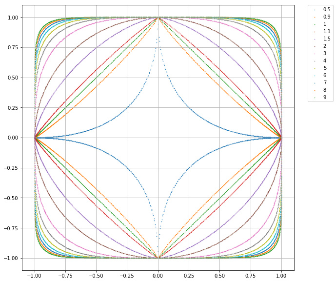
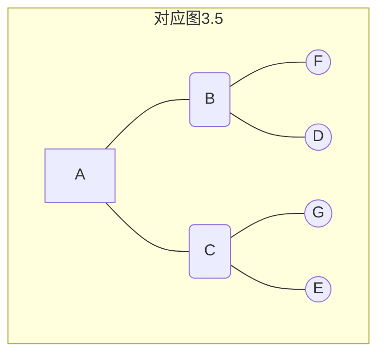

# CH03 k近邻法


[TOC]

## 前言

### 章节目录

1. k近邻算法
1. k近邻模型
   1. 模型
   1. 距离度量
   1. k值选择
   1. 分类决策规则
1. k近邻法的实现: KDTree
   1. 构造KDTree
   1. 搜索KDTree

### 导读

kNN是一种基本分类与回归方法。

- kNN是机器学习中被分析的最透彻的算法之一。
- 多数表决规则等价于0-1损失函数下的经验风险最小化，支持多分类， 有别于前面的感知机算法
- kNN的k和KDTree的k含义不同，书上这部分有注释说明
- KDTree是一种存储k维空间数据的树结构，KDTree是平衡二叉树
- KNN应用的一个实践问题是如何建立高效的索引。建立空间索引的方法在点云数据处理中也有广泛的应用，KDTree和八叉树在3D点云数据组织中应用比较广
- 书中的KDTree搜索实现的时候针对了一种$k=1$的特殊的情况，实际是**最**近邻搜索
- KDTree的搜索问题分为**k近邻查找**和**范围查找**，一个是已知$k$，求点集范围，一个是已知范围，求里面有k个点。范围查找问题在维度高的时候复杂度非常高，不太推荐用KDTree做范围查找。
- K近邻问题在杭电ACM里面有收录，HUD4347
- 图像的特征点匹配，数据库查询，图像检索本质上都是同一个问题--相似性检索问题。Facebook开源了一个高效的相似性检索工具Faiss，用于有效的相似性搜索和稠密矢量聚类。
- 这一章有个经典的图，在很多文章和教材上都能看到，就是第一个图3.1。这个图画出了1NN算法在实例空间上的决策面形状。这种类型的图经常被称为在训练集上的的Voronoi图，也叫Thiessen Polygons。可以通过检索Delaunay三角剖分和Voronoi划分进一步了解。
- 在scipy.spatial.KDTree中有KDTree的实现，KDTree在创建马赛克照片的时候可以用到。

## 最近邻算法

$k=1$的情形，称为最近邻算法。书中后面的分析都是按照最近邻做例子，这样不用判断类别，可以略去一些细节。

## k近邻模型

### 算法

输入: $T=\{(x_1,y_1),(x_2,y_2),\dots,(x_N,y_N)\}， x_i\in \cal{X}\sube{\bf{R}^n}, y_i\in\cal{Y}=\{c_1,c_2,\dots, c_k\}$; 实例特征向量$x$

输出: 实例所属的$y$

步骤:

1. 根据指定的**距离度量**，在$T$中查找$x$的**最近邻的$k$个点**，覆盖这$k$个点的$x$的邻域定义为$N_k(x)$

1. 在$N_k(x)$中应用**分类决策规则**决定$x$的类别$y$
   $$
   y=\arg\max_{c_j}\sum_{x_i\in N_k(x)}I(y_i=c_j), i=1,2,\dots,N, j=1,2,\dots,K
   $$
   

这里提到了$k$近邻模型的三要素，如算法描述中黑体标注的部分， 注意这里的三要素和前面说的统计学习方法的三要素不是一个东西。后面讲到[隐马尔可夫模型](CH10/README.md)的时候也有三要素。

### 距离度量

> **特征空间**中的两个实例点的距离是两个实例点相似程度的反映。

书中是如上描述的，这里要注意**距离越近(数值越小)， 相似度越大**。


这里用到了$L_p$距离, 可以参考Wikipedia上$L_p$ Space词条[^1]

1. $p=1$ 对应 曼哈顿距离
1. $p=2$ 对应 欧氏距离
1. 任意$p$ 对应 闵可夫斯基距离


$$L_p(x_i, x_j)=\left(\sum_{l=1}^{n}{\left|x_{i}^{(l)}-x_{j}^{(l)}\right|^p}\right)^{\frac{1}{p}}$$



考虑二维的情况，上图给出了不同的$p$值情况下与原点距离为1的点的图形。

 这个图有几点理解下:

1. 与原点的距离
1. 与原点距离为1的点
1. 前一点换个表达方式，图中的点向量($x_1$, $x_2$)的$p$范数都为1
1. 图中包含多条曲线，关于p=1并没有对称关系
1. 定义中$p\geqslant1$，这一组曲线中刚好是凸的

这里要补充一点：

范数是对向量或者矩阵的度量，是一个标量，这个里面两个点之间的$L_p$距离可以认为是两个点坐标差值的$p$范数。

参考下例题3.1的测试案例，这个实际上没有用到模型的相关内容。

### $k$值选择

1. 关于$k$大小对预测结果的影响，书中给的参考文献是ESL，这本书还有个先导书叫ISL。
1. 通过**交叉验证**选取最优$k$，算是超参数
1. 二分类问题，$k$选择奇数有助于避免平票

### 分类决策规则

Majority Voting Rule

误分类率

$\frac{1}{k}\sum_{x_i\in N_k(x)}{I(y_i\ne c_i)}=1-\frac{1}{k}\sum_{x_i\in N_k(x)}{I(y_i= c_i)}$

如果分类损失函数是0-1损失，误分类率最低即经验风险最小。

关于经验风险，参考书上[CH01](../CH01/README.md)第一章 (1.11)和(1.16)

## 实现

kNN在实现的时候，要考虑多维数据的存储，这里会用到树结构。

在Scipy Cookbook里面有个kd树具体的实现[^2]可参考

### 构造KDTree

KDTree的构建是一个递归的过程

注意: KDTree左边的点比父节点小，右边的点比父节点大。

这里面有提到，KDTree搜索时效率未必是最优的，这个和样本分布有关系。随机分布样本**KDTree搜索**(这里应该是**最**近邻搜索)的平均计算复杂度是$O(\log N)$，空间维数$K$接近训练样本数$N$时，搜索效率急速下降，几乎$O(N)$

看维度，如果维度比较高，搜索效率很低。当然，在考虑维度的同时也要考虑样本的规模。

考虑个例子

```python
[[1, 1],
 [2, 1],
 [3, 1],
 [4, 1],
 [5, 1],
 [6, 1],
 [100, 1]，
 [1000, 1]]
```

这个数据，如果找[100, 1]

### 搜索KDTree

这部分书中的例子是最近邻的搜索例子。

#### $k$近邻查找

KNN查找已知查询点$p$，树当前节点$o$，近邻数目$k$

可以用一个优先队列存储最优的$k$个点，每次比对回溯节点是否比当前最优点更优的时候，就只需用当前最优中距离$p$最远的节点来对比，而这个工作对于优先队列来说是$O(1)$的[^3]

#### 范围查询

给定一个范围，问其中有多少点。比较常见的应用是GIS类应用，使用者附近多大半径内包含多少单车，多少酒店等。

实际上为了实现快速搜索， 在空间数据的存储结构上要有考虑。

## 例子

### 例3.1

分析$p$值对最近邻点的影响，这个有一点要注意关于闵可夫斯基距离的理解：

- 两点坐标差的$p$范数

具体看相关测试案例的实现

### 例3.2

KDTree创建


### 例3.3

KDTree搜索



这个例子说明了搜索的方法，理解一下书中的图3.5，对应的KDTree如上。


## 参考

1. [^1]: [Lp Space](https://en.wikipedia.org/wiki/Lp_space)

2. ESL

3. [^2]: [KDTree](https://docs.scipy.org/doc/scipy-0.14.0/reference/generated/scipy.spatial.KDTree.html)

4. [^3 ]: [KD Tree: k近邻查询和范围查询](https://ask.hellobi.com/blog/zlx19930503/10481)

5. [^4]: [HUD4347](http://acm.hdu.edu.cn/showproblem.php?pid=4347)

**[⬆ top](#导读)**