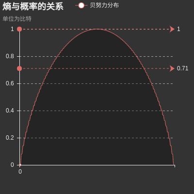
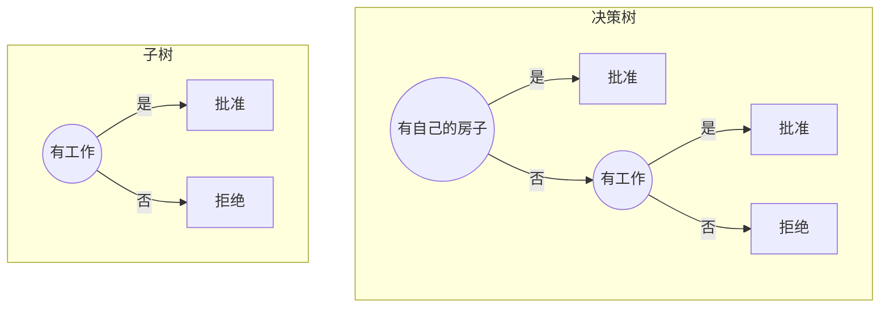
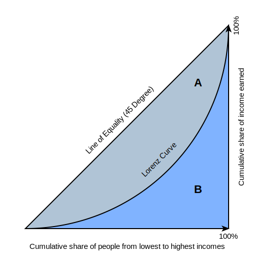

# CH05 决策树


[TOC]

## 前言

### 章节目录

1. [模型与策略]决策树**模型**与**学习**
   1. 决策树模型
      1. 决策树与if-then规则
      1. 决策树与条件概率分布
   1. 决策树学习(三个步骤:特征选择，决策树生成，决策树修剪)
1. ~~算法~~
   1. [算法]特征选择
      1. 特征选择问题(下面两个介绍了常用的准则，另外还有基尼系数在CART算法部分讲解)
         1. 信息增益
         1. 信息增益比
   1. [算法]决策树的生成
      1. ID3算法
      1. C4.5的生成算法
   1. [算法]决策树的剪枝
   1. [算法]CART算法
      1. CART生成
      1. CART剪枝

### 导读

- 决策树是一种基本的分类与回归方法. 在书中CART算法之前的章节说的都是分类树，ID3和C4.5都只能处理分类问题，从CART(Classification and Regression Tree)开始有回归树，统称为决策树
- 以上在章节目录部分添加了一部分标记，把这个章节按照模型，策略与算法进行划分，进一步重新整理了结构，希望可以帮助理清章节内容之间的关系
- 在[CH12](../CH12/README.md)中有提到，决策树学习的损失函数是**对数似然损失**，关于决策树的剪枝，最重要的在于这个损失函数的理解。
- 这个章节的主题是决策树，内容内涵和外延都很广，这个章节推荐阅读图灵社区的一个访谈[^1]，了解一下李航老师的故事，也可以对本章的最后三个参考文献[^2][^3][^4]有进一步的了解.
- 引文中关于CART的介绍，是一本368页的书，2017年10月有了[Kindle版本](https://www.amazon.com/Classification-Regression-Trees-Leo-Breiman-ebook/dp/B076M7QKC6)，书的共同作者Friedman JH也是另一本神书ESL[参考文献7]的共同作者。
- CART虽然在本书中排在ID3和C4.5后面，但是发表的时间顺序为CART->ID3->C4.5，了解决策树历史可以参考Loh的报告[^5]
- 熵, 基尼指数衡量的都是集合的不确定性, 应用在推荐的场景, 不确定性越大, 覆盖率可能就越大.
- 书中有提到，`分类问题中， 决策树表示基于特征对实例进行分类的过程。它可以认为是if-then规则的集合， 也可以认为是定义在特征空间上与类空间的条件概率分布。`书中第一小节对这个问题做了解释。
- **剪枝**是模型压缩领域中的经典技术。剪枝可以降低模型复杂度，防止过拟合，提升模型泛化性能。LeCun等在1990年提出OBD[^8]方法对神经网络进行剪枝。

## 概念

### 熵

$$
H(p)=H(X)=-\sum_{i=1}^{n}p_i\log p_i
$$

**熵只与$X$的分布有关，与$X$取值无关**，这句注意理解

定义$0\log0=0$，熵是非负的。

### 条件熵

随机变量$(X,Y)$的联合概率分布为

$P(X=x_i,Y=y_j)=p_{ij}, i=1,2,\dots ,n;j=1,2,\dots ,m$

条件熵$H(Y|X)$表示在已知随机变量$X$的条件下随机变量$Y$的不确定性
$$
H(Y|X)=\sum_{i=1}^np_iH(Y|X=x_i)
$$
其中$p_i=P(X=x_i),i=1,2,\dots ,n$

### 经验熵， 经验条件熵

> 当熵和条件熵中的概率由数据估计(特别是极大似然估计)得到时，所对应的熵与条件熵分别称为经验熵和经验条件熵

就是从已知的数据计算得到的结果。

### 信息增益

特征$A$对训练数据集$D$的信息增益$g(D|A)$，定义为集合$D$的经验熵$H(D)$与特征$A$给定的条件下$D$的经验条件熵$H(D|A)$之差
$$
g(D,A)=H(D)-H(D|A)
$$

熵与条件熵的差称为互信息.

决策树中的信息增益等价于训练数据集中的类与特征的互信息。

考虑ID这种特征， 本身是唯一的。按照ID做划分， 得到的经验条件熵为0, 会得到最大的信息增益。所以， 按照信息增益的准则来选择特征， 可能会倾向于取值比较多的特征。

### 信息增益比

$$
g_R(D,A)=\frac{g(D,A)}{H_A(D)}\\
H_A(D)=-\sum_{i=1}^n\frac{D_i}{D}log_2\frac{D_i}{D}
$$


## 算法

这部分内容，原始的[5.1数据](./Input/data_5-1.txt)中最后的标签也是是和否，表示树模型的时候，叶结点不是很明显，所以简单改了下[数据标签](./Input/mdata_5-1.txt)。对应同样的树结构，输出的结果如下

```python
# data_5-1.txt
{'有自己的房子': {'否': {'有工作': {'否': {'否': None}, '是': {'是': None}}}, '是': {'是': None}}}
# mdata_5-1.txt
{'有自己的房子': {'否': {'有工作': {'否': {'拒绝': None}, '是': {'批准': None}}}, '是': {'批准': None}}}
```

### 先导

#### 算法5.1 信息增益

> 输入：训练数据集$D$和特征$A$
>
> 输出：特征$A$对训练数据集$D$的信息增益$g(D,A)$
>
> 1. 数据集$D$的经验熵$H(D)=-\sum_{k=1}^K\frac{|C_k|}{|D|}\log_2\frac{|C_k|}{|D|}$
> 1.  特征$A$对数据集$D$的经验条件熵$H(D|A)=\sum_{i=1}^n\frac{|D_i|}{|D|}H(D_i)=-\sum_{i=1}^n\frac{|D_i|}{|D|}\sum_{k=1}^K\frac{|D_{ik}|}{|D_i|}\log_2\frac{|D_{ik}|}{|D_i|}$
> 1. 信息增益$g(D,A)=H(D)-H(D|A)$


#### 算法5.2 ID3算法

> 输入：训练数据集$D$, 特征集$A$，阈值$\epsilon$
> 输出：决策树$T$
>
> 1. 如果$D$属于同一类$C_k$，$T$为单节点树，类$C_k$作为该节点的类标记，返回$T$
> 1. 如果$A$是空集，置$T$为单节点树，实例数最多的类作为该节点类标记，返回$T$
> 1. 计算$g$, 选择信息增益最大的特征$A_g$
> 1. 如果$A_g$的信息增益小于$\epsilon$，$T$为单节点树，$D$中实例数最大的类$C_k$作为类标记，返回$T$
> 1. $A_g$划分若干非空子集$D_i$，
> 1. $D_i$训练集，$A-A_g$为特征集，递归调用前面步骤，得到$T_i$，返回$T_i$


#### 算法5.3 C4.5生成

> 输入：训练数据集$D$, 特征集$A$，阈值$\epsilon$
> 输出：决策树$T$
>
> 1. 如果$D$属于同一类$C_k$，$T$为单节点树，类$C_k$作为该节点的类标记，返回$T$
> 1. 如果$A$是空集, 置$T$为单节点树，实例数最多的作为该节点类标记，返回$T$
> 1. 计算$g$, 选择**信息增益比**最大的特征$A_g$
> 1. 如果$A_g$的**信息增益比**小于$\epsilon$，$T$为单节点树，$D$中实例数最大的类$C_k$作为类标记，返回$T$
> 1. $A_g$划分若干非空子集$D_i$，
> 1. $D_i$训练集，$A-A_g$为特征集，递归调用前面步骤，得到$T_i$，返回$T_i$
> ID3和C4.5在生成上，差异只在准则的差异。

#### 算法5.4 树的剪枝

决策树损失函数摘录如下：

> 树$T$的叶结点个数为$|T|$，$t$是树$T$的叶结点，该结点有$N_t$个样本点，其中$k$类的样本点有$N_{tk}$个，$H_t(T)$为叶结点$t$上的经验熵， $\alpha\geqslant 0$为参数，决策树学习的损失函数可以定义为
> $$
> C_\alpha(T)=\sum_{i=1}^{|T|}N_tH_t(T)+\alpha|T|
> $$
> 其中
> $$
> H_t(T)=-\sum_k\color{red}\frac{N_{tk}}{N_t}\color{black}\log \frac{N_{tk}}{N_t}
> $$
>
> $$
> C(T)=\sum_{t=1}^{|T|}\color{red}N_tH_t(T)\color{black}=-\sum_{t=1}^{|T|}\sum_{k=1}^K\color{red}N_{tk}\color{black}\log\frac{N_{tk}}{N_t}
> $$
>
> 这时有
> $$
> C_\alpha(T)=C(T)+\alpha|T|
> $$
> 其中$C(T)$表示模型对训练数据的误差，$|T|$表示模型复杂度，参数$\alpha \geqslant 0$控制两者之间的影响。

上面这组公式中，注意红色部分，下面插入一个图



这里面没有直接对$H_t(T)$求和，系数$N_t$使得$C(T)$和$|T|$的大小可比拟。这个地方再理解下。

> 输入：生成算法生成的整个树$T$，参数$\alpha$
>
> 输出：修剪后的子树$T_\alpha$
>
> 1. 计算每个结点的经验熵
> 1. 递归的从树的叶结点向上回缩
>    假设一组叶结点回缩到其父结点之前与之后的整体树分别是$T_B$和$T_A$，其对应的损失函数分别是$C_\alpha(T_A)$和$C_\alpha(T_B)$，如果$C_\alpha(T_A)\leqslant C_\alpha(T_B)$则进行剪枝，即将父结点变为新的叶结点
> 1. 返回2，直至不能继续为止，得到损失函数最小的子树$T_\alpha$

```python
{'有自己的房子': {'否': {'有工作': {'否': {'拒绝': None}, '是': {'批准': None}}}, '是': {'批准': None}}}
```

重新看一下这个建好的树，同样是字典的key，但是是有区别的。

- 有自己的房子和有工作，是特征的索引

- 是，否，是特征的取值



这个图里面，每一个划分都能计算经验熵

```python
ID	年龄	有工作	有自己的房子	信贷情况	类别
1	青年	否	否	一般	拒绝
2	青年	否	否	好	拒绝
15	老年	否	否	一般	拒绝
5	青年	否	否	一般	拒绝
6	中年	否	否	一般	拒绝
7	中年	否	否	好	拒绝
					
13	老年	是	否	好	批准
14	老年	是	否	非常好	批准
3	青年	是	否	好	批准
					
4	青年	是	是	一般	批准
8	中年	是	是	好	批准
9	中年	否	是	非常好	批准
10	中年	否	是	非常好	批准
11	老年	否	是	非常好	批准
12	老年	否	是	好	批准

```

这里先不考虑书中提到的剪枝方案，从上面划分的过程，思考如何做前剪枝，显然可以通过控制最后的叶子节点的样本数量来控制，最后的样本数量越少，就越可能出现模型过分的去拟合训练样本中的数据。

该章节代码中有这部分实现，在创建树的时候做预剪枝。

```python
def _min_samples_leaf_check(self,
                            X):
    items, cnts = np.unique(X, return_counts=True)
    return np.min(cnts) < self.min_samples_leaf
```

剪枝，书中讲的算法是后剪枝，需要计算每个结点的经验熵，这个计算应该是在树构建的时候已经算过。

这里面没有具体的实现例子，给出的参考文献是李航老师在CL上的文章，文章介绍的MDL是模型选择的一种具体框架，里面有介绍KL散度，这部分可以参考下。

### CART

关于CART的算法可以看下十大算法里面的第十章[^6]，一转眼就十大数据挖掘算法都发表十年了，这个本书第十章作者放在了ResearchGate上，链接见参考部分。

#### 算法5.5 最小二乘回归树生成

输入：训练数据集$D$

输出：回归树$f(x)$

步骤：

1. 遍历变量$j$，对固定的切分变量$j$扫描切分点$s$，得到满足上面关系的$(j,s)$
   $$
   \min\limits_{j,s}\left[\min\limits_{c_1}\sum\limits_{x_i\in R_1(j,s)}(y_i-c_1)^2+\min\limits_{c_2}\sum\limits_{x_i\in R_2(j,s)}(y_i-c_2)^2\right]
   $$

1. 用选定的$(j,s)$, 划分区域并决定相应的输出值
   $$
   R_1(j,s)=\{x|x^{(j)}\leq s\}, R_2(j,s)=\{x|x^{(j)}> s\} \\
   \hat{c}_m= \frac{1}{N}\sum\limits_{x_i\in R_m(j,s)} y_j, x\in R_m, m=1,2
   $$

1. 对两个子区域调用(1)(2)步骤， 直至满足停止条件
1. 将输入空间划分为$M$个区域$R_1, R_2,\dots,R_M$，生成决策树：
   $$
   f(x)=\sum_{m=1}^M\hat{c}_mI(x\in R_m)
   $$


#### 算法5.6 CART分类树生成

这个算法用到的策略是基尼系数，所以是分类树的生成算法。

>  概率分布的基尼指数定义

$$
Gini(p) = \sum_{k=1}^Kp_k(1-p_k)=1-\sum_{k=1}^Kp_k^2
$$


基尼系数是一个来源于经济学的指标. 范围(0, 1), 有很多中表示形式, 比如衡量收入分布的基尼系数.
$$
G=\frac{1}{n-1}\sum_{j=1}^n(2j-n-1)p(i_j)
$$



经济学基尼系数的解释[^7],基尼系数为$\frac{A}{A+B}$

#### 算法5.7 CART剪枝


## 例子

### 例5.1

这个例子引出在特征选择的问题，后面跟着引出了熵，条件熵，信息增益与信息增益比的概念。这些是介绍决策树学习的基础。

### 例5.2

根据信息增益准则选择最优特征

习题的5.1是让用信息增益比生成树，和这个基本一样，换一个准则就可以了。在单元测试里面实现了这部分代码。


## 参考

1. [^1]: [图灵社区李航访谈](http://www.ituring.com.cn/article/196610)

1. [^2]: [山西健司]()

1. [^3]: [决策列表, Text classification using ESC-based stochastic decision lists]()

1. [^4]: [李航，安倍，CL文章，Generalizing case frames using a thesaurus and the MDL principle](http://www.aclweb.org/anthology/J98-2002)

1. [^5]: [A Brief History of Classification and Regression Trees](http://washstat.org/presentations/20150604/loh_slides.pdf)

1. [^6]: [The Top Ten Algorithms in Data Mining](https://www.researchgate.net/publication/265031802_Chapter_10_CART_Classification_and_Regression_Trees)

1. [^7 ]: [Gini Coefficient](https://en.wikipedia.org/wiki/Gini_coefficient#/media/File:Economics_Gini_coefficient2.svg)

1. [^8 ]: [Optimal brain damage](http://yann.lecun.com/exdb/publis/pdf/lecun-90b.pdf)

**[⬆ top](#导读)**