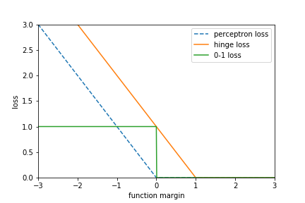

# CH07 支持向量机

[TOC]

## 前言

### 章节目录

1. [理论]线性可分支持向量机与硬间隔最大化
	1. 线性可分支持向量机
	1. 函数间隔和几何间隔
	1. 间隔最大化
	1. 学习的对偶算法
1. [理论]线性支持向量机与软间隔最大化
	1. 线性支持向量机
	1. 学习的对偶算法
	1. 支持向量
	1. 合页损失函数
1. [理论]非线性支持向量机与核函数
	1. 核技巧
	1. 正定核
	1. 常用核函数 
	1. 非线性支持向量分类机
1. [实现]序列最小最优化算法
	1. 两个变量二次规划的求解方法
	1. 变量的选择方法
	1. SMO算法

### 导读

本章概要部分比较精简, 多刷几遍。

支持向量机是一种二类分类模型。

- **基本模型**是定义在特征空间上的间隔最大的**线性分类器**
- 支持向量机还包括**核技巧**， 这使它称为实质上的**非线性分类器**。
- 支持向量机学习策略是间隔最大化，可形式化为一个求解凸二次规划的问题，也等价于正则化的合页损失函数的最小化问题。
- 支持向量机：线性可分支持向量机，线性支持向量机假设输入空间和特征空间的**元素一一对应**，并将输入空间中的输入映射为特征空间的特征向量；非线性支持向量机利用一个从输入空间到特征空间的**非线性映射**将输入映射为特征向量。
- 判别模型
- 符号函数, Sign, 0 对应了超平面(hyper plane), >0与<0对应了半空间(half space)
- 仿射变换是保凸变换
- `分离超平面将特征空间划分为两部分，一部分是正类，一部分是负类。法向量指向的一侧是正类， 另一侧为负类`
- 关于SVM的历史可以参考附录2[^2]，Vapnik的1995年的那个文章名字叫Support-vector networks，主要是提出了soft margin，在这篇文章的附录中给出了线性可分支持向量机与线性支持向量机的推导。同年Vapnik将支持向量机推广到支持向量回归，发表了文章统计学习理论的本质， 这个有中译版本，见书中本章参考文献[4]
- Vapnik全名弗拉基米尔·万普尼克， 出生于苏联， VC理论的主要创建人之一，统计学习理论之父。1990年底移居美国，1991-2001年间，他在AT&T工作。2006年成为美国国家工程院院士。2014年加入Facebook人工智能实验室。
- 1995年SVN的文章结尾有这样的描述：```The support-vector network combines 3 ideas: the solution technique from optimal hy- perplanes (that allows for an expansion of the solution vector on support vectors), the idea of convolution of the dot-product (that extends the solution surfaces from linear to non-linear), and the notion of soft margins (to allow for errors on the training set).```
- KKT条件是该最优化问题的充分必要条件。
- 样本比较多的时候，Boosting和RF往往能得到最好的效果，但是数据集较少的时候，SVM的效果可能会比较好。

---

这一章介绍了几个算法

1. 算法7.1 最大间隔法，针对线性可分支持向量机，直接求$w^*,b^*$
1. 算法7.2 学习的对偶算法，求$\alpha$进一步求$w^*,b^*$
1. 算法7.3 线性支持向量机的学习算法， 增加超参$C$，求$\alpha$进一步求$w^*,b^*$
1. 算法7.4 非线性支持向量机的学习算法，进一步引入核函数$K(x,z)$，求$\alpha$进一步求$b^*$
1. 算法7.5 序列最小最优化

注意前四个算法里面，都没有写该怎么去求解$\alpha$，最后一节**序列最小最优化**讨论了具体实现。也就是算法7.5给出了求解$\hat\alpha$的方法。

另外，注意对比算法7.3和算法7.4，关注输出，关注$b^*​$.


## [1] 线性可分支持向量机

### 问题描述

$$
\begin{align}
&\min_{w,b}\frac{\hat \gamma}{\left\|w\right\|}\\
&s.t.\ \ \ y_i(w\cdot x_i+b)-1\geqslant0,i=1,2,\dots,N\\
\end{align}
$$


这是个凸二次规划问题.

如果求出了上述方程的解$w^*, b^*$，就可得到

分离超平面
$$
w^*\cdot x+b^*=0
$$


相应的分类决策函数
$$
f(x)=sign(w^*\cdot x+b^*)
$$

### 算法

#### 函数间隔

对于给定数据集$T$和超平面$(w,b)$，定义超平面$(w,b)$关于样本点$(x_i,y_i)$的函数间隔为
$$
\hat \gamma_i=y_i(w\cdot x_i+b)
$$
定义超平面$(w,b)$关于训练数据集$T$的函数间隔为超平面$(w,b)$关于$T$中所有样本点$(x_i,y_i)$的函数间隔之最小值，即
$$
\hat \gamma=\min_{i=1,\cdots,N}\hat\gamma_i
$$
函数间隔可以表示分类预测的**正确性**及**确信度**。

#### 几何间隔


#### 间隔最大化


#### 支持向量和间隔边界

由于支持向量在确定分离超平面中起着决定作用，所以将这种分类模型称为支持向量机。

支持向量对应
$$
y_i(w\cdot x_i+b)-1 = 0
$$
上式对应两个超平面

分离超平面对应
$$
w\cdot x+b=0
$$
注意，在算法7.1中，并没有说明这个问题如何求得最优解，在7.1.4节中有描述该如何求解。

针对例7.1，可以先用$scipy$中的包求解，这个例子我们要清楚：

1. 该问题怎么定义的
1. 有哪些约束
1. 支持向量在哪里
1. 三个重要的超平面是怎么得到的

可以用如下程序实现

```python
# data 2.1
# x_1 = (3, 3), x_2 = (4, 3), x_3 = (1, 1)
# ref: [example 16.3](http://www.bioinfo.org.cn/~wangchao/maa/Numerical_Optimization.pdf)
from scipy import optimize
import numpy as np

fun = lambda x: ((x[0]) ** 2 + (x[1]) ** 2)/2
cons = ({'type': 'ineq', 'fun': lambda x: 3 * x[0] + 3 * x[1] + x[2] - 1},
        {'type': 'ineq', 'fun': lambda x: 4 * x[0] + 3 * x[1] + x[2] - 1},
        {'type': 'ineq', 'fun': lambda x: -x[0] - x[1] - x[2] - 1})
res = optimize.minimize(fun, np.ones(3), method='SLSQP', constraints=cons)
res
```

### 对偶算法

1. 对偶问题往往更容易求解
1. 自然引入核函数，进而推广到非线性分类问题

针对每个不等式约束，定义拉格朗日乘子$\alpha_i\ge0​$，定义拉格朗日函数
$$
\begin{align}
L(w,b,\alpha)&=\frac{1}{2}w\cdot w-\left[\sum_{i=1}^N\alpha_i[y_i(w\cdot x_i+b)-1]\right]\\
&=\frac{1}{2}\left\|w\right\|^2-\left[\sum_{i=1}^N\alpha_i[y_i(w\cdot x_i+b)-1]\right]\\
&=\frac{1}{2}\left\|w\right\|^2-\sum_{i=1}^N\alpha_iy_i(w\cdot x_i+b)+\sum_{i=1}^N\alpha_i
\end{align}\\
\alpha_i \geqslant0, i=1,2,\dots,N
$$
其中$\alpha=(\alpha_1,\alpha_2,\dots,\alpha_N)^T​$为拉格朗日乘子向量

**原始问题是极小极大问题**

根据**拉格朗日对偶性**，原始问题的**对偶问题是极大极小问题**:
$$
\max\limits_\alpha\min\limits_{w,b}L(w,b,\alpha)
$$

关于对偶问题，引用Wikipedia中的描述

> [Duality (optimization)](https://en.wikipedia.org/wiki/Duality_(optimization))
>
> In [mathematical optimization](https://en.wikipedia.org/wiki/Mathematical_optimization) theory, **duality** or the **duality principle** is the principle that [optimization problems](https://en.wikipedia.org/wiki/Optimization_problem) may be viewed from either of two perspectives, the **primal problem** or the **dual problem**. The solution to the dual problem provides a lower bound to the solution of the primal (minimization) problem.[[1\]](https://en.wikipedia.org/wiki/Duality_(optimization)#cite_note-Boyd-1) However in general the optimal values of the primal and dual problems need not be equal. Their difference is called the [duality gap](https://en.wikipedia.org/wiki/Duality_gap). For [convex optimization](https://en.wikipedia.org/wiki/Convex_optimization) problems, the duality gap is zero under a [constraint qualification](https://en.wikipedia.org/wiki/Constraint_qualification) condition.


转换后的对偶问题
$$
\min\limits_\alpha \frac{1}{2}\sum_{i=1}^N\sum_{j=1}^N\alpha_i\alpha_jy_iy_j(x_i\cdot x_j)-\sum_{i=1}^N\alpha_i\\
s.t. \ \ \ \sum_{i=1}^N\alpha_iy_i=0\\
\alpha_i\geqslant0, i=1,2,\dots,N
$$


对于任意线性可分的两组点，他们在分类超平面上的投影都是线性不可分的。

$\alpha$不为零的点对应的实例为支持向量，通过支持向量可以求得$b$值

核心公式两个
$$
\begin{align}
w^*&=\sum_{i=1}^{N}\alpha_i^*y_ix_i\\
b^*&=\color{red}y_j\color{black}-\sum_{i=1}^{N}\alpha_i^*y_i(x_i\cdot \color{red}x_j\color{black})
\end{align}
$$
这里面比较重要的是$b^*$的公式的理解，通过$\arg\max \alpha^*$实现，因为支持向量共线，所以通过任意支持向量求解都可以。

介绍学习的对偶算法之后，引入了例7.2解决之前同样的问题，这部分代码整理下

```python
# data 2.1
data = np.array([[3, 3],
                 [4, 3],
                 [1, 1]])
label = np.array([1, 1, -1])

def fun(a):
    return 4 * (a[0]) ** 2 + 13 / 2 * (a[1]) ** 2 + 10 * a[0] * a[1] - 2 * a[0] - 2 * a[1]
# cons = ({'type': 'ineq', 'fun': lambda a: a[0]},
#         {'type': 'ineq', 'fun': lambda a: a[1]})
bnds = ((0, None), (0, None))
res = optimize.minimize(fun, np.ones(2), method='SLSQP', bounds=bnds)

alpha = res["x"]
alpha = np.append(alpha, alpha[0] + alpha[1])
w = np.sum((alpha * label).reshape(-1, 1) * data, axis=0)
j = np.argmax(alpha)
b = label[j] - np.sum(alpha * label * np.dot(data, data[j, :]), axis=0)
#  0和2都OK，因为都为0.5 > 0
# b = label[0] - np.sum(alpha*label*np.dot(data,data[0,:]),axis=0)
# b = label[2] - np.sum(alpha*label*np.dot(data,data[2,:]),axis=0)
```

至此，两个例子求解的都是线性可分支持向量机。

## [2] 线性支持向量机

### 问题描述

$$
\begin{align}
\min_{w,b,\xi} &\frac{1}{2}\left\|w\right\|^2+C\sum_{i=1}^N\xi_i\\
s.t. \ \ \ &y_i(w\cdot x_i+b)\geqslant1-\xi_i, i=1,2,\dots,N\\
&\xi_i\geqslant0,i=1,2,\dots,N
\end{align}
$$

### 对偶问题描述

原始问题里面有两部分约束，涉及到两个拉格朗日乘子向量
$$
\begin{align}
\min_\alpha\ &\frac{1}{2}\sum_{i=1}^N\sum_{j=1}^N\alpha_i\alpha_jy_iy_j(x_i\cdot x_j)-\sum_{i=1}^N\alpha_i\\
s.t.\ \ \ &\sum_{i=1}^N\alpha_iy_i=0\\
&0\leqslant \alpha_i \leqslant C,i=1,2,\dots,N
\end{align}
$$
通过求解对偶问题， 得到$\alpha$，然后求解$w,b$的过程和之前一样

注意， 书后总结部分，有这样一句描述：**线性支持向量机的解$w^*$唯一但$b^*$不一定唯一**

线性支持向量机是线性可分支持向量机的超集。

### 算法

#### 软间隔最大化

>对于线性支持向量机学习来说
>模型为分离超平面$w^*\cdot x+b^*=0$
>
>决策函数为$f(x)=sign(w^*\cdot x+b^*)$
>
>学习策略为软间隔最大化
>
>学习算法为凸二次规划


#### 合页损失

另一种解释，最小化目标函数

$$\min\limits_{w,b} \sum\limits_{i=1}^N\left[1-y_i(w\cdot x+b)\right]_++\lambda\left\|w\right\|^2$$

其中

- 第一项是经验损失或经验风险，函数$L(y(w\cdot x+b))=[1-y(w\cdot x+b)]_+$称为合页损失，可以表示成$L = \max(1-y(w\cdot x+b), 0)$
- 第二项是**系数为$\lambda$的$w$的$L_2$范数的平方**，是正则化项

书中这里通过定理7.4说明了用合页损失表达的最优化问题和线性支持向量机原始最优化问题的关系。
$$
\begin{align}
\min_{w,b,\xi} &\frac{1}{2}\left\|w\right\|^2+C\sum_{i=1}^N\xi_i\\
s.t. \ \ \ &y_i(w\cdot x_i+b)\geqslant1-\xi_i, i=1,2,\dots,N\\
&\xi_i\geqslant0,i=1,2,\dots,N
\end{align}
$$
等价于
$$
\min\limits_{w,b} \sum\limits_{i=1}^N\left[1-y_i(w\cdot x+b)\right]_++\lambda\left\|w\right\|^2
$$
证明：

令合页损失$\left[1-y_i(w\cdot x+b)\right]_+=\xi_i$，合页损失非负，所以有$\xi_i\ge0$，这个对应了原始最优化问题中的**一个约束【1】**。

还是根据合页损失非负，当$1-y_i(w\cdot x+b)\leq\color{red}0​$的时候，有$\left[1-y_i(w\cdot x+b)\right]_+=\color{red}\xi_i=0​$，所以有

$1-y_i(w\cdot x+b)\leq\color{red}0=\xi_i$，这对应了原始最优化问题中的**另一个约束【2】**。

所以，在满足这**两个约束【1】【2】**的情况下，有
$$
\begin{aligned}
\min\limits_{w,b} &\sum\limits_{i=1}^N\left[1-y_i(w\cdot x+b)\right]_++\lambda\left\|w\right\|^2\\
\min\limits_{w,b} &\sum\limits_{i=1}^N\xi_i+\lambda\left\|w\right\|^2\\
\min\limits_{w,b} &\frac{1}{C}\left(\frac{1}{2}\left\|w\right\|^2+C\sum\limits_{i=1}^N\xi_i\right), with \  \lambda=\frac{1}{2C}\\
\end{aligned}
$$
看下下面这个图，其中合页损失和感知机损失函数之间的关系，合页损失要求函数间隔大于1的时候才没有损失（loss=0），而感知机只要函数间隔大于0就认为没有损失，所以说合页损失对学习有更高的要求。

再解释下，对于线性支持向量机大于一的意思是符号为正，且值要大于1；对于感知机大于零的意思是符号为正，就可以了。




```python
import numpy as np
import matplotlib.pyplot as plt

x = np.linspace(-3,3,601)
# perceptron loss
y1 = list(map(lambda x: max(0, -x), x))
# hinge loss
y2 = list(map(lambda x: max(0,1-x), x))
# 0-1 loss
y3 = list(map(lambda x:1 if x <= 0 else 0, x))
# lr loss
y4 = list(map(lambda x:np.log2(1+np.exp(-x)), x))
# adaboost
y5 = list(map(lambda x:np.exp(-x), x))
plt.plot(x,y1,'--', label='perceptron loss')
plt.plot(x,y2, '-', label='hinge loss' )
plt.plot(x,y3, '-', label='0-1 loss')
plt.plot(x,y4, '-', label='lr')
plt.plot(x,y5, '-', label='adaboost')

plt.legend()
plt.xlim(-3,3)
plt.ylim(0,3)
plt.xlabel("functional margin")
plt.ylabel("loss")
plt.savefig("test.png")
plt.show()
```


以上：

- 0-1损失函数不是连续可导
- 合页损失认为是0-1损失函数的上界，在[AdaBoost](../CH08/README.md)中也有说明，指数损失也是0-1损失函数的上界，在[感知机](../CH02/README.md)中有提到`损失函数的自然选择是误分类点的个数`，这句在最开始见到的时候，可能不一定有上面图片的直觉。注意在本书[CH12](../CH12/README.md)中也有这个图，可以对比理解下。
- 感知机误分类驱动， 选择函数间隔作为损失考虑分类的正确性，合页损失不仅要考虑分类正确， 还要考虑确信度足够高时损失才是0.

## [3]非线性支持向量机
核技巧的想法是在学习和预测中只定义核函数$K(x,z)$，而不是显式的定义映射函数$\phi$

通常，直接计算$K(x,z)$比较容易， 而通过$\phi(x)$和$\phi(z)$计算$K(x,z)$并不容易。
$$
\begin{align}
W(\alpha)=\frac{1}{2}\sum_{i=1}^N\sum_{j=1}^N\alpha_i\alpha_jy_iy_jK(x_i,x_j)-\sum_{i=1}^N\alpha_i\\
f(x)=sign\left(\sum_{i=1}^{N_s}\alpha_i^*y_i\phi(x_i)\cdot \phi(x)+b^*\right)=sign\left(\sum_{i=1}^{N_s}\alpha_i^*y_iK(x_i,x)+b^*\right) 
\end{align}
$$
学习是隐式地在特征空间进行的，不需要显式的定义特征空间和映射函数。这样的技巧称为核技巧，核技巧不仅引用于支持向量机，而且应用于其他统计学习问题。

TODO：字符串核函数
### 核函数

例7.3 主要是为了说明

> 对于给定的核$K(x,z)$，特征空间$\mathcal H$和映射函数$\phi(x)$的取法并不唯一，可以取不同的特征空间，即便是同一特征空间里也可以取不同的映射

注意这个例子里面$\phi(x)$实现了从低维空间到高维空间的映射。
$$
K(x,z)=(x\cdot z)^2\\
\cal{X}=\R^2, x=(x^{(1)},x^{(2)})^T\\
\cal{H}=\R^3, \phi(x)=((x^{(1)})^2, \sqrt2x^{(1)}x^{(2)}, (x^{(2)})^2)^T\\
\cal{H}=\R^4, \phi(x)=((x^{(1)})^2, x^{(1)}x^{(2)}, x^{(1)}x^{(2)}, (x^{(2)})^2)^T\\
$$

这里看下：

- 理解下$\R^n$
- 理解下计算$K$要比通过$\phi$计算$K$要容易
- 核函数的定义相当于给出了$\phi(x)\cdot\phi(z)$的结果，而没有显式的给出$\phi$的定义，$\phi$实现了从输入空间到特征空间的变换，所以说，学习是隐式的从特征空间中进行的，不需要显式的定义特征空间和映射函数，这样的技巧称为核技巧，通过线性分类学习方法和核函数解决非线性问题。

核具有再生性即满足
$$
K(\cdot,x)\cdot f=f(x)\\
K(\cdot,x)\cdot K(\cdot, z)=K(x,z)
$$
称为再生核


### 问题描述

~~和线性支持向量机的问题描述一样~~，注意，这里是有差异的，将向量内积替换成了核函数，而后续SMO算法求解的问题是该问题。

构建最优化问题：
$$
\begin{align}
\min_\alpha\ &\frac{1}{2}\sum_{i=1}^N\sum_{j=1}^N\alpha_i\alpha_jy_iy_jK(x_i,x_j)-\sum_{i=1}^N\alpha_i\\
s.t.\ \ \ &\sum_{i=1}^N\alpha_iy_i=0\\
&0\leqslant \alpha_i \leqslant C,i=1,2,\dots,N
\end{align}
$$


求解得到$\alpha^*=(\alpha_1^*,\alpha_2^*,\cdots,\alpha_N^*)^T$

选择$\alpha^*$的一个正分量计算
$$
b^*=y_j-\sum_{i=1}^N\alpha_i^*y_iK(x_i,x_j)
$$
构造决策函数
$$
f(x)=sign\left(\sum_{i=1}^N\alpha_i^*y_iK(x,x_i)+b^*\right)
$$


## 学习算法：序列最小最优化

支持向量机的学习问题可以形式化为求解凸二次规划问题，这部分主要参考文献是文献5[^1]

### 问题描述

$$
\begin{aligned}
\min_\alpha\ &\frac{1}{2}\sum_{i=1}^N\sum_{j=1}^N\alpha_i\alpha_jy_iy_jK(x_i,x_j)-\sum_{i=1}^N\alpha_i\\
s.t.\ \ \ &\sum_{i=1}^N\alpha_iy_i=0\\
&0\leqslant \alpha_i \leqslant C,i=1,2,\dots,N
\end{aligned}
$$

这个问题中，变量是$\alpha$，一个变量$\alpha_i$对应一个样本点$(x_i,y_i)$，变量总数等于$N$


### KKT 条件

KKT条件是该最优化问题的充分必要条件。这个参考[附录C](../APP/README.md)


### SMO算法

整个SMO算法包括两~~步骤~~**部分**：

1. 求解两个变量二次规划的解析方法
1. 选择变量的启发式方法

$$
\begin{aligned}
\min_\alpha\ &\frac{1}{2}\sum_{i=1}^N\sum_{j=1}^N\alpha_i\alpha_jy_iy_j(x_i\cdot x_j)-\sum_{i=1}^N\alpha_i\\
s.t.\ \ \ &\sum_{i=1}^N\alpha_iy_i=0\\
&0\leqslant \alpha_i \leqslant C,i=1,2,\dots,N
\end{aligned}
$$

注意，这里是**两个部分**，而不是先后的两个步骤。

#### Part I

两变量二次规划求解

选择两个变量$\alpha_1,\alpha_2​$

由等式约束可以得到

$\alpha_1=-y_1\sum\limits_{i=2}^N\alpha_iy_i​$

所以这个问题实质上是单变量优化问题。
$$
\begin{align}
\min_{\alpha_1,\alpha_2} W(\alpha_1,\alpha_2)=&\frac{1}{2}K_{11}\alpha_1^2+\frac{1}{2}K_{22}\alpha_2^2+y_1y_2K_{12}\alpha_1\alpha_2\nonumber\\
&-(\alpha_1+\alpha_2)+y_1\alpha_1\sum_{i=3}^Ny_i\alpha_iK_{il}+y_2\alpha_2\sum_{i=3}^Ny_i\alpha_iK_{i2}\\
s.t. \ \ \ &\alpha_1y_1+\alpha_2y_2=-\sum_{i=3}^Ny_i\alpha_i=\varsigma\\
&0\leqslant\alpha_i\leqslant C, i=1,2
\end{align}
$$

上面存在两个约束：

1. **线性**等式约束
1. 边界约束

这里有个$\color{red}配图$，其中这样一段描述**等式约束使得$(\alpha_1,\alpha_2)$在平行于盒子$[0,C]\times [0,C]$的对角线的直线上**

这句怎么理解？

$y_i\in \mathcal Y=\{+1,-1\}$所以又等式约束导出的关系式中两个变量的系数相等，所以平行于对角线。

要时刻记得，支持向量机是个二类分类模型。后面有研究者对这个问题做多分类扩展，应该不是简单的OvO或者OvR吧，不然能专门发文章写一下？

书中**剪辑**的概念对应了文献[^1]中的**clipped**，剪辑的操作对应的是clipping，也叫truncation或者shortening。

#### Part II

变量的选择方法

1. 第一个变量$\alpha_1$
   外层循环
   违反KKT条件**最严重**的样本点
1. 第二个变量$\alpha_2$
   内层循环
   希望能使$\alpha_2$有足够大的变化
1. 计算阈值$b$和差值$E_i$

### 算法7.5

> 输入：训练数据集$T={(x_1,y_1),(x_2,y_2),\dots, (x_N,y_N)}$，其中$x_i\in\mathcal X=\bf R^n, y_i\in\mathcal Y=\{-1,+1\}, i=1,2,\dots,N$,精度$\epsilon$
>
> 输出：近似解$\hat\alpha$
>
> 1. 取初值$\alpha_0=0$，令$k=0$
>
> 1. **选取**优化变量$\alpha_1^{(k)},\alpha_2^{(k)}$，解析求解两个变量的最优化问题，求得最优解$\alpha_1^{(k+1)},\alpha_2^{(k+1)}$，更新$\alpha$为$\alpha^{k+1}$
>
> 1. 若在精度$\epsilon$范围内满足停机条件
>    $$
>    \sum_{i=1}^{N}\alpha_iy_i=0\\
>    0\leqslant\alpha_i\leqslant C,i=1,2,\dots,N\\
>    y_i\cdot g(x_i)=
>    \begin{cases}
>    \geqslant1,\{x_i|\alpha_i=0\}\\
>    =1,\{x_i|0<\alpha_i<C\}\\
>    \leqslant1,\{x_i|\alpha_i=C\}
>    \end{cases}\\
>    g(x_i)=\sum_{j=1}^{N}\alpha_jy_jK(x_j,x_i)+b
>    $$
>    则转4,否则，$k=k+1$转2
>
> 1. 取$\hat\alpha=\alpha^{(k+1)}$

TODO:

其实这里支持向量机的几个核心的思想是不难理解的，这里涉及到的主要是求解二次规划问题么？

## 扩展

### 对比支持向量机和提升方法

参考下[CH08](../CH08/README.md)


### 对比二次规划求解工具和SMO

## 习题

### 7.3

线性支持向量机还可以定义成以下形式：
$$
\begin{aligned}
\min_{w,b,\xi}\ &\frac{1}{2}||w||^2+C\sum_{i=1}^{N}\xi_i^2\\
s.t.\ &y_i(w\cdot x_i+b)\ge1-\xi_i, i=1,2,\cdots,N\\
&\xi_i\ge 0, i=1,2,\cdots,N
\end{aligned}
$$

求其对偶形式。

## 参考

1. [^1]: [Fast training of support vector machines using sequential minimal optimization](http://www.cs.utsa.edu/~bylander/cs6243/smo-book.pdf)

2. [^2]: [支持向量机历史](http://www.svms.org/history.html)

**[⬆ top](#导读)**