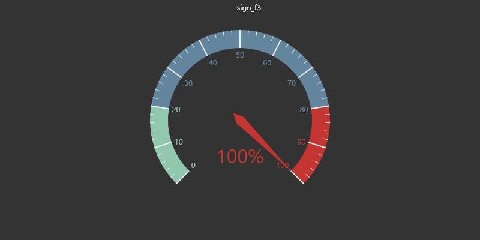
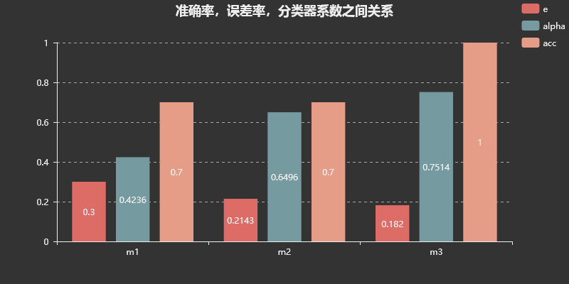

# CH08 提升方法

[TOC]

## 前言

### 章节目录

1. 提升方法AdaBoost算法
   1. 提升方法的基本思路
   1. AdaBoost算法
   1. AdaBoost的例子
1. AdaBoost算法的训练误差分析
1. AdaBoost算法的解释
   1. 前向分步算法
   1. 前向分布算法与AdaBoost
1. 提升树
   1. 提升树模型
   1. 提升树算法
   1. 梯度提升

### 导读

- 可能会有疑问，为什么支持向量机前置在这一章之前，可以参考本章的第一个参考文献[^1]，Yoav Freund和Robert Schapire因此获得了[2003年的哥德尔奖](https://en.wikipedia.org/wiki/G%C3%B6del_Prize)， 本书中关于误差率的表述与该文献是一致的， PRML中则对分类误差率进行了归一化。
- 在训练误差分析部分有这样一句`AdaBoost算法不需要知道下界$\gamma$，这正是Freund与Schapire设计AdaBoost时所考虑的`。如果对这句没有sense，了解下历史。书中也讲到1988年Kearns和Valiant提出"强可学习"和"弱可学习"的概念，并提出了一个问题这两种复杂性类别是否等价。Schapire给出了答案，是等价的，并给出了算法，这是最早的Boost，但是这个算法需要知道学习器的误差界。后来AdaBoost提出，不再需要知道误差界等信息。
- 关于AdaBoost和SVM的联系，主要在**函数间隔**的这个概念上文献[^1]和本书[CH02](../CH02/README.md)[CH07](../CH07/README.md)中内容合并理解，本文后面在算法的解释部分会添加一个和SVM关系的对比摘要一下文献中的理解。这篇文章在介绍AdaBoost和SVM的关系的时候， 引用了三篇文献，在[CH07](../CH07/README.md)中都有引用，是经典的SVM文献。
- 间隔包含了分类正确性与确信度的含义。
- 如果看过林轩田老师的课程(只需看第一课)，可能对hypothesis这个概念迷糊，没有sense。那可以翻下前面提到的这个文章，可能会对这些概念的理解有帮助。另外文章中有提到VC维，用来度量hypotheses的复杂度。
- 另外一篇文献，推荐下RE Schapire的文章[^2]关于间隔的理解
- AdaBoost的两个性质：
  1. 能在学习过程中不断减少训练误差
  1. 训练误差是以指数速率下降的
- 基函数和基本分类器不是一个概念， 在加法模型部分有提到。
- 这章里面提到了，这样一句， `大多数的提升方法都是改变训练数据的概率分布（训练数据的权值分布），针对不同的训练数据分布调用弱学习算法学习一系列弱分类器`， 这里改变训练数据的权值分布，可能不是很容易理解， 字面理解好像是给数据乘了系数， 实际上这个权值分布在计算分类误差率的时候才用到，通过$\alpha_m=\frac{1}{2}\log\frac{1-e_m}{e_m}$生成了对应的弱分类器的系数。另外， 这个权值分布在更新的时候， 做了归一化， 使他满足了概率分布的条件。
- 提升树针对不同的问题， 选择不同的损失函数：指数损失（分类问题），平方损失（回归问题）， 一般损失（一般问题）， 针对一般问题， 优化方法采用梯度提升就有了GBDT。 
- 书中讲的AdaBoost是用在二分类上， 和SVM的二分类差不多， 算法8.1中有用到符号函数。公式8.4也用到了$Y=\{1,-1\}$的性质, 和感知机部分的应用类似。 
- 在sklearn中有引用书中参考文献5[^7]，sklearn中的实现支持多分类， 引用了参考文献[^3]， 本书中引用了更早的一个实现多分类的文献[^4]
- 提升方法最初用来解决分类问题，这里面算法8.1描述的就是二分类的算法，
- 本章最后介绍了提升树， 关于各种树相关的算法关系， 林轩田有页slides， 可以参考。[^5]
- 算法8.3用来求回归问题的提升树， 注意**拟合残差**这个内容的理解，可以理解例子8.2
- 关于参考文献9[^6]， 这个文章，简要说两句， 提到了Bregman distance， 这篇文章的编辑是Bengio
- Boosting不容易过拟合

###  加法模型+前向分步算法

回顾这一章其实可以划分成三个阶段：
1. 1️⃣加法模型 + 指数损失[特例,Adaboost又进一步是特例]
1. 2️⃣加法模型 + 平方损失[特例]
1. 3️⃣加法模型 + 一般损失

再复习下，之前李航老师讲到的：
> 统计学习方法之间的不同，主要来自器模型、策略、算法的不同。确定了模型、策略、算法，统计学习的方法也就确定了。这也就是将其称为统计学习三要素的原因。

再结构化一下这三个部分，好好理解：

* 模型：需要学习的条件概率分布或者决策函数
* 策略：按照什么样的准则学习或选择最优的模型。统计学习的目标在于从假设空间中选取最优模型。
    * 经验风险最小化($R_{emp}$)
    * 结构风险最小化($R_{srm}$)
* 算法：考虑用什么样的方法求解最优模型，这时统计学习问题归结为最优化问题，统计学习方法的算法称为求解最优化问题的算法。

Boosting方法是一种常用的统计学习方法，应用广泛且有效
- 【在分类问题中】改变训练样本权重，学习多个分类器
- 线性组合

## 提升方法AdaBoost算法

### 提升方法的基本思路

概率近似正确(PAC, Probably approximately correct)

在PAC学习框架下，一个概念是强可学习的**充分必要条件**是这个概念是弱可学习的。
两个问题

1. 在每一轮如何改变训练数据的权值或者概率分布
1. 如何将弱分类器组合成一个强分类器

Adaboost解决方案：
1. 提高前一轮被分错的分类样本的权值，降低被正确分类的样本的权值
1. 加权多数表决的方法
### Adaboost算法
#### 算法8.1

* 输入：训练数据集$T=\{(x_1,y_1), (x_2,y_2),...,(x_N,y_N)\}, x\in  \cal X\sube \R^n$, 弱学习方法
* 输出：最终分类器$G(x)$

步骤
1. 初始化训练数据的权值分布 $D_1=(w_{11},\cdots,w_{1i},\cdots,w_{1N},w_{1i}=\frac{1}{N})​$
1. m = 1,2, M
    1. $G_m(x):X->{-1,+1}$
    1. 求$G_m$在训练集上的分类误差率  $e_m=\sum_{i=1}^{N}P(G_m(x_i)\ne y_i)=\sum_{i=1}^{N}w_{mi}I(G_m(x_i)\ne y_i)$
    1. 计算$G_m(x)$的系数，$\alpha_m=\frac{1}{2}log\frac{1-e_m}{e_m}$，自然对数
    1. $w_{m+1,i}=\frac{w_{mi}}{Z_m}exp(-\alpha_my_iG_m(x_i))​$
    1. $Z_m=\sum_{i=1}^Nw_{mi}exp(-\alpha_my_iG_m(x_i))$
1. $f(x)=\sum_{m=1}^M\alpha_mG_m(x)$
1. 最终分类器$G(x)=sign(f(x))=sign(\sum_{m=1}^M\alpha_mG_m(x))$■

从算法8.1的输入可以看出来，AdaBoost是个集成学习算法， 因为在他的输入中包含了**弱学习算法**。

注意这里面有个描述

> 使用具有权值分布$D_m$的训练数据集

这个怎么理解，是改变了数据么？
* 这里不是的
* 弱分类器的分类准则是错误率$e_m=P(G_m(x_i)\ne y_i)=\sum_{i=1}^{N}w_{mi}I(G_m(x_i)\ne y_i)$
* 弱分类器的分类准则是错误率$e_m=\color{red}\sum_{i=1}^{N}\color{black}P(G_m(x_i)\ne y_i)=\sum_{i=1}^{N}w_{mi}I(G_m(x_i)\ne y_i)​$
* 以上这两条再考虑下
* 每次学习用到的数据集没有变，划分方式也没有变（比如阈值分类器中的分类点的选取方式），变是评价每个划分错误的结果。
* 不同的权值分布上，不同样本错分对评价结果的贡献不同，**分类器**中分类错误的会被放大，分类正确的系数会减小，错误和正确的系数比值为$e^{2\alpha_m}=\frac{1-e_m}{e_m}$，这个比值是分类器分类正确的**几率**($odds$)，关于几率在[CH06](../CH06/README.md)中有讲到，这也是为什么在1999年的时候Schapire的文章中开篇用Horse racing gambler来引入Boosting，几率就是个源自赌博的概念。
* 书中对这点也有解释：误分类样本在下一轮学习中起更大的作用。不改变所给的训练数据，而不断改变训练数据权值的分布，似的训练数据在基本分类器的学习中起不同的作用， 这是AdaBoost的一个特点。
### AdaBoost例子

#### 例子8.1 

数据见[data_8-1.txt](input/data_8-1.txt)

弱分类器选为阈值分类器，通过阈值将数据划分成两部分，标准是分类误差率最低。其实这个弱分类器就是决策树桩。

需要确定两个参数：

1. 阈值选在哪里
1. 划分的两部分类别指定方式

下面显示m=1，2，3时弱分类器的选择过程

m=1

m=2

 

m=3

 

数据显示了每一轮计算的结果

| x    | 0    | 1    | 2    | 3    | 4    | 5    | 6    | 7    | 8    | 9    |
| ---- | ---- | ---- | ---- | ---- | ---- | ---- | ---- | ---- | ---- | ---- |
| y    |     1 |1      |1      | -1     |-1      |-1      |1      |1      |  1    |  -1    |
|d1|0.1|0.1|0.1|0.1|0.1|0.1|0.1|0.1|0.1|0.1|
|G1|1|1|1|-1|-1|-1|-1|-1|-1|-1|
|d2|0.07143|0.07143|0.07143|0.07143|0.07143|0.07143|0.16666|0.16666|0.16666|0.07143|
|f1|0.4236|0.4236|0.4236|-0.4236|-0.4236|-0.4236|-0.4236|-0.4236|-0.4236|-0.4236|
|sign_f1|1.0|1.0|1.0|-1.0|-1.0|-1.0|-1.0|-1.0|-1.0|-1.0|
|G2|1|1|1|1|1|1|1|1|1|-1|
|d3|0.0455|0.0455|0.0455|0.1667|0.1667|0.1667|0.1061|0.1061|0.1061|0.0455|
|f2|1.0732|1.0732|1.0732|0.226|0.226|0.226|0.226|0.226|0.226|-1.0732|
|sign_f2|1.0|1.0|1.0|1.0|1.0|1.0|1.0|1.0|1.0|-1.0|
|G3|-1|-1|-1|-1|-1|-1|1|1|1|1|
|d4|0.125|0.125|0.125|0.1019|0.1019|0.1019|0.0648|0.0648|0.0648|0.125|
|f3|0.3218|0.3218|0.3218|-0.5254|-0.5254|-0.5254|0.9774|0.9774|0.9774|-0.3218|
|sign_f3|1.0|1.0|1.0|-1.0|-1.0|-1.0|1.0|1.0|1.0|-1.0|

通过这个图来解释什么是加法模型

- 同样的数据集T，配合不同的权值分布，拿到不同的基分类器G
- 误差率的定义将权值系数分布与基分类器的结果联系在了一起
- 权值分布D的宽度代表分类器的*误差率*相对大小，D1➡️D3递减
- G的宽度代表最终模型中该分类器对应的系数大小，G1➡️G3递增
- 在模型的最终表示中有个$\sum$

TODO：

增加不同轮次的样本权重的可视化。

## AdaBoost 误差分析

这部分可以看下张潼老师的论文。其中提到这样一句， `The basic idea is to minimize a convex upper bound of the classification error function I(p,y).`

这样就自然的过度到了后面的AdaBoost的另外一种解释， 指数损失。

注意，张潼老师的论文里面提到了指示函数是error function。作为指示函数， 这里条件判断的是**是否相等**

书中的定理8.1如下描述

AdaBoost算法最终分类器的训练误差界为
$$
\frac{1}{N}\sum\limits_{i=1}\limits^N I(G(x_i)\neq y_i)\le\frac{1}{N}\sum\limits_i\exp(-y_i f(x_i))=\prod\limits_m Z_m
$$
这个的意思就是说指数损失是0-1损失的上界，然后通过递推得到了归一化系数的连乘。

定理8.2后面再看。

## AdaBoost 算法的解释

加法模型， 指数损失， 前向分步， 二分类。

### 前向分步算法

#### 算法8.2

输入：训练数据集$T={(x_1,y_1),(x_2,y_2),...,(x_N, y_N)}, x_i \in \cal X \sube R^n, y_i\in \{-1, 1\}$， 损失函数$L(y, f(x))$; 基函数集合$\{b(x;\gamma)\}$

输出：加法模型$f(x)$

步骤：

1. 初始化$f_0(x)=0$
1. 对$m=1,2,\dots,M$
1. 极小化损失函数
   $$
   (\beta_m,\gamma_m)=\arg\min \limits_ {\beta,\gamma}\sum_{i=1}^NL(y_i, f_{m-1}(x_i)+\beta b(x_i;\gamma))
   $$

1. 更新
   $$
   f_m(x)=f_{m-1}(x)+\beta _mb(x;\gamma_m)
   $$

1. 得到加法模型
   $$
   f(x)=f_M(x)=\sum_{m=1}^M\beta_m b(x;\gamma_m)
   $$

## 提升树

提升方法实际采用加法模型（即基函数的线性组合）与前向分步算法。

### 提升树模型

以决策树为基函数的提升方法称为提升树。

决策树$T(x;\Theta_m)$

提升树模型可以表示成决策树的加法模型
$$
f_M(x)=\sum_{m=1}^MT(x;\Theta_m)
$$
上面这个公式用回归问题理解挺好理解(不等式求和)， 后面给了例子。

### 提升树算法

不同的问题， 主要区别在于损失函数不同：

1. 平方误差用于回归问题
1. 指数损失用于分类问题

#### 算法8.3

回归问题的提升树算法

输入：训练数据集

输出：提升树$f_M(x)$

步骤：

1. 初始化$f_0(x)=0$
1. 对$m=1,2,\dots,M$
   1. 计算残差
   $$
   r_{mi}=y_i-f_{m-1}(x_i), i=1,2,\dots,N
   $$
   1. **拟合残差**$r_{mi}$学习一个回归树，得到$T(x;\Theta_m)$
   1. 更新$f_m(x)=f_{m-1}(x)+T(x;\Theta_m)$
1. 得到回归问题提升树
   $$
   f(x)=f_M(x)=\sum_{m=1}^MT(x;\Theta_m)
   $$

5.5节中有回归树相关说明。

#### 例子8.2

可以看代码中测试案例test_e82

### 梯度提升(GBDT)

#### 算法8.4
输入： 训练数据集$T={(x_1,y_1),(x_2,y_2),\dots,(x_N,y_N)}, x_i \in \cal x \sube \R^n, y_i \in \cal y \sube \R$；损失函数$L(y,f(x))$
输出：回归树$\hat{f}(x)$
步骤：
1. 初始化
   $$
   f_0(x)=\arg\min\limits_c\sum_{i=1}^NL(y_i, c)
   $$

1. $m=1,2,\dots,M$
1. $i=1,2,\dots,N$
   $$
   r_{mi}=-\left[\frac{\partial L(y_i, f(x_i))}{\partial f(x_i)}\right]_{f(x)=f_{m-1}(x)}
   $$

1. 对$r_{mi}$拟合一个回归树，得到第$m$棵树的叶节点区域$R_{mj}, j=1,2,\dots,J$
1. $j=1,2,\dots,J$
   $$
   c_{mj}=\arg\min_c\sum_{xi\in R_{mj}}L(y_i,f_{m-1}(x_i)+c)
   $$

1. 更新
   $$
   f_m(x)=f_{m-1}(x)+\sum_{j=1}^Jc_{mj}I(x\in R_{mj})
   $$

1. 得到回归树
   $$
   \hat{f}(x)=f_M(x)=\sum_{m=1}^M\sum_{j=1}^Jc_{mj}I(x\in R_{mj})
   $$

这个算法里面注意，关键是`用损失函数的负梯度，在当前模型的值作为回归问题提升树算法中的残差近似值，拟合回归树`

### AdaBoost与SVM的关系

TODO: 训练数据集与测试数据集的误差率关系。

摘要文献中对AdaBoost和SVM的理解。

$|x|_1=\sum_{i=1}^N|x|$，向量元素绝对值的和

$|x|_\infty=\max\limits_i|x_i|$，向量所有元素绝对值中的最大值

$|x|_{-\infty}=\min\limits_i|x_i|$，向量所有元素绝对值中的最小值

向量和矩阵的范数不同，具体可以参考numpy的帮助文档[^8]

AdaBoost这个方法， 比较迷人的地方就在于训练数据集误差率降为0之后， 依然能继续降低测试误差，看起来，似乎不会过拟合。Schapire给出的解释主要是基于间隔理论， 但是， AdaBoost的间隔和SVM的间隔是不一样的。

关于AdaBoost的间隔理论， Schapire在1998年提出之后，受到过质疑，周志华老师在这个问题上给出了解释，并说明了当间隔分布无法继续提升的时候， 过拟合终将发生。

### AdaBoost与LR的关系

第一次提到AdaBoost和LR 的关系是本书参考文献[6]， 给出了Boosting和LR损失函数之间的关系， 但是里面用到的损失小二乘。

本书的参考文献[9]，从Bregman散度的角度解释AdaBoost和LR的关系。

文献[9]中有说明，LR的特征对应了AdaBoost中的弱分类器，或者是基分类器，分类器对应了hypotheses。

## 习题

### 8.2

比较SVM，AdaBoost，LR的学习策略与算法

## 参考

1. [^1]: [A Short Introduction to Boosting](https://cseweb.ucsd.edu/~yfreund/papers/IntroToBoosting.pdf)

2. [^2]: [Boosting the margin: A new explanation for the effectiveness of voting methods](https://www.cc.gatech.edu/~isbell/tutorials/boostingmargins.pdf)

3. [^3 ]: [Multi-class AdaBoost](https://web.stanford.edu/~hastie/Papers/samme.pdf)

4. [^4]: [Improve boosting algorithms using confidence-rated predictions](https://sci2s.ugr.es/keel/pdf/algorithm/articulo/1999-ML-Improved%20boosting%20algorithms%20using%20confidence-rated%20predictions%20(Schapire%20y%20Singer).pdf)

5. [^5]: [Machine Learning Techniques: Lecture 11: Gradient Boosted Decision Tree ](https://www.csie.ntu.edu.tw/~htlin/mooc/doc/211_handout.pdf)

6. [^6]: [Logistic regression, AdaBoost and Bregman distances](https://link.springer.com/content/pdf/10.1023%2FA%3A1013912006537.pdf)

7. [^7]: [A decision-theoretic generalization of on-line learning and an application to boosting](http://www.dklevine.com/archive/refs4570.pdf)

8. [^8]:[numpy.linalg.norm](https://docs.scipy.org/doc/numpy-1.15.1/reference/generated/numpy.linalg.norm.html#numpy-linalg-norm)

**[⬆ top](#导读)**