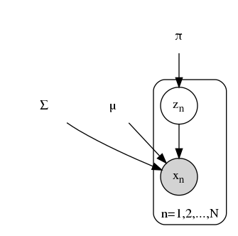

# 	CH09 EM算法及其推广

[TOC]

## 前言

### 章节目录

1. EM算法的引入
   1. EM算法
   1. EM算法的导出
   1. EM算法在非监督学习中的应用
1. EM算法的收敛性
1. EM算法在高斯混合模型学习中的应用
   1. 高斯混合模型
   1. 高斯混合模型参数估计的EM算法
1. EM算法的推广
   1. F函数的极大极大算法

### 导读

- **概率模型**有时既含有观测变量，又含有隐变量或潜在变量。这句很重要。

- 这章如果看三硬币有疑问，可以往后继续看，看到高斯混合模型，然后再回头理解三硬币。有不理解的地方，可以重新看对应问题的定义，重新理解各个符号的意义，因为这章开始，需要分析的问题和之前的分类问题有差异，任务不同了要理解需求。希望对学习有帮助。

- EM算法可以用于**生成模型**的非监督学习，EM算法是个一般方法，不具有具体模型。

  > EM算法是一种迭代算法，用于含有隐变量的概率模型的极大似然估计，或极大后验概率估计。

  本书[CH12](../CH12/README.md)在对比各种模型的策略的时候，从这章开始，学习策略都是MLE，损失函数都是对数似然损失。体现了这一类问题的共性与联系。

- 这里面注意体会不同变量的大小以及对应的取值范围。

- 一个$m\times n\times k$的矩阵可能可以划分成$n$个$m\times k$的形式，这点理解下。

- 涉及混合模型的部分推导有很多求和，注意体会是按照**样本**做的，还是按照**模型**做的，也就是操作的域

- 如果对PDF，高斯分布，边缘概率分布，协方差矩阵不清楚，可以在这个章节从GMM的角度扩展阅读下，一定会有收获。

- 似然和概率的关系可以推广了解，这章关于概率和似然的符号表示，可能会有点看不懂，比如$P_{157}$中的部分表述。可以参考引用内容[^3], 概率和似然是同样的形式描述的都是**可能性**，$P(Y|\theta)$是一个两变量的函数，似然是给定结果，求参数可能性；概率是给定参数求结果可能性。

  > Suppose you have a probability model with parameters $\theta$.
  > $p(x|\theta)$ has two names.
  > It can be called the **probability of $x$** (given $\theta$),
  > or the **likelihood of $\theta$** (given that $x$  was observed).

- 学习过程中注意**观测数据**在EM算法每次迭代中的意义。

- GMM中注意区分$\alpha_k$和$\gamma_{jk}$的差异，直觉上都有一种归属的感觉，$\gamma_{jk}$是二值函数，$\alpha_k$是一种概率的表示。$\gamma_{jk}$是one-hot encoding(also: 1-of-K representation)，还有$\hat\gamma_{jk}$这个是个估计注意和$\gamma_{jk}$的关系

- GMM这里面实际上还涉及到一个概念叫做凸组合(Convex Combination)[^4]，是凸几何领域的一个概念，点的线性组合，所有系数都非负且和为1。点集的凸包等价于该点集的凸组合。

- 无论是三硬币还是GMM，采样的过程都是如下:

  > 1. Sample $z_i \sim p(z|\pi)$
  > 1. Sample $x_i \sim p(x|\pi)$

  注意，这里用到了$\pi$，在强化学习中，随机性策略$\pi(x,a)$表示为状态$x$下选择动作$a$的概率。

- 关于EM算法的解释
  注意这里EM不是模型，是个一般方法，不具有具体的模型，这点前面已经提到

  1. PRML
     $kmeans \rightarrow GMM \rightarrow EM$
     所以，EM应用举例子为kmeans也OK。而且，西瓜书$P_{165}$上有说， `k均值聚类算法就是一个典型的EM算法`
  1. 统计学习方法
     1. $MLE \rightarrow B$
     1. $F$函数的极大-极大算法

- 这个repo里面实现了BMM算法和GMM算法两种混合模型

- HMM也是Discrete **Dynamic Model**，从图模型角度考虑，可以发现HMM和卡尔曼滤波以及粒子滤波深层之间的联系。这部分内容在PRML中有讨论。

- 书中图9.1说一下，可以参考[CH08](../CH08/README.md)的部分内容，关于Bregman distance的那部分说明。

- HMM作了两个基本假设，实际上是在说在图模型中，存在哪些**边**。

### 符号说明

> 一般地，用$Y$表示观测随机变量的数据，$Z$表示隐随机变量的数据。$Y$和$Z$一起称为**完全数据**(complete-data)，观测数据$Y$又称为**不完全数据**(incomplete-data)

上面这个概念很重要，Dempster在1977年提出EM算法的时候文章题目就是《Maximum likelihood from incomplete data via the EM algorithm》，具体看书中本章参考文献[^3]

>假设给定观测数据$Y$，其概率分布是$P(Y|\theta)$，其中$\theta$是需要估计的模型参数
>那么不完全数据$Y$的似然函数是$P(Y|\theta)$，对数似然函数是$L(\theta)=\log P(Y|\theta)$
>
>假设$Y$和$Z$的联合概率分布是$P(Y,Z|\theta)$，那么完全数据的对数似然函数是$\log P(Y,Z|\theta)$

上面这部分简单对应一下，这里说明一下，你看到下面概率分布和似然函数形式看起来一样。在概率中，$\theta$已知, 求$Y$，在似然函数中通过已知的Y去求$\theta$

|   |       |     |       |
| - | - | - | - |
|   | 观测数据$Y$ | 不完全数据$Y$ |   |
| 不完全数据$Y$ | 概率分布$P(Y|\theta)$ | 似然函数$P(Y|\theta )$ | 对数似然函数$\log P(Y|\theta)$ |
| 完全数据 $(Y, Z)$ | $Y$和$Z$的联合概率分布$P(Y,Z|\theta )$ | 似然函数$P(Y,Z|\theta)$ | 对数似然函数$\log P(Y,Z|\theta)$|

7hb 观测数据$Y$

有一点要注意下, 这里没有出现$X$, 在**9.1.3**节中有提到一种理解

> - 有时训练数据只有输入没有对应的输出${(x_1,\cdot),(x_2,\cdot),\dots,(x_N,\cdot)}$，从这样的数据学习模型称为非监督学习问题。
> - EM算法可以用于生成模型的非监督学习。
> - 生成模型由联合概率分布$P(X,Y)$表示，可以认为非监督学习训练数据是联合概率分布产生的数据。$X$为观测数据， $Y$为未观测数据。

有时候，只观测显变量看不到关系，就需要把隐变量引进来。

## 混合模型

书中用三硬币模型做为引子，在学习这部分内容的时候，注意体会观测数据的作用。

### 伯努利混合模型(三硬币模型)

#### 问题描述

书中用例子来介绍EM算法的问题，并给出了EM算法迭代求解的过程，具体例子描述见**例9.1**，这块如果不懂，可以跳过，看完后面高斯混合模型再回来看。

问题的描述过程中有这样一句：独立的重复$n$次实验(这里$n=10$)，观测结果如下:

`1,1,0,1,0,0,1,0,1,1`

思考上面这个观测和`1,1,1,1,1,1,0,0,0,0`有区别么?

没有任何信息的前提下，我们得到上面的观测数据可以假定是一个**二项分布**的形式，参数$n=10, p=0.6$

把$k=6$次成功分布在$n=10$次试验中有$C(10,6)$种可能.

所以上面两个观测序列，可能出自同一个模型。在这个问题的求解上是没有区别的，测试案例$test\_t91$做了这个说明，可以参考。

我们通过一段代码来生成这个数据

```python
import numpy as np Engine

p = 0.6
n = 10
# np.random.seed(2018)
flag_a = 1
flag_b = 1
cnt = 0
while flag_a or flag_b:
    tmp = np.random.binomial(1, p, n)
    if (tmp == np.array([1,1,1,1,1,1,0,0,0,0])).all():
        flag_a = 0
        print("[1,1,1,1,1,1,0,0,0,0] at %d\n" % cnt)
    if (tmp == np.array([1,1,0,1,0,0,1,0,1,1])).all():
        flag_b = 0
        print("[1,1,0,1,0,0,1,0,1,1] at %d\n" % cnt)
    cnt += 1
```

实际上题目的描述中说明了观测数据生成的过程，这些参数是未知的，所以需要对这些参数进行估计。

解的过程记录在这里。

三硬币模型可以写作
$$
\begin{equation}
        \begin{aligned}
            P(y|\theta)&=\sum_z P(y,z|\theta) \\
            &=\sum_z P(z|\theta)P(y|z,\theta) \\
            &=\pi p^y (1-p)^{1-y} + (1-\pi)q^y(1-q)^{1-y}
        \end{aligned}
\end{equation}
$$
以上

1. 随机变量$y$是观测变量，表示一次试验观测的结果是**1或0**
1. 随机变量$z$是隐变量，表示未观测到的掷硬币$A$的结果
1. $\theta=(\pi,p,q)$是模型参数
1. 这个模型是**以上数据**(1,1,0,1,0,0,1,0,1,1)的生成模型

观测数据表示为$Y=(Y_1, Y_2, Y_3, \dots, Y_n)^T$, 未观测数据表示为$Z=(Z_1,Z_2, Z_3,\dots, Z_n)^T$, 则观测数据的似然函数为

> 其实觉得这里应该是小写的$y=(y_1,y_2,\dots,y_n), z=(z_1, z_2, \dots,z_n)$
$$
P(Y|\theta) = \sum\limits_{Z}P(Z|\theta)P(Y|Z,\theta)
$$
注意这里的求和是下面的"+"描述的部分

即
$$
P(Y|\theta)=\prod\limits^{n}_{j=1}[\pi p^{y_j}(1-p)^{1-y_j}+(1-\pi)q^{y_j}(1-q)^{1-y_j}]
$$
注意这里连乘是$Y\rightarrow y_j$出来的, 不理解看似然定义.

考虑求模型参数$\theta=(\pi,p,q)$的极大似然估计, 即
$$
\hat \theta = \arg\max\limits_{\theta}\log P(Y|\theta)
$$
这个题目的标准答案实际上也是未知的，因为可能生成这样的观测的假设空间太大。

#### 三硬币模型的EM算法

##### 1.初值

EM算法首选参数初值，记作$\theta^{(0)}=(\pi^{(0)},p^{(0)}, q^{(0)})$, 然后迭代计算参数的估计值。

如果第$i$次迭代的模型参数估计值为$\theta^{(i)}=(\pi^{(i)}, p^{(i)}, q^{(i)})$

##### 2.E步

那么第$i+1$ 次迭代的模型参数估计值表示为
$$
\mu_j^{i+1} = \frac{\pi^{(i)}(p^{(i)})^{y_j}(1-p^{(i)})^{1-y_j}}{\pi^{(i)}(p^{(i)})^{y_j}(1-p^{(i)})^{1-y_j} + (1-\pi^{(i)})(q^{(i)})^{y_j}(1-q^{(i)})^{1-y_j}}
$$
因为是硬币，只有0，1两种可能，所有有上面的表达。

这个表达方式还可以拆成如下形式
$$
\mu_j^{i+1} =
\begin{cases}
\frac{\pi^{(i)}p^{(i)}}{\pi^{(i)}p^{(i)} + (1-\pi^{(i)})q^{(i)}}&, y_j = 1\\
\frac{\pi^{(i)}(1-p^{(i)})}{\pi^{(i)}(1-p^{(i)}) + (1-\pi^{(i)})(1-q^{(i)})}&, y_j = 0\\
\end{cases}
$$
所以, 这步(求$\mu_j$)干了什么，样本起到了什么作用？

 这一步，通过假设的参数，计算了不同的样本对假设模型的响应($\mu_j$)，注意这里因为样本($y_j$)是二值的，所以，用$\{y_j, 1-y_j\}$ 构成了one-hot的编码，用来表示样本归属的假设。

以上，有点绕。

这一步是什么的期望？书中有写，**观测数据来自硬币$B$的概率, 在二项分布的情况下, 响应度和概率是一个概念. **这个说明，有助于后面M步公式的理解。

##### 3.M步

$$
\begin{align}
\pi^{(i+1)} &= \frac{1}{n}\sum_{j=1}^{n}\mu_j^{(i+1)}\\
\color{red}
p^{(i+1)} &= \frac{\sum_{j=1}^{n}\mu_j^{(i+1)}y_j}{\sum_{j=1}^{n}\mu_j^{(i+1)}}\\
\color{red}
q^{(i+1)} &= \frac{\sum_{j=1}^{n}(1-\mu_j^{(i+1)})y_j}{\sum_{j=1}^{n}(1-\mu_j^{(i+1)})}
\end{align}
$$
上面，红色部分的公式从`观测数据是来自硬币B的概率`这句来理解。

##### 初值影响

这个例子里面0.5是个合理又牛逼的初值。迭代收敛的最后结果是(0.5, 0.6, 0.6)

这个结果说明，如果A是均匀的，那么一个合理的解就是B，C是同质的。他们的分布情况和观测的分布一致。

在测试案例$test\_e91$中有计算这部分的结果，注意看，这种简单的模型其实收敛的很快。

##### p,q 含义

这里面p对应了A =1，B=1，q对应了A=0，C=1

这三个公式可以改写成如下形式:
$$
\begin{align}
\pi^{(i+1)} &= \frac{1}{n}\sum_{j=1}^{n}\mu_j^{(i+1)}\\
\color{red}
p^{(i+1)} &= \frac{\sum_{j=1}^{n}\mu_j^{(i+1)}y_j}{\sum_{j=1}^{n}(\mu_j^{(i+1)}y_j+\mu_j^{(i+1)}(1-y_j)}\\
\color{red}
q^{(i+1)} &= \frac{\sum_{j=1}^{n}(1-\mu_j^{(i+1)})y_j}{\sum_{j=1}^{n}((1-\mu_j^{(i+1)})y_j+(1-\mu_j^{(i+1)})(1-y_j))}
\end{align}
$$
$\pi$的表达式回答这样一个问题:  刷了这么多样本，拿到一堆数，那么$\pi$应该是多少，均值十个比较好的选择。

$p$的表达式回答这样一个问题:  如果我知道每个结果$y_j$以$\mu_j$的可能来自硬币B(A=1)，那么用这些数据刷出来他可能是正面的概率。这里面$\mu_j$对应了$A=1$

$q$的表达式同理，其中$1-\mu_j$对应了$A=0$

到后面讲高斯混合模型的时候，可以重新审视这里
$$
\begin{aligned}
\alpha_0& \leftrightarrow \pi \\
\mu_0& \leftrightarrow p^{y_j}(1-p)^{1-y_j}\\
\alpha_1& \leftrightarrow 1-\pi\\
\mu_1& \leftrightarrow q^{y_j}(1-q)^{1-y_j}
\end{aligned}
$$
以上对应了包含两个分量的伯努利混合模型, BMM, 包含四个参数, 因为$\alpha_k$满足等式约束, 所以通常会有三个参数, 另外参见习题$9.3$中有提到`两个分量的高斯混合模型的五个参数`实际上也是因为等式约束.

[bmm.py](bmm.py)对伯努利混合模型做了实现, 有几点说明一下:

1. $(p^{(i)})^{y_i}(1-p^{(i)})^{1-y_i}$这个表达式对应了伯努利分布的概率密度, 可以表示成矩阵乘法, 尽量不要用for, 效率会差

1. 书中$e_{91}$的表达中, 采用了$\pi, p, q$来表示, 注意在题目的说明部分有说明三个符号的含义

1. 实际上不怎么抛硬币, 但是0-1的伯努利分布很多, 在书中算法9.4部分, 有这样一个说明:

   > 当参数$\theta$的维数为$d(d\ge2 )$的时候, 可以采用一种特殊的GEM算法, 它将算法的M步分解成d次条件极大化, 每次只改变参数向量的一个分量,其余量不改变.

### EM算法另外视角

> 输入: 观测变量数据$Y$，隐变量数据$Z$，联合分布$P(Y,Z|\theta)$，条件分布$P(Z|Y,\theta)$
>
> 输出: 模型参数$\theta$
>
> 1. 选择参数的初值$\theta^{(0)}$，开始迭代
>
> 1. E步：记$\theta^{(i)}$为第 $i$ 次迭代参数$\theta$的估计值，在第$i+1$次迭代的$E$步，计算
> $$
> \begin{align}
> Q(\theta, \theta^{(i)}) =& E_Z[\log P(Y,Z|\theta)|Y,\theta^{(i)}]\\
> =&\sum_Z\color{red}\log P(Y,Z|\theta)\color{green}P(Z|Y, \theta^{(i)})
> \end{align}
> $$
>
> 3. M步
>    求使$Q(\theta, \theta^{(i)})$最大化的$\theta$，确定第$i+1$次迭代的参数估计值
>
> $$
> \theta^{(i+1)}=\arg\max_\theta Q(\theta, \theta^{(i)})
> $$
>

#### Q 函数

注意Q函数的定义，可以帮助理解上面E步中的求和表达式

完全数据的**对数似然函数$\log P(Y, Z|\theta)$关于**给定观测数据$Y$的当前参数$\theta^{(i)}$下对为观测数据$Z$的**条件概率分布$P(Z|Y,\theta^{(i)})$的期望**称为Q函数。

#### BMM的EM算法

> 输入: 观测变量数据$y_1, y_2, \dots, y_N$, 伯努利混合模型
>
> 输出: 伯努利混合模型参数
>
> 1. 选择参数的初始值开始迭代, $2K$ 个参数
> 1. E步:
> $$\hat\gamma_{jk}=\frac{\alpha_kBern(y_j|\theta_k)}{\sum_{k=1}^K\alpha_kBern(y_j|\theta_k)}=\frac{\alpha_k\mu_k^{y_j}(1-\mu_k)^{1-y_j}}{\sum_{k=1}^K\alpha_k\mu_k^{y_j}(1-\mu_k)^{1-y_j}}, j=1,2,\dots,N; k=1,2,\dots,K$$
> 1. M步:
> $$\hat\mu_k=\frac{\sum_{j=1}^N\hat\gamma_{jk}y_j}{\sum_{j=1}^N\hat\gamma_{jk}}\\
> \hat\alpha_k=\frac{n_k}{N}$$

#### 目标函数L

$$
L(\theta)=\log P(Y|\theta)=\log \sum_Z P(Y,Z|\theta)=\log(\sum_Z P(Y|Z,\theta)P(Z|\theta))
$$

目标函数是不完全数据的对数似然

#### EM算法导出

书中这部分内容回答为什么EM算法能近似实现对观测数据的极大似然估计？
$$
\begin{align}
L(\theta)-L(\theta^{(i)})&=\log \left(\sum_Z\color{green}P(Y|Z,\theta^{(i)})\color{black}\frac{P(Y|Z,\theta)P(Z|\theta)}{\color{green}P(Y|Z,\theta^{(i)})}\color{black}\right)-\log P(Y|\theta^{(i)})\\
&\ge\sum_Z \color{green}P(Z|Y,\theta^{(i)})\color{black}\log \frac{P(Y|Z,\theta)P(Z|\theta)}{\color{green}P(Z|Y,\theta^{(i)})\color{black}}-\log P(Y|\theta^{(i)})\\
&=\sum_Z P(Z|Y,\theta^{(i)})\log \frac{P(Y|Z,\theta)P(Z|\theta)}{P(Z|Y,\theta^{(i)})}-\color{red}\sum_ZP(Z|Y,\theta^{(i)})\color{black}\log P(Y|\theta^{(i)})\\
&=\sum_ZP(Z|Y,\theta^{(i)})\log \frac{P(Y|Z,\theta)P(Z|\theta)}{P(Z|Y,\theta^{(i)})P(Y|\theta^{(i)})}
\end{align}
$$

以上用于推导迭代过程中两次$L$会变大， 这里面红色部分是后加的方便理解前后两步之间的推导。绿色部分是为了构造期望， 进而应用琴声不等式。在这里凑项应该是凑$P(Z|Y,\theta^{(i)})$，书中这部分可能是笔误。

这里也写一下琴声不等式
$$
\log \sum_j \lambda_j y_j \ge \sum_j \lambda_j \log y_j, s.t., \lambda_j \ge 0, \sum_j \lambda_j = 1
$$
所以，这里的这一项不是随便凑的。

TODO:更新下这个图


### 高斯混合模型

**混合模型**，有多种，高斯混合模型是最常用的。

高斯混合模型(Gaussian Mixture Model)是具有如下**概率分布**的模型:
$$
P(y|\theta)=\sum\limits^{K}_{k=1}\alpha_k\phi(y|\theta_k)
$$
其中，$\alpha_k$是系数，$\alpha_k\ge0$，$\sum\limits^{K}_{k=1}\alpha_k=1$, $\phi(y|\theta_k)$ 是**高斯分布密度**，$\theta_k=(\mu,\sigma^2)$
$$
\phi(y|\theta_k)=\frac{1}{\sqrt{2\pi}\sigma_k}\exp\left(-\frac{(y-\mu_k)^2}{2\sigma_k^2}\right)
$$
上式表示第k个**分**模型。

以上, 注意几点：

1. GMM的描述是概率分布，形式上可以看成是加权求和
1. 加权求和的权重$\alpha$满足$\sum_{k=1}^K\alpha_k=1$的约束

1. 求和符号中除去权重的部分，是高斯分布密度(PDF)。高斯混合模型是一种$\sum(权重\times 分布密度)=分布$的表达
    高斯混合模型的参数估计是EM算法的一个重要应用，隐马尔科夫模型的非监督学习也是EM算法的一个重要应用。

1. 书中描述的是一维的高斯混合模型，d维的形式如下[^2]，被称作多元正态分布，也叫多元高斯分布
$$
\phi(y|\theta_k)=\frac{1}{\sqrt{(2\pi)^d|\Sigma|}}\exp\left(-\frac{(y-\mu_k)^T\Sigma^{-1}(y-\mu_k)}{2}\right)
$$
其中，协方差矩阵$\Sigma\in \R^{n\times n}$

5. 另外，关于高斯模型的混合，还有另外一种混合的方式，沿着时间轴的方向做混合。可以理解为滤波器，典型的算法就是Kalman Filter，对应了时域与频域之间的关系，两个高斯的混合依然是高斯，混合的方法是卷积，而不是简单的加法，考虑到的是概率密度的混合，也是一种线性的加权。

#### GMM的图模型

这个弄的不咋好看，plate notation



#### GMM的EM算法

问题描述:

已知观测数据$y_1, y_2, \dots , y_N$，由高斯混合模型生成
$$
P(y|\theta)=\sum_{k=1}^K\alpha_k\phi(y|\theta_k)
$$
其中， $\theta=(\alpha_1,\alpha_2,\dots,\alpha_K;\theta_1,\theta_2,\dots,\theta_K)$

补充下，不完全数据的似然函数应该是
$$
\begin{align}
P(y|\theta)=&\prod_{j=1}^NP(y_j|\theta)\\
=&\prod_{j=1}^N\sum_{k=1}^K\alpha_k\phi(y|\theta_k)
\end{align}
$$
使用EM算法估计GMM的参数$\theta$

##### 1. 明确隐变量, 初值

- 观测数据$y_j, j=1,2,\dots,N$这样产生, 是**已知的**:

  1. 依概率$\alpha_k$**选择第$k$个**高斯分布分模型$\phi(y|\theta_k)$;
  1. 依第$k$个分模型的概率分布$\phi(y|\theta_k)$生成观测数据$y_j$
  1. 反映观测数据$y_j$来自第$k$个分模型的数据是**未知的**, $k=1,2,\dots,K$ 以**隐变量$\gamma_{jk}$**表示
     **注意这里$\gamma_{jk}$的维度$(j\times k)$**
$$
  \gamma_{jk}=
  \begin{cases}
  1, &第j个观测来自第k个分模型\\
  0, &否则
  \end{cases}\\
  j=1,2,\dots,N; k=1,2,\dots,K; \gamma_{jk}\in\{0,1\}
$$
  注意, 以上说明有几个假设:

  1. 隐变量和观测变量的数据对应, 每个观测数据，对应了一个隐变量，$\gamma_{jk}$是一种one-hot的形式。
  1. 具体的单一观测数据是混合模型中的某一个模型产生的

- 完全数据为$(y_j,\gamma_{j1},\gamma_{j2},\dots,\gamma_{jK},k=1,2,\dots,N)$

- 完全数据似然函数
$$
\begin{aligned}
  P(y,\gamma|\theta)=&\prod_{j=1}^NP(y_j,\gamma_{j1},\gamma_{j2},\dots,\gamma_{jK}|\theta)\\
  =&\prod_{k=1}^K\prod_{j=1}^N\left[\alpha_k\phi(y_j|\theta_k)\right]^{\gamma_{jk}}\\
  =&\prod_{k=1}^K\alpha_k^{n_k}\prod_{j=1}^N\left[\phi(y_j|\theta_k)\right]^{\gamma_{jk}}\\
  =&\prod_{k=1}^K\alpha_k^{n_k}\prod_{j=1}^N\left[\frac{1}{\sqrt{2\pi}\sigma_k}\exp\left(-\frac{(y_j-\mu_k)^2}{2\sigma^2}\right)\right]^{\gamma_{jk}}\\
  \end{aligned}
$$
  其中$n_k=\sum_{j=1}^N\gamma_{jk}, \sum_{k=1}^Kn_k=N$

- 完全数据对数似然函数
$$
  \log P(y,\gamma|\theta)=\sum_{k=1}^K\left\{n_k\log \alpha_k+\sum_{j=1}^N\gamma_{jk}\left[\log \left(\frac{1}{\sqrt{2\pi}}\right)-\log \sigma_k -\frac{1}{2\sigma^2}(y_j-\mu_k)^2\right]\right\}
$$
##### 2. E步,确定Q函数

把$Q$ 函数表示成参数形式

$$\begin{aligned}Q(\theta,\theta^{(i)})=&E[\log P(y,\gamma|\theta)|y,\theta^{(i)}]\\=&\color{green}E\color{black}\left\{\sum_{k=1}^K\left\{\color{red}n_k\color{black}\log \alpha_k+\color{blue}\sum_{j=1}^N\gamma _{jk}\color{black}\left[\log \left(\frac{1}{\sqrt{2\pi}}\right)-\log \sigma _k-\frac{1}{2\sigma^2(y_j-\mu_k)^2}\right]\right\}\right\}\\=&\color{green}E\color{black}\left\{\sum_{k=1}^K\left\{\color{red}\sum_{j=1}^N\gamma_{jk}\color{black}\log \alpha_k+\color{blue}\sum_{j=1}^N\gamma _{jk}\color{black}\left[\log \left(\frac{1}{\sqrt{2\pi}}\right)-\log \sigma _k-\frac{1}{2\sigma^2(y_j-\mu_k)^2}\right]\right\}\right\}\\=&\sum_{k=1}^K\left\{\color{red}\sum_{j=1}^{N}(\color{green}E\color{red}\gamma_{jk})\color{black}\log \alpha_k+\color{blue}\sum_{j=1}^N(\color{green}E\color{blue}\gamma _{jk})\color{black}\left[\log \left(\frac{1}{\sqrt{2\pi}}\right)-\log \sigma _k-\frac{1}{2\sigma^2(y_j-\mu_k)^2}\right]\right\}\\\end{aligned}$$

$$\begin{aligned}\hat \gamma _{jk}= &\color{purple}E(\gamma_{jk}|y,\theta)=P(\gamma_{jk}=1|y,\theta)\\=&\frac{P(\gamma_{jk}=1,y_j|\theta)}{\sum_{k=1}^KP(\gamma_{jk}=1,y_j|\theta)}\\=&\frac{P(y_j|\color{red}\gamma_{jk}=1,\theta\color{black})\color{green}P(\gamma_{jk}=1|\theta)}{\sum_{k=1}^KP(y_j|\gamma_{jk}=1,\theta)P(\gamma_{jk}=1|\theta)}\\=&\frac{\color{green}\alpha_k\color{black}\phi(y_j|\color{red}\theta_k)}{\sum_{k=1}^K\alpha_k\phi(y_j|\theta_k)}\end{aligned}$$

   这部分内容就是搬运了书上的公式，有几点说明:

1. 注意这里$E(\gamma_{jk}|y,\theta)$，记为$\hat\gamma_{jk}$， 对应了E步求的**期望**中的一部分。
1. 对应理解一下上面公式中的红色，蓝色和绿色部分，以及$\hat\gamma_{jk}$中红色和绿色的对应关系
1. 这里用到了$n_k=\sum_{j=1}^N\gamma_{jk}$
1. $\hat \gamma_{jk}$为分模型$k$对观测数据$y_j$的响应度。这里，紫色标记的第一行参考伯努利分布的期望。

$$Q(\theta,\theta^{(i)})=\sum_{k=1}^Kn_k\log \alpha_k+\sum_{j=1}^N\hat \gamma_{jk}\left[\log \left(\frac{1}{\sqrt{2\pi}}\right)-\log \sigma_k-\frac{1}{2\sigma_k^2}(y_j-\mu_k)^2\right]$$
其中$i$表示第$i$步迭代

1. 写出$Q$ 函数在推导的时候有用，但是在程序计算的时候，E步需要计算的就是$\hat\gamma_{jk}$，M步用到了这个结果。其实抄公式没有什么意义，主要是能放慢看公式的速度。和图表一样，公式简洁的表达了很多信息，公式中也许更能体会到数学之美。

##### 3. M步

求函数$Q(\theta,\theta^{(i)})$对$\theta$的极大值，分别求$\sigma, \mu, \alpha$
$$
\theta^{(i+1)}=\arg\max_\theta Q(\theta,\theta^{(i)})
$$

- $\arg\max$ 就是求Q的极值对应的参数$\theta$，如说是离散的，遍历所有值，最大查找，如果是连续的，偏导为零求极值。
- $\frac {\partial Q}{\partial \mu_k}=0, \frac {\partial{Q}}{\partial{\sigma^2}}= 0$  得到$\hat\mu_k, \hat \sigma_k^2$
- $\sum_{k=1}^K\alpha_k=1, \frac{\partial{Q}}{\partial{\alpha_k}}=0$ 得到$\alpha_k$

##### 4. 停止条件

重复以上计算，直到对数似然函数值不再有明显的变化为止。

#### 算法9.2

这部分摘要总结了前面的公式。

因为公式比较集中，方便对比，注意体会以下两个方面:

1. 这几个公式中待求的变量的维度和角标的关系。
1. 这里面有求和，前面提到过要注意体会每一步刷的是模型，还是样本

#### GMM在CV中的应用

其实CV中用到了很多统计的方法，GMM在GrabCut方法中用于前景和背景建模。

### Kmeans

另外，直觉上看，GMM最直观的想法就是Kmeans，那么:

1. 在Kmeans常见的描述中都有距离的概念，对应在算法9.2 的描述中，该如何理解?
   这里面距离对应了方差，二范数平方。
1. 那么又是怎么在每轮刷过距离之后，重新划分样本的分类呢?
   这里对应了响应度，响应度对应了一个$j \times k$的矩阵，记录了每一个$y_j$ 对第$k$个模型的响应度，可以理解为划分了类别。

#### K怎么定

- 手肘法
- Gap Statistics[^1]

### 广义期望极大

广义期望极大(generalized expectation maximization, $GEM$)

广义期望极大是为了解决什么问题？

看名字是为了通用解决方案吧

## 其他

### 习题9.3
GMM模型的参数($\alpha _k, \mu _k, \sigma^2_k $)应该是$3k$个，题目9.3中提出两个分量的高斯混合模型的5个参数，是因为参数$\alpha_k$满足$\sum_{k=1}^K\alpha _k=1$

### 习题9.4

EM算法用到朴素贝叶斯的非监督学习，就是说没有标注的数据。	

这个题目可以参考https://ttic.uchicago.edu/~suriya/website-intromlss2018/course_material/Day10a.pdf

## 参考

1. [^3]: [Maximum-likelihood from incomplete data via the EM algorithm](-)

2. [EM Algorithm](https://en.wikipedia.org/wiki/Expectation%E2%80%93maximization_algorithm)

3. [Sklearn Gaussian Mixed Model](http://scikit-learn.org/stable/modules/mixture.html)

4. [^1]: [Gap Statistics](https://web.stanford.edu/~hastie/Papers/gap.pdf)

5. [^2]: [多元正态分布](https://zh.wikipedia.org/wiki/%E5%A4%9A%E5%85%83%E6%AD%A3%E6%80%81%E5%88%86%E5%B8%83)

6. [mml]([https://mml-book.com](https://mml-book.com/))

7. [^3 ]: [probability and likelihood](https://www.quora.com/What-is-the-difference-between-probability-and-likelihood-1/answer/Jason-Eisner)

8. [^4]: [Convex Combination](https://en.wikipedia.org/wiki/Convex_combination)

**[⬆ top](#导读)**
