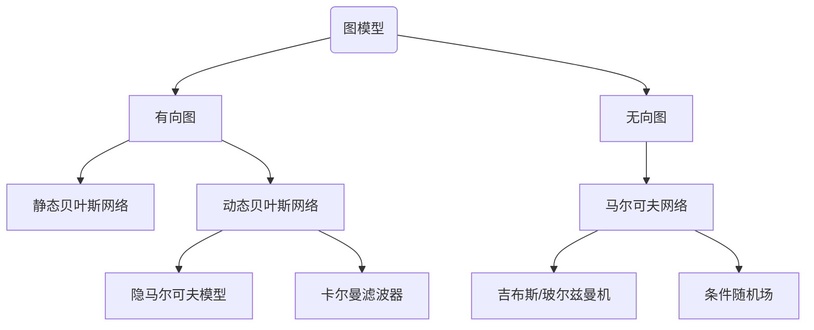
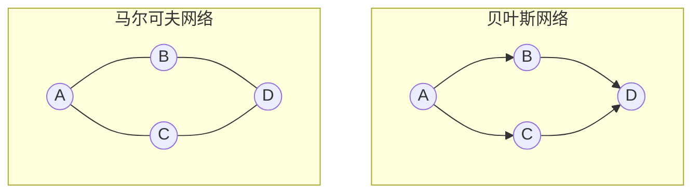

# CH10 隐马尔科夫模型

## 前言

本章目录结构如下

1. 隐马尔可夫模型的基本概念
   1. 隐马尔可夫模型的定义
   1. 观测序列的生成过程
   1. 隐马尔可夫模型的三个基本问题
1. 概率计算方法
   1. 直接计算法
   1. 前向算法
   1. 后向算法
   1. 一些概率与期望值的计算
1. 学习算法
   1. 监督学习方法
   1. Baum-Welch算法
   1. Baum-Welch模型参数估计公式
1. 预测算法
   1. 近似算法
   1. 维特比算法

动态贝叶斯网络的最简单实现隐马尔可夫模型. HMM可以看成是一种推广的混合模型.

序列化建模, 打破了数据独立同分布的假设.

有些关系需要理清

另外一个图

另外, 注意一点, 在李老师这本书上介绍的HMM, 涉及到举例子的, 给的都是观测概率矩阵是离散的情况, 对应了MultinominalHMM. 而这个观测概率矩阵是可以为连续的分布的, 比如高斯模型, 对应了GaussianHMM. 具体课可以参考hmmlearnb库[^2].

## 概念

有些基本的概念, 引用吴军在数学之美[^1]之中的描述. 

### 随机变量与随机过程

>19世纪, 概率论的发展从对(相对静态的)**随机变量**的研究发展到对随机变量的时间序列$s_1,s_2, s_3, \dots,s_t,\dots$,即**随机过程**(动态的)的研究
>
>数学之美,吴军

### 马尔可夫链

>随机过程有两个维度的不确定性. 马尔可夫为了简化问题, 提出了一种简化的假设, 即随机过程中各个状态$s_t$的概率分布, 只与它的前一个状态$s_{t-1}$有关, 即$P(s_t|s_1, s_2, s_3, \dots,s_{t-1})=P(s_t|s_{t-1})$
>
>这个假设后来被称为**马尔可夫假设**,而符合这个假设的随机过程则称为**马尔可夫过程**, 也称为**马尔可夫链**.
>
>数学之美, 吴军

$$
P(s_t|s_1, s_2, s_3, \dots,s_{t-1})=P(s_t|s_{t-1})
$$

时间和状态取值都是离散的马尔可夫过程也称为马尔可夫链.

### 隐含马尔可夫模型

$$
P(s_1,s_2,s_3,\dots,o_1,o_2,o_3,\dots)=\prod_tP(s_t|s_{t-1})\cdot P(o_t|s_t)
$$

隐含的是**状态**$s$

隐含马尔可夫模型由**初始概率分布**(向量$\pi$), **状态转移概率分布**(矩阵$A$)以及**观测概率分布**(矩阵$B$)确定.

隐马尔可夫模型$\lambda$ 可以用三元符号表示, 即
$$
\lambda = (A, B, \pi)
$$

其中$A,B,\pi$称为模型三要素.

 

### 两个基本假设

1. 齐次马尔科夫假设(**状态**)
   $$
   P(i_t|i_{t-1},o_{t-1},\dots,i_1,o_1) = P(i_t|i_{t-1}), t=1,2,\dots,T
   $$
   注意书里这部分的描述

   >假设隐藏的马尔可夫链在**任意时刻$t$的状态**$\rightarrow i_t$
   >
   >只依赖于其前一时刻的状态$\rightarrow i_{t-1}$
   >
   >与其他时刻的状态 $\rightarrow i_{t-1, \dots, i_1}$
   >
   >及观测无关 $\rightarrow o_{t-1},\dots,o_1$
   >
   >也与时刻$t$无关 $\rightarrow t=1,2,\dots,T$

   如此烦绕的一句话, 用一个公式就表示了, 数学是如此美妙.

1. 观测独立性假设(**观测**)
   $$
   P(o_t|i_T,o_T,i_{T-1},o_{T-1},\dots,i_{t+1},o_{t+1},i_t,i_{t-1},o_{t-1},\dots,i_1,o_1)=P(o_t|i_t)
   $$
   书里这部分描述如下

   > 假设**任意时刻$t$的观测**$\rightarrow o_t$
   >
   > 只依赖于该时刻的马尔可夫链的状态 $\rightarrow i_t$
   >
   > 与其他观测  $\rightarrow o_T,o_{T-1},\dots,o_{t+1},o_{t-1},\dots,o_1$
   >
   > 及状态无关 $\rightarrow i_T,i_{T-1},\dots,i_{t+1},i_{t-1},\dots,i_1$

   李老师这个书真的是无废话

### 三个基本问题

1. 概率计算问题
   输入: 模型$\lambda=(A,B,\pi)$, 观测序列$O=(o_1,o_2,\dots,o_T)$
   输出: $P(O|\lambda)$
1. 学习问题
   输入: 观测序列 $O=(o_1,o_2,\dots,o_T)$
   输出: 输出$\lambda=(A,B,\pi)$
1. 预测问题, 也称为解码问题
   输入: 模型$\lambda=(A,B,\pi)$, 观测序列$O=(o_1,o_2,\dots,o_T)$ 
   输出: 状态序列 $I=(i_1,i_2,\dots,i_T)$

>There are three fundamental problems for HMMs:
>
>- Given the model parameters and observed data, estimate the optimal sequence of hidden states.
>- Given the model parameters and observed data, calculate the likelihood of the data.
>- Given just the observed data, estimate the model parameters.
>
>The first and the second problem can be solved by the dynamic programming algorithms known as the Viterbi algorithm and the Forward-Backward algorithm, respectively. The last one can be solved by an iterative Expectation-Maximization (EM) algorithm, known as the Baum-Welch algorithm.
>
>---hhmlearn

## 算法

### 前向与后向算法

#### 前向概率与后向概率

>给定马尔可夫模型$\lambda$, 定义到时刻$t$部分观测序列为$o_1, o_2, \dots ,o_t$, 且状态$q_i$的概率为**前向概率**, 记作
>$$
>\alpha_t(i)=P(o_1,o_2,\dots,o_t,i_t=q_i|\lambda)
>$$
>给定马尔可夫模型$\lambda$, 定义到时刻$t$状态为$q_i$的条件下, 从$t+1$到$T$的部分观测序列为$o_{t+1}, o_{t+2}, \dots ,o_T$的概率为**后向概率**, 记作
>$$
>\beta_t(i)=P(o_{t+1},o_{t+2},\dots,o_T|i_t=q_i, \lambda)
>$$
>$\color{red} 关于\alpha 和\beta 这两个公式,  仔细看下, 细心理解.$
>

#### 前向算法

> 输入: $\lambda , O$
>
> 输出:$P(O|\lambda)$
>
> 1. 初值
>    $$
>    \alpha_1(i)=\pi_ib_i(o_1), i=1,2,\dots,N
>    $$
>    观测值$o_1$, $i$的含义是对应状态$q_i$
>
>    这里$\alpha$ 是$N$维向量, 和状态集合$Q$的大小$N$有关系. $\alpha$是个联合概率.
>
> 1. 递推 
>    $$
>    \color{red}\alpha_{t+1}(i) = \left[\sum\limits_{j=1}^N\alpha_t(j)a_{ji}\right]b_i(o_{t+1})\color{black}, \   i=1,2,\dots,N, \ t = 1,2,\dots,T-1
>    $$
>    转移矩阵$A$维度$N\times  N$,  观测矩阵$B$维度$N\times M$, 具体的观测值$o$可以表示成one-hot形式, 维度$M\times1$, 所以$\alpha$的维度是$\alpha = \alpha ABo=1\times N\times N\times N \times N\times M \times M\times N=1\times N$
>
> 1. 终止
>    $$
>    P(O|\lambda)=\sum\limits_{i=1}^N\alpha_T(i)
>    $$
>    注意, 这里$O\rightarrow (o_1, o_2, o_3,\dots, o_t)$, $\alpha_i$见前面前向概率的定义$P(o_1,o_2,\dots,o_t,i_t=q_i|\lambda)$, 所以, 对$i$求和能把联合概率中的$I$消掉.
>
>    这个书里面解释的部分有说. 

>  书中有说前向算法的关键是其局部计算前向概率,  然后利用路径结构将前向概率"递推"到全局.
>
> 减少计算量的原因在于每一次计算直接引用前一时刻的计算结果, **避免重复计算**.

前向算法计算$P(O|\lambda)$的复杂度是$O(N^2T)$阶的, 直接计算的复杂度是$O(TN^T)$阶, 所以$T=2$时候并没什么改善.

#### 后向算法

> 输入: $\lambda , O$
>
> 输出:$P(O|\lambda)$
>
> 1. 终值
>    $$
>    \beta_T(i)=1, i=1,2,\dots,N
>    $$
>    在$t=T$时刻, 观测序列已经确定.
>
> 1. 递推
>    $$
>    \color{red}\beta_t(i)=\sum\limits_{j=1}^Na_{ij}b_j(o_{t+1})\beta_{t+1}(j)\color{black}, i=1,2,\dots,N, t=T-1, T-2,\dots,1
>    $$
>    从后往前推
>     $\beta = ABo\beta = N \times N \times N \times M \times M \times N \times N \times 1 = N \times 1$
>
> 1. 
>    $$
>    P(O|\lambda)=\sum\limits_{i=1}^N\pi_ib_i(o_1)\beta_1(i)
>    $$
>
>
>
>

#### 小结

>求解的都是**观测序列概率**
>观测序列概率$P(O|\lambda)$统一写成
>$$
>P(O|\lambda)=\sum_{i=1}^N\sum_{j=1}^N\alpha_t(i)a_{ij}b_j(o_{t+1}\beta_{t+1}(j)),\ t=1,2,\dots,T-1
>$$
>
>$P(O|\lambda) = \alpha ABo\beta$

前向后向主要是有这个关系:
$$
\alpha_t(i)\beta_t(i)=P(i_t=q_i,O|\lambda)
$$
当$t=1$或者$t=T-1$的时候, 单独用后向和前向就可以求得$P(O|\lambda)$

**概率与期望**

1. 输入模型$\lambda$与观测$O$, 输出在时刻$t$处于状态$q_i$的概率$\gamma_t(i)$
1. 输入模型$\lambda$与观测$O$, 输出在时刻$t$处于状态$q_i$且在时刻$t+1$处于状态$q_j$的概率$\xi_t(i,j)$
1. 在观测$O$下状态$i$出现的期望值
1. 在观测$O$下状态$i$转移的期望值
1. 在观测$O$下状态$i$转移到状态$j$的期望值

### Baum-Welch算法

### Viterbi算法

## 例子

### 例10.1

这个例子主要说明怎么从数据中拿到状态集合, 观测集合, 序列长度以及模型三要素.

分清楚哪些是已知, 哪些是推导得到.

书中描述也很清楚

> 这是一个隐马尔可夫模型的例子, 根据所给条件, 可以明确状态集合, 观测集合, 序列长度以及模型三要素.

恩, 例子干的就是这个事, 而这个小节叫做 隐马尔可夫模型的定义.

### 例10.2

这个例子就是递归的矩阵乘法

$$
\alpha = ABO
$$

### 例10.3

求最优状态序列

## 实际问题

### 手写数字生成

采样应用

隐马尔可夫模型的一个强大的性质是他对与时间轴上的局部的变形具有某种程度的不变性.

### 中文分词

有几个问题要弄清:

1. 怎么评价分词效果的好坏?
1. 模型参数训练的过程, 迭代应该在什么时候停止?

###

## 参考

1. [^1]: [数学之美-CH05隐含马尔可夫模型, 吴军]()

1. [^2]: [hhmlearn](https://hmmlearn.readthedocs.io/en/latest/tutorial.html)

1. [Wikipedia: Hidden Markov Model](https://en.wikipedia.org/wiki/Hidden_Markov_model)

1. 

