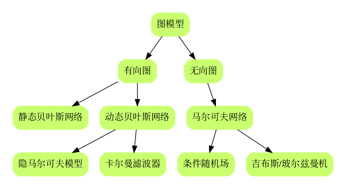
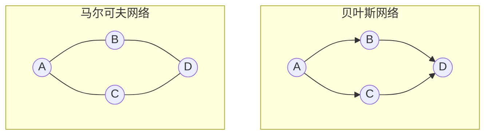

#                                                                                                                                                                                                                                                                                                                                                                                                                                                                                                                                                                                                                                                                                                                                                                                                                                                                                                                                                                                                                                                                                                                                                                                                                                                                                                                                                                                                                                                                                                                                                                                                                                                                                                                                                                                                                                                                                                                                                                                                                                                                                                                                                                                                                                                                                                                                                                                                                                                                                                                                                                                                                                                                                                                                                                                                                                                                                                                                                                                                                                                                                                                                                                                                                                                                                                                                                                                                                                                                                                                                                                                                                                                                                                                                                                                                                                                                                                                                                                                                                                                                                                                                                                                                                                                                                                                                                                                                                                                                                                                                                                                                                                                                                                                                                                                                                                                                                                                                                                                                                                                                                                                                                                                                                                                                                                                                                                                                                                                                                                                                                                                                                                                                                                                                                                                                                                                                                                                                                                                                                                                                                                                                                                                                                                                                                                                                                                                                                                                                                                                                                                                                                                                                                                                                                                                                                                                                                                                                                                                                                                                                                                                                                                                                                                                                                                                                                                                                                                                                                                                                                                                                                                                                                                                                                                                                                                                                                                                                                                                                                                                                                                                                                                                                                                                                                                                                                                                                                                                                                                                                                                                                                                                                                                                                                                                                                                                                                                                                                                                                                                                                                                                                                                                                                                                                                                                                                                                                                                                                                                                                                                                                                                                                                                                                                                                                                                                                                                                                                                                                                                                                                                                                                                                                                                                                                                                                                                                                                                                                                                                                                                                                                                                                                                                                                                                                                                                                                                                                                                                                                                                                                                                                                                                                                                                                                                                                                                                                                                                                                                                                                                                                                                                                                                                                                                                                                                                                                                                                                                                                                                                                                                                                                                                                                                                                                                                                                                                                                                                                                                                                                                                                                                                                                                                                                                                                                                                                                                                                                                                                                                                                                                                                                                                                                                                                                                                                                                                                                                                                                                                                                                                                                                                                                                                                                                                                                                                                                                                                                                                                                                                                                                                                                                                                                                                                                                                                                                                                                                                                                                                                                                                                                                                                                                                                                                                                                                                                                                                                                                                                                                                                                                                                                                                                                                                                                                                                                                                                                                                                                                                                                                                                                                                                                                                                                                                                                                                                                                                                                                                                                                                                                                                                                                                                                                                                                                                                                                                                                                                                                                                                                                                                                                                                                                                                                                                                                                                                                                                                                                                                                                                                                                                                                                                                                                                                                                                                                                                                                                                                                                                                                                                                                                                                                                                                                                                                                                                                                                                                                                                                                                                                                                                                                                                                                                                                                                                                                                                                                                                                                                                                                                                                                                                                                                                                                                                                                                                                                                                                                                                                                                                                                                                                                                                                                                                                                                                                                                                                                                                                                                                                                                                                                                                                                                                                                                                                                                                                                                                                                                                                                                                                                                                                                                                                                                                                                                                                                                                                                                                                                                                                                                                                                                                                                                                                                                                                                                                                                                                                                                                                                                                                                                                                                                                                                                                                                                                                                                                                                                                                                                                                                                                                                                                                                                                                                                                                                                                                                                                                                                                                                                                                                                                                                                                                                                                                                                                                                                                                                                                                                                                                                                                                                                                                                                                                                                                                                                                                                                                                                                                                                                                                                                                                                                                                                                                                                                                                                                                                                                                                                                                                                                                                                                                                                                                                                                                                                                                                                                                                                                                                                                                                                                                                                                                                                                                                                                                                                                                                                                                                                                                                                                                                                                                                                                                                                                                                                                                                                                                                                                                                                                                                                                                                                                                                                                                                                                                                                                                                                                                                                                                                                                                                                                                                                                                                                                                                                                                                                                                                                                                                                                                                                                                                                                                                                                                                                                                                                                                                                                                                                                                                                                                                                                                                                                                                                                                                                                                                                                                                                                                                                                                                                                                                                                                                                                                                                                                                                                                                                                                                                                                                                                                                                                                                                                                                                                                                                                                                                                                                                                                                                                                                                                                                                                                                                                                                                                                                                                                                                                                                                                                                                                                                                                                                                                                                                                                                                                                                                                                                                                                                                                                                                                                                                                                                                                                                                                                                                                                                                                                                                                                                                                                                                                                                                                                                                                                                                                                                                                                                                                                                                                                                                                                                                                                                                                                                                                                                                                                                                                                                                                                                                                                                                                                                                                                                                                                                                                                                                                                                                                                                                                                                                                                                                                                                                                                                                                                                                                                                                                                                                                                                                                                                                                                                                                                                                                                                                                                                                                                                                                                                                                                                                                                                                                                                                                                                                                                                                                                                                                                                                                                                                                                                                                                                                                                                                                                                                                                                                                                                                                                                                                                                                                                                                                                                                                                                                                                                                                                                                                                                                                                                                                                                                                                                                                                                                                                                                                                                                                                                                                                                                                                                                                                                                                                                                                                                                                                                                                                                                                                                                                                                                                                                                                                                                                                                                                                                                                                                                                                                                                                                                                                                                                                                                                                                                                                                                                                                                                                                                                                                                                                                                                                                                                                                                                                                                                                                                                                                                                                                                                                                                                                                                                                                                                                                                                                                                                                                                                                                                                                                                                                                                                                                                                                                                                                                                                                                                                                                                                                                                                                                                                                                                                                                                                                                                                                                                                                                                                                                                                                                                                                                                                                                                                                                                                                                                                                                                                                                                                                                                                                                                                                                                                                                                                                                                                                                                                                                                                                                                                                                                                                                                                                                                                                                                                                                                                                                                                                                                                                                                                                                                                                                                                                                                                           CH10 隐马尔科夫模型

[TOC]

## 前言

### 章节目录

1. 隐马尔可夫模型的基本概念
   1. 隐马尔可夫模型的定义
   1. 观测序列的生成过程
   1. 隐马尔可夫模型的三个基本问题
1. 概率计算方法
   1. 直接计算法
   1. 前向算法
   1. 后向算法
   1. 一些概率与期望值的计算
1. 学习算法
   1. 监督学习方法
   1. Baum-Welch算法
   1. Baum-Welch模型参数估计公式
1. 预测算法
   1. 近似算法
   1. 维特比算法

### 导读

- 我记得在[第六章](../CH06/README.md)有一个经典的文献介绍最大熵的原理的，例子是语言翻译。这章有个类似的文献就是书中给出的前两个参考文献[^4]， 书中的符号体系和书中的参考文献1的保持一致。

- 动态贝叶斯网络的最简单实现隐马尔可夫模型。HMM可以看成是一种推广的混合模型。

- 序列化建模，打破了数据独立同分布的假设。

- 有些关系需要理清

- 另外一个图

另外，注意一点，在李老师这本书上介绍的HMM，涉及到举例子的，给的都是观测概率矩阵是离散的情况，对应了Multinominal HMM。但这个观测概率矩阵是可以为连续的分布的，比如高斯模型，对应了Gaussian HMM，高斯无处不在。具体可以参考hmmlearn库[^2]

- HMM有两个基本假设和三个基本问题， 两个基本假设。$I$是隐变量。
- 才发现这一章居然都没有提到概率图模型。

## 概念

有些基本的概念， 引用吴军在数学之美[^1]之中的描述。

### 随机变量与随机过程

>19世纪, 概率论的发展从对(相对静态的)**随机变量**的研究发展到对随机变量的时间序列$s_1,s_2, s_3, \dots,s_t,\dots$,即**随机过程**(动态的)的研究
>
>数学之美,吴军

### 马尔可夫链

>随机过程有两个维度的不确定性。马尔可夫为了简化问题，提出了一种简化的假设，即随机过程中各个状态$s_t$的概率分布，只与它的前一个状态$s_{t-1}$有关, 即$P(s_t|s_1, s_2, s_3, \dots,s_{t-1})=P(s_t|s_{t-1})$
>
>这个假设后来被称为**马尔可夫假设**，而符合这个假设的随机过程则称为**马尔可夫过程**，也称为**马尔可夫链**。
>
>数学之美，吴军

$$
P(s_t|s_1, s_2, s_3, \dots,s_{t-1})=P(s_t|s_{t-1})
$$

时间和状态取值都是离散的马尔可夫过程也称为马尔可夫链。

### 隐含马尔可夫模型

$$
P(s_1,s_2,s_3,\dots,o_1,o_2,o_3,\dots)=\prod_tP(s_t|s_{t-1})\cdot P(o_t|s_t)
$$

隐含的是**状态**$s$

隐含马尔可夫模型由**初始概率分布**(向量$\pi$), **状态转移概率分布**(矩阵$A$)以及**观测概率分布**(矩阵$B$)确定.

隐马尔可夫模型$\lambda$ 可以用三元符号表示, 即
$$
\lambda = (A, B, \pi)
$$

其中$A,B,\pi$称为模型三要素。

具体实现的过程中，如果观测的概率分布是定的，那么$B$就是确定的。在hhmlearn[^2]中，实现了三种概率分布的HMM模型：MultinominalHMM，GaussianHMM，GMMHMM。还可以定义不同的emission probabilities[^3]，生成不同的HMM模型。

### 两个基本假设

1. 齐次马尔科夫假设(**状态**)
   $$
   P(i_t|i_{t-1},o_{t-1},\dots,i_1,o_1) = P(i_t|i_{t-1}), t=1,2,\dots,T
   $$
   注意书里这部分的描述

   >假设隐藏的马尔可夫链在**任意时刻$t$的状态**$\rightarrow i_t$
   >
   >只依赖于其前一时刻的状态$\rightarrow i_{t-1}$
   >
   >与其他时刻的状态 $\rightarrow i_{t-1, \dots, i_1}$
   >
   >及观测无关 $\rightarrow o_{t-1},\dots,o_1$
   >
   >也与时刻$t$无关 $\rightarrow t=1,2,\dots,T$

   如此烦绕的一句话, 用一个公式就表示了, 数学是如此美妙.

1. 观测独立性假设(**观测**)
   $$
   P(o_t|i_T,o_T,i_{T-1},o_{T-1},\dots,i_{t+1},o_{t+1},i_t,i_{t-1},o_{t-1},\dots,i_1,o_1)=P(o_t|i_t)
   $$
   书里这部分描述如下

   > 假设**任意时刻$t$的观测**$\rightarrow o_t$
   >
   > 只依赖于该时刻的马尔可夫链的状态 $\rightarrow i_t$
   >
   > 与其他观测  $\rightarrow o_T,o_{T-1},\dots,o_{t+1},o_{t-1},\dots,o_1$
   >
   > 及状态无关 $\rightarrow i_T,i_{T-1},\dots,i_{t+1},i_{t-1},\dots,i_1$

   李老师这个书真的是无废话

### 三个基本问题

1. 概率计算问题
   输入: 模型$\lambda=(A,B,\pi)$, 观测序列$O=(o_1,o_2,\dots,o_T)$
   输出: $P(O|\lambda)$

1. 学习问题
   输入: 观测序列 $O=(o_1,o_2,\dots,o_T)$
   输出: 输出$\lambda=(A,B,\pi)$

1. 预测问题, 也称为解码问题(Decoding)
   输入: 模型$\lambda=(A,B,\pi)$, 观测序列$O=(o_1,o_2,\dots,o_T)$ 
   输出: 状态序列 $I=(i_1,i_2,\dots,i_T)$

   因为状态序列是隐藏的，不可观测的，所以叫解码。

>There are three fundamental problems for HMMs:
>
>- Given the model parameters and observed data, estimate the optimal sequence of hidden states.
>- Given the model parameters and observed data, calculate the likelihood of the data.
>- Given just the observed data, estimate the model parameters.
>
>The first and the second problem can be solved by the dynamic programming algorithms known as the Viterbi algorithm and the Forward-Backward algorithm, respectively. The last one can be solved by an iterative Expectation-Maximization (EM) algorithm, known as the Baum-Welch algorithm.
>
>---hhmlearn

## 算法

### 观测序列生成算法

> 输入：$\lambda=(A,B,\pi)$ ,观测序列长度$T$
>
> 输出：观测序列$O=(o_1,o_2,\dots,o_T)$
>
> 1. 按照初始状态分布$\pi$产生$i_1$
> 1. $t=1​$
> 1. 按照状态$i_t$的观测概率分布$b_{i_t}(k)$生成$o_t$
> 1. 按照状态$i_t$的状态转移概率分布$\{a_{i_t, {i_{t+1}}}\}$产生状态$i_{t+1}$,$\color{red}i_{t+1}=1,2,\dots,N$
> 1. $t=t+1​$ 如果$t<T​$转到3,否则，终止

上面是书中的描述，和本章大参考文献[^5]的描述是一样的， 但这里面有点容易混淆。

书中定义了$I=(i_1,i_2,\dots,i_T), Q=\{q_1,q_2,\dots,q_T\}$根据定义， $i_t$的取值集合应该是$Q$，而上面算法描述中说明了$\color{red}i_{t+1}=1,2,\dots,N$
注意这里面的$i_t$实际上不是状态， 而是对应了前面的$i,j$的含义，实际的状态应该是$q_{i_t}$这个算法中的$a_{i_ti_{t+1}}=P(i_{t+1}=q_{i_{t+1}}|i_t=q_{i_t})$ 这里同样的符号，表示了两个不同的含义。

Rabiner定义的$a_{ij}$是这样的
$$
A={a_{ij}},a_{ij}=Pr(q_j at t+1|q_i at t)
$$
这里理解就好， 有时候用角标$i​$代表对应的state， 有时候用$q_i​$代表对应的state。

### 学习算法

#### 概率计算算法

#### 前向概率与后向概率

>给定马尔可夫模型$\lambda$, 定义到时刻$t$部分观测序列为$o_1, o_2, \dots ,o_t$, 且状态$q_i$的概率为**前向概率**, 记作
>$$
>\alpha_t(i)=P(o_1,o_2,\dots,o_t,i_t=q_i|\lambda)
>$$
>给定马尔可夫模型$\lambda$, 定义到时刻$t$状态为$q_i$的条件下, 从$t+1$到$T$的部分观测序列为$o_{t+1}, o_{t+2}, \dots ,o_T$的概率为**后向概率**, 记作
>$$
>\beta_t(i)=P(o_{t+1},o_{t+2},\dots,o_T|i_t=q_i, \lambda)
>$$
>$\color{red} 关于\alpha 和\beta 这两个公式,  仔细看下, 细心理解.$ 前向概率从前往后递推， 后向概率从后向前递推。
>

##### 前向算法

> 输入: $\lambda , O$
>
> 输出:$P(O|\lambda)$
>
> 1. 初值
>    $$
>    \alpha_1(i)=\pi_ib_i(o_1), i=1,2,\dots,N
>    $$
>    观测值$o_1$, $i$的含义是对应状态$q_i$
>
>    这里$\alpha$ 是$N$维向量, 和状态集合$Q$的大小$N$有关系. $\alpha$是个联合概率.
> 2. 递推 
>    $$
>    \color{red}\alpha_{t+1}(i) = \left[\sum\limits_{j=1}^N\alpha_t(j)a_{ji}\right]b_i(o_{t+1})\color{black}, \   i=1,2,\dots,N, \ t = 1,2,\dots,T-1
>    $$
>    转移矩阵$A$维度$N\times  N$,  观测矩阵$B$维度$N\times M$, 具体的观测值$o$可以表示成one-hot形式, 维度$M\times1$, 所以$\alpha$的维度是$\alpha = \alpha ABo=1\times N\times N\times N \times N\times M \times M\times N=1\times N$
> 3. 终止
>    $$
>    P(O|\lambda)=\sum\limits_{i=1}^N\alpha_T(i)=\color{red}\sum\limits_{i=1}^N\alpha_T(i)\beta_T(i)
>    $$
>    注意, 这里$O\rightarrow (o_1, o_2, o_3,\dots, o_t)$, $\alpha_i$见前面前向概率的定义$P(o_1,o_2,\dots,o_t,i_t=q_i|\lambda)$, 所以, 对$i$求和能把联合概率中的$I$消掉.
>
>    这个书里面解释的部分有说. 

>  书中有说前向算法的关键是其局部计算前向概率,  然后利用路径结构将前向概率"递推"到全局.
>
> 减少计算量的原因在于每一次计算直接引用前一时刻的计算结果, **避免重复计算**.

前向算法计算$P(O|\lambda)$的复杂度是$O(N^2T)$阶的，直接计算的复杂度是$O(TN^T)$阶，所以$T=2$时候并没什么改善。

红色部分为后补充了$\beta_T(i)$项，这项为1,此处注意和后面的后向概率对比。

##### 后向算法

> 输入: $\lambda , O$
> 输出:$P(O|\lambda)$
> 
> 1. 终值
> $$
> \beta_T(i)=1, i=1,2,\dots,N
> $$
> 在$t=T$时刻, 观测序列已经确定.
> 
> 2. 递推
> $$
> \color{red}\beta_t(i)=\sum\limits_{j=1}^Na_{ij}b_j(o_{t+1})\beta_{t+1}(j)\color{black}, i=1,2,\dots,N, t=T-1, T-2,\dots,1
> $$
> 从后往前推
>  $\beta = ABo\beta = N \times N \times N \times M \times M \times N \times N \times 1 = N \times 1$
>
> 3. 
>
> $$
> P(O|\lambda)=\sum\limits_{i=1}^N\pi_ib_i(o_1)\beta_1(i)=\color{red}\sum\limits_{i=1}\alpha_1(i)\beta_1(i)
> $$
>

- 这里需要**注意**下，按照后向算法，$\beta$在递推过程中会越来越小，如果层数较多，怕是$P(O|\lambda)$会消失
- 另外一个要注意的点$\color{red}o_{t+1}\beta_{t+1}$
- 注意，红色部分为后补充，结合前面的前向概率最后的红色部分一起理解。

##### 小结

>求解的都是**观测序列概率**
>观测序列概率$P(O|\lambda)$统一写成
>$$
>P(O|\lambda)=\sum_{i=1}^N\sum_{j=1}^N\alpha_t(i)a_{ij}b_j(o_{t+1}\beta_{t+1}(j)),\ t=1,2,\dots,T-1
>$$
>
>$P(O|\lambda) = \alpha ABo\beta$

其实前向和后向不是为了求整个序列$O$的概率，是为了求中间的某个点$t$，前向后向主要是有这个关系:
$$
\alpha_t(i)\beta_t(i)=P(i_t=q_i,O|\lambda)
$$
当$t=1$或者$t=T-1$的时候，单独用后向和前向就可以求得$P(O|\lambda)$，分别利用前向和后向算法均可以求解$P(O|\lambda)$，结果一致。

利用上述关系可以得到下面一些概率和期望，这些概率和期望的表达式在后面估计模型参数的时候有应用。

**概率与期望**

1. 输入模型$\lambda$与观测$O$，输出在时刻$t$处于状态$q_i$的概率$\gamma_t(i)$
1. 输入模型$\lambda$与观测$O$，输出在时刻$t$处于状态$q_i$且在时刻$t+1$处于状态$q_j$的概率$\xi_t(i,j)$
1. 在观测$O$下状态$i$出现的期望值
1. 在观测$O$下状态$i$转移的期望值
1. 在观测$O$下状态$i$转移到状态$j$的期望值

#### 监督学习方法

效果好，费钱，如果有钱能拿到标注数据，不用犹豫，去干吧。

#### Baum-Welch算法

马尔可夫模型实际上是一个含有隐变量的概率模型
$$
P(O|\lambda)=\sum\limits_IP(O|I,\lambda)P(I|\lambda)
$$
关于EM算法可以参考[第九章](../CH09/README.md), 对隐变量求期望, $Q$函数极大化

> 输入: 观测数据$O=(o_1, o_2, \dots, o_T)$
>
> 输出: 隐马尔可夫模型参数
>
> 1. 初始化
> 对$n=0$，选取$a_{ij}^{(0)}, b_j(k)^{(0)}, \pi_i^{(0)}$，得到模型参数$\lambda^{(0)}=(A^{(0)}, B^{(0)},\pi^{(0)})$
>
> 1. 递推
> 对$n=1,2,\dots,$
> $$
> a_{ij}^{(n+1)}=\frac{\sum\limits_{t=1}^{T-1}\xi_t(i,j)}{\sum\limits_{t=1}^{T-1}\gamma_t(i)}
> $$
>
> $$
> b_j(k)^{(n+1)}=\frac{\sum\limits_{t=1,o_t=v_k}^{T}\gamma_t(j)}{\sum\limits_{t=1}^T\gamma_t(j)}
> $$
>
> $$
> \pi_i^{(n+1)}=\gamma_1(i)
> $$
>
> 1. 终止
> 得到模型参数$\lambda^{(n+1)}=(A^{(n+1)}, B^{(n+1)},\pi^{(n+1)})$

##### $b_j(k)$的理解

单独说一下这个问题，公式里面求和有个$o_t=v_k$, 什么意思？

$\gamma$的维度应该是$N\times T$，通过$\sum\limits_{t=1}^T$可以降维到$N$，但是实际上$B$的维度是$N\times M$，所以有了这个表达，~~窃以为这里可以表示成$b_{jk}$~~，书中对应部分的表达在$P_{172}的10.3$，也说明了$b_j(k)$的具体定义。

注意这里$b_j(k)$并不要求是离散的，可以定义为一个连续的函数， 所以书中这样的表达更通用一些，关于这点在本章大参考文献[^5]中有部分内容讨论，见`Special cases of the B parameters`。

这里涉及到实际实现的时候，可以考虑把观测序列$O$转换成one-hot的形式, $O_{one\_hot}$维度为$M\times T$，$B$的维度$N\times M$，$B\cdot O$之后，转换成观测序列对应的发射概率矩阵，维度为$N\times T$。

补充一下， $o_t=v_k$有另外一种表达是$ \sigma_{o_t,v_k}$， 克罗内克函数。

克罗内克函数是一个二元函数， 自变量一般是两个整数， 如果两者相等， 输出是1, 否则为0.

其实和指示函数差不多， 只不过条件只限制在了相等。
$$
\sigma_{ij}=
\begin{cases}
1 (i = j)\\
0 (i\ne j)
\end{cases}
\\
b_j(k)=\frac{\sum\limits_{t=1,o_t=v_k}^{T}\gamma_t(j)}{\sum\limits_{t=1}^T\gamma_t(j)}=\frac{\sum\limits_{t=1}^{T}\sigma_{o_t,v_k}\gamma_t(j)}{\sum\limits_{t=1}^T\gamma_t(j)}
$$

##### $E$步与$M$步的理解

Baum-Welch算法是EM算法在隐马尔可夫模型学习中的**具体实现**, 由Baum和Welch提出.

看到书上这里都知道是EM算法, 具体实现$\color{red}哪里是E,哪里是M?$

书中在前向后向算法介绍之后, 单独有一个小节介绍了"一些概率与**期望**值的计算", 这部分内容在后面的Baum

-Welch算法中会用到, 代码实现的时候才理解, 这小节对应的是E步概率和期望, 后面算法里面的是M步的内容, 说明如何用这些概率和期望去更新HMM模型的参数.

重新梳理一下整个10.2节的内容，这部分内容描述**概率计算方法 **， 实际上在E步操作的时候都要用到，需要用到前向后向算法根据模型参数$A,B,\pi$来更新$\alpha$和$\beta$，然后利用这两个值来更新一些概率和期望，再通过模型参数的递推公式来更新模型参数。

这里可能还有点疑问，EM算法的描述里面，E步计算的是Q函数，但是前面的描述似乎并没有显示Q函数和这些工作之间的关系。另外，M步具体操作是参数更新的递推公式，怎么就是最大化了呢? 书中$P_{182}$的推导也许能解释这个问题。

看到这里, 感觉书上真的是一句废话都没有...

这部分的理解，要再结合第九章的内容反复一下，应该会有新的体会。

注意E步计算Q函数
$$
Q(\lambda,\bar{\lambda})=\sum_I\log P(O,I|\lambda)P(O,I|\bar\lambda)
$$
对比一下算法9.1，$P(O,I|\bar\lambda)=P(I|O,\bar\lambda)P(O|\bar\lambda)$，所以书中在这个地方有个注释，略去了对于$\lambda$而言的常数因子$1/P(O|\bar\lambda)$

### 预测算法

#### 近似算法(MAP)

每个时刻最有可能的状态$i_t^*$是
$$
i_t^*=\arg \max\limits_{1\leqslant i\leqslant N}\left[\gamma_t(i)\right], t=1,2,\dots,T
$$
得到序列$I^*=(i_1^*,i_2^*,\dots,i_T^*)$

这个算法, 在输出每个状态的时候, 只考虑了当前的状态.

#### 维特比算法(Viterbi)

> 输入: 模型$\lambda=(A, B, \pi)$和观测$O=(o_1, o_2,\dots,o_T)$
>
> 输出: 最优路径$I^*=(i_1^*, i_2^*,\dots,i_T^*)$
>
> 1. 初始化
>    $\delta_1(i)=\pi_ib_i(o_1), i=1,2,\dots,N$
>    $\psi_1(i)=0, i=1,2,\dots,N$
> 1. 递推
>    $t=2,3,\dots,T$
>    $\delta_t(i)=\max\limits_{1\leqslant j \leqslant N}\left[\delta_{t-1}(j)a_{ji}\right]b_i(o_t), i=1,2,\dots,N$
>    $\psi_t(j)=\arg\max\limits_{1\leqslant j \leqslant N}\left[\delta_{t-1}(j)a_{ji}\right], i=1,2,\dots,N$
> 1. 终止
>    $P^*=\max\limits_{1\leqslant i\leqslant N}\delta_T(i)$
>    $i_T^*=\arg\max\limits_{1\leqslant i \leqslant N}\left[ \delta_T(i)\right]$
> 1. 最优路径回溯
>    $t=T-1, T-2, \dots,1$
>    $i_t^*=\psi_{t+1}(i_{i+1}^*)$

书上配了个图，这个图可视化了$\delta$

## 例子

### 例10.1

这个例子主要说明怎么从数据中拿到状态集合, 观测集合, 序列长度以及模型三要素.

分清楚哪些是已知, 哪些是推导得到.

书中描述也很清楚

> 这是一个隐马尔可夫模型的例子, 根据所给条件, 可以明确状态集合, 观测集合, 序列长度以及模型三要素.

恩, 例子干的就是这个事, 而这个小节叫做 隐马尔可夫模型的定义.

### 例10.2

这个例子就是递推的~~~矩阵乘法~~~

$$
\alpha = ABO
$$

因为是递推的, 所以没办法用矩阵乘法实现. 

这里针对这个例子说下自己的看法, 这个例子稍微有点特殊$T$和$N$都是3, 这种情况对展开分析算法不是很合适, 如果$T=4$有些问题可能会更容易分析. 

### 例10.3

求最优状态序列

这个例子相对简单了, 在验证的过程中, 要核对$\delta$的结果.

上面两个例子真的比较特殊,~~状态转移矩阵还是对称矩阵~~.

状态转移矩阵$A$肯定是个方阵，但是这个例子里面状态数和序列长度一样， 稍微有点不方便。

 

## 习题

前面在处理例10.2的时候, 还觉得这个例子不合适. 翻看后面习题的过程中发现, 有些点是在习题中有所展开.

### 习题10.1

模型参数和例子10.2是一样的, 只是改变了观测序列长度.

### 习题 10.2

状态转移矩阵非对称, 观测序列长度更长, 求解的过程需要使用前向后向一起求解.

针对这个问题$i_4=q_3$给定了条件$t=4, i=3$, 那么公式10.22有下面的形式
$$
P(O|\lambda)=\sum\limits_{j=1}^N\alpha_4(3)a_{3j}b_j(o_5)\beta_5(j)
$$
这个习题应该是要思考观测序列概率的形式吧, 应该是一个维度是$N\times N \times T$的一个三维矩阵.
### 习题 10.3

求例子10.1 的隐状态序列

### 习题10.4

### 习题10.5

这个在自己推导的过程中, 不自觉的注意到了.

推荐按照书中的例子, 推导$\alpha, \beta, \delta $, 在推导的过程中, 会发现$\alpha, \delta$有相同的初值. 当然, 这个公式定义上也是一样的.

一个用到了求和, 另外一个用到了求最大值.

## 实际问题

### 手写数字生成

采样应用

隐马尔可夫模型的一个强大的性质是他对与时间轴上的局部的变形具有某种程度的不变性.

### 中文分词

有几个问题要弄清:

1. 怎么评价分词效果的好坏?
1. 模型参数训练的过程, 迭代应该在什么时候停止?

## 参考

1. [^4]: A tutorial on hidden Markov models and selected applications in speech recognition

1. [^1]: [数学之美-CH05隐含马尔可夫模型, 吴军]()

1. [^2]: [hhmlearn](https://hmmlearn.readthedocs.io/en/latest/tutorial.html)

1. [^3]: [PRML:13.2](## 参考)

1. [Wikipedia: Hidden Markov Model](https://en.wikipedia.org/wiki/Hidden_Markov_model)

1. [^5]: [An introduction to hidden markov Models](http://ai.stanford.edu/~pabbeel/depth_qual/Rabiner_Juang_hmms.pdf)

**[⬆ top](#导读)**