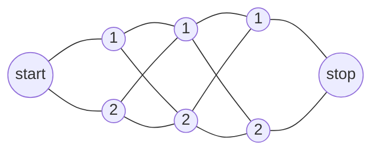
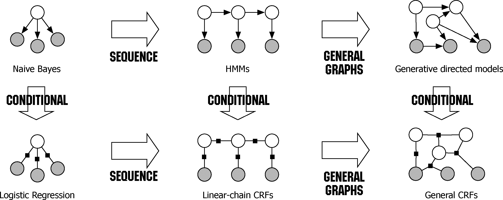

# CH11 条件随机场

[TOC]

## 前言

### 章节目录

1. 概率无向图模型
   1. 模型定义
   1. 概率无向图的**因子分解**
1. 条件随机场的定义与形式
   1. 条件随机场的定义
   1. 条件随机场的**参数化形式**
   1. 条件随机场的**简化形式**
   1. 条件随机场的**矩阵形式**
1. 条件随机场的概率计算问题
   1. 前向-后向算法
   1. 概率计算
   1. 期望值计算
1. 条件随机场的学习方法
   1. 改进的迭代尺度法
   1. 拟牛顿法
1. 条件随机场的预测算法

### 导读

- 条件随机场是给定一组输入随机变量的**条件**下另一组输出随机变量的条件概率分布模型，其特点是假设输出随机变量构成马尔可夫**随机场**。注意这里条件，随机场的对应。
- 整个这一章的介绍思路，和前一章有点像，尤其是学习算法部分，和HMM比主要增加了特征函数，关于特征函数要和[CH06](../CH06/README.md)对比着看
- CRF是对数线性模型
- 概率无向图模型又称马尔可夫随机场，是可以用无向图表示的**联合概率分布**，注意，一个概率图模型就是一个联合概率分布。
- 条件随机场三个基本问题：概率计算问题，学习问题和预测问题
- 前面的章节中，我们学习，更新参数的过程中很多时候用到了导数，那么积分有没有用？联合概率分布包含了很多随机变量，如果希望消除一些变量，就会用到积分，在离散的情况下，就是求和。这个过程就是边缘化。所有的概率图模型都尝试提出有效的方法来解决这个积分的问题。
- 统计力学中，波尔兹曼分布是描述粒子处于特定状态下的概率，是关于状态能量与系统温度的函数。
  $P_\alpha=\frac{1}{Z}\exp(\frac{-E_\alpha}{kT})$
  $p_\alpha$是粒子处于状态$\alpha$的概率，$E_\alpha$为状态$\alpha$的能量，$k$为波尔兹曼常量，$T$为系统温度，$\exp(\frac{-E_\alpha}{kT})$称为波尔兹曼因子，是没有归一化的概率，$Z$为归一化因子，是对系统所有状态进行总和。
  在统计力学中， $Z$一般称为配分函数，其定义为
  $Z=\sum\limits_\alpha\exp(\frac{-E_\alpha}{kT})$
  波尔兹曼分布的一个性质是两个状态的概率的比值，仅仅依赖于两个状态能量的差值，这里除法变减法，想到的应该是指数分布。
  $\frac{p_\alpha}{p_\beta}=\exp(\frac{E_\beta-E_\alpha}{kT})$
  所以，系统应该倾向于停留在能量大的状态。
- 

## 概念

### 符号表

节点$\nu\in V$表示一个随机变量$Y_{\nu}$

边$e\in E​$表示随机变量之间的概率依赖关系

图$G(V,E)$表示联合概率分布$P(Y)$

$Y\in \mathcal Y$是**一组随机变量**$Y=(Y_{\nu})_{\nu \in V}$

### IOB标记

**I**nside, **O**utside, **B**egin

### 概率无向图模型

注意整个书中第一节的内容， 还不是条件随机场， 都是马尔可夫随机场，告诉读者可以用图来表示联合分布，以及拿到图之后， 怎么转化成概率表达形式。

概率无向图模型又称**马尔可夫随机场(MRF)**，是一个可以由**满足以下三个性质的无向图**表示的**联合概率分布**。

- 成对马尔可夫性
  给定随机变量组$Y_O$的条件下随机变量$Y_u$和$Y_v$是条件独立的
  $P(Y_u,Y_v|Y_O)=P(Y_u|Y_O)P(Y_v|Y_O)$

- 局部马尔可夫性
  给定随机变量组$Y_W​$的条件下随机变量$Y_v​$与随机变量组$Y_O​$是独立的
  $P(Y_v,Y_O|Y_W)=P(Y_v|Y_W)P(Y_O|Y_W)​$

- 全局马尔可夫性
  给定随机变量组$Y_C$的条件下随机变量组$Y_A$和$Y_B$是条件独立的
  $P(Y_A,Y_B|Y_C)=P(Y_A|Y_C)P(Y_B|Y_C)$

#### MRF的因子分解

> 将概率无向图模型的联合概率分布表示为其**最大团**上的随机变量的函数的乘积形式的操作，称为概率无向图模型的因子分解(factorization)
> 概率无向图模型的最大特点就是**易于因子分解**

#### 团与最大团


#### 有向图模型

插入一点有向图模型

### 条件随机场

条件随机场是给定随机变量$X$条件下，随机变量$Y$的马尔可夫随机场。

#### 线性链条件随机场

设$X=(X_1,X_2,\cdots,X_n)，Y=(Y_1,Y_2,\cdots,Y_n)$均为线性链表示的随机变量序列，若在给定随机变量序列$X$的条件下，随机变量序列$Y$的条件概率分布$P(Y|X)$构成条件随机场，即满足马尔可夫性
$$
P(Y_i|X,Y_1,\cdots,Y_{i-1},Y_{i+1},\cdots,Y_n)=P(Y_i|X,Y_{i-1},Y_{i+1})\\
i=1,2,\cdots,n (在i=1和n时只考虑单边)
$$
则称$P(Y|X)$为线性链条件随机场。**在标注问题中**，$X$表示输入观测序列， $Y$表示输出标记序列或状态序列。

### 特征函数

线性链条件随机场的参数化形式
$$
P(y|x)=\frac{1}{Z(x)}\exp\left(\sum\limits_{i,k}\lambda_kt_k(y_{i-1},y_i,x,i)+\sum_{i,l}\mu_ls_l(y_i,x,i)\right)
$$
其中

$t_k$是定义在**边**上的特征函数，称为转移特征

$s_l$是定义在**结点**上的特征函数，称为状态特征

注意到这种表达就是不同特征的加权求和形式，$t_k,s_l$都依赖于位置，是局部特征函数。

### 对数线性模型

线性链条件随机场也是**对数线性模型**(定义在时序数据上的)。

条件随机场可以看做是最大熵马尔可夫模型在标注问题上的推广。

条件随机场是计算**联合概率分布**的有效模型。

>现实中，一般假设$X$和$Y$有相同的图结构。
>
>本书主要考虑无向图为
>$$
>G=(V={1,2,\dots,n},E={(i,i+1)}),i=1,2,\dots,n-1
>$$
>在此情况下，$X=(X_1,X_2,\dots,X_n), Y=(Y_1, Y_2,\dots,Y_n)$

线性链条件随机场定义

> 设$X=(X_1,X_2,\dots,X_n), Y=(Y_1, Y_2,\dots,Y_n)$均为线性链表示的随机变量序列， 若在给定随机变量序列$X$的条件下， 随机变量序列$Y$的条件概率分布$P(Y|X)$构成条件随机场， 即满足马尔可夫性
> $P(Y_i|X,Y_1,\dots,Y_{i-1},Y_{i+1},\dots,Y_n)=P(Y_i|X,Y_{i-1},Y{i+1}), i=1,2,\dots,n$
>
> 则称$P(Y|X)$为线性链条件随机场

#### 参数化形式

随机变量$X$取值为$x$的**条件**下，随机变量$Y$取值为$y$的条件概率具有如下形式：
$$
P(y|x)=\frac{1}{Z}\exp\left(\sum_{i,k}\lambda_kt_k(y_{i-1},y_i,x,i+\sum_{i,l}\mu_ls_l(y_i,x,i)\right)
$$
其中
$$
Z(x)=\sum_y\left(\sum_{i,k}\lambda_kt_k(y_{i-1},y_i,x,i)+\sum_{i,l}\mu_ls_l(y_i,x,i)\right)
$$
$k,l$对应特征函数的编号，注意这里用了$k,l$两个编号，$i$对应了输出序列的每个位置
$$
\begin{aligned}
t_1&=t_1(y_{i-1}=1,y_i=2,x,i),&i&=2,3,&\lambda_1&=1 \\
t_2&=t_2(y_{i-1}=1,y_i=1,x,i),&i&=2,&\lambda_2&=0.5\\
\color{red}t_3&=t_3(y_{i-1}=2,y_i=1,x,i),&i&=3,&\lambda_3&=1\\
\color{red}t_4&=t_4(y_{i-1}=2,y_i=1,x,i),&i&=2,&\lambda_4&=1\\
t_5&=t_5(y_{i-1}=2,y_i=2,x,i),&i&=3,&\lambda_5&=0.2\\
s_1&=s_1(y_i=1,x,i),&i&=1,&\mu_1&=1\\
s_2&=s_2(y_i=1,x,i),&i&=1,2,&\mu_2&=0.5\\
s_3&=s_3(y_i=1,x,i),&i&=2,3,&\mu_3&=0.8\\
s_4&=s_4(y_i=2,x,i),&i&=3&\mu_4&=0.5\\
\end{aligned}
$$
可以抽象成上面这种形式。


#### 简化形式

上面的结构，包含了两个部分，表达式不够简单，如何落地？

$K_1$个转移特征， $K_2$个状态特征

$$
\color{red}
f_k(y_{i-1},y_i,x,i)=
\begin{cases}
t_k(y_{i-1},y_i,x,i),&k=1,2,\dots,K_1\\
s_l(y_i,x,i),&k=K_1+l;l=1,2,\dots,K_2
\end{cases}
$$
**上面这个红色的式子很重要，把unigram和bigram统一到一起了，如果有trigram等也在这里融合**

然后，对转和状态特征在各个位置$i$求和，记作
$$
f_k(y,x)=\sum_{i=1}^nf_k(y_{i-1},y_i,x,i),k=1,2,\dots,K
$$
用$w_k$表示特征$f_k(y,x)$的权值
$$
w_k=
\begin{cases}
\lambda_k,&k=1,2,\dots,K_1\\
\mu_l,&k=K1+l;l=1,2,\dots,K_2
\end{cases}
$$
于是条件随机场可以表示为
$$
\begin{align}
P(y|x)&=\frac{1}{Z(x)}\exp\sum_{k=1}^Kw_kf_k(y,x)\\
Z(x)&=\sum_y\exp\sum_{k=1}^Kw_kf_k(y,x)
\end{align}
$$
若以$w$表示权值向量， 即
$$
w=(w_1,w_2,\dots,w_K)^T
$$
以$F$表示全局特征向量，即
$$
F(y,x)=(f_1(y,x),f_2(y,x),\dots,f_K(y,x))^T
$$
条件随机场可以表示成向量内积的形式
$$
\begin{align}
P_w(y|x)&=\frac{\exp(w\cdot F(y,x))}{Z_w(x)}\\
Z_w(x)&=\sum_y\exp\left(w\cdot F(y,x)\right)
\end{align}
$$
在参数化形式的展示中，书中的公式已经做了删减。
而实际上这里应该是展开的。
$$
\begin{aligned}
f_k&=t_1(y_{i-1}=1,y_i=2,x,i),&i&=2,&w_k&=1,&k=1 \\
f_k&=t_1(y_{i-1}=1,y_i=2,x,i),&i&=3,&w_k&=1,&k=1 \\
f_k&=t_2(y_{i-1}=1,y_i=1,x,i),&i&=2,&w_k&=0.5,&k=2\\
f_k&=t_2(y_{i-1}=1,y_i=1,x,i),&i&=3,&w_k&=0.5,&k=2\\
\color{red}f_k&=t_3(y_{i-1}=2,y_i=1,x,i),&i&=2,&w_k&=1,&k=3\\
\color{red}f_k&=t_3(y_{i-1}=2,y_i=1,x,i),&i&=3,&w_k&=1,&k=3\\
\color{red}f_k&=t_4(y_{i-1}=2,y_i=1,x,i),&i&=2,&w_k&=1,&k=4\\
\color{red}f_k&=t_4(y_{i-1}=2,y_i=1,x,i),&i&=3,&w_k&=1,&k=4\\
f_k&=t_5(y_{i-1}=2,y_i=2,x,i),&i&=2,&w_k&=0.2,&k=5\\
f_k&=t_5(y_{i-1}=2,y_i=2,x,i),&i&=3,&w_k&=0.2,&k=5\\
\\
f_k&=s_1(y_i=1,x,i),&i&=1,&w_k&=1,&k=6\\
f_k&=s_1(y_i=1,x,i),&i&=2,&w_k&=1,&k=6\\
f_k&=s_1(y_i=1,x,i),&i&=3,&w_k&=1,&k=6\\
f_k&=s_2(y_i=1,x,i),&i&=1,&w_k&=0.5,&k=7\\
f_k&=s_2(y_i=1,x,i),&i&=2,&w_k&=0.5,&k=7\\
f_k&=s_2(y_i=1,x,i),&i&=3,&w_k&=0.5,&k=7\\
f_k&=s_3(y_i=1,x,i),&i&=1,&w_k&=0.8,&k=8\\
f_k&=s_3(y_i=1,x,i),&i&=2,&w_k&=0.8,&k=8\\
f_k&=s_3(y_i=1,x,i),&i&=3,&w_k&=0.8,&k=8\\
f_k&=s_4(y_i=2,x,i),&i&=1,&w_k&=0.5,&k=9\\
f_k&=s_4(y_i=2,x,i),&i&=2,&w_k&=0.5,&k=9\\
f_k&=s_4(y_i=2,x,i),&i&=3,&w_k&=0.5,&k=9
\end{aligned}
$$

这里对于$w_k$的理解再体会下。


#### 矩阵形式

针对线性链条件随机场

引入起点和终点状态标记$y_0=start,y_{n+1}=end$， 这时$P_w(y|x)$可以矩阵形式表示。

对应观测序列的**每个位置**$i=1,2,\dots,\color{red}n+1$，定义一个$m$阶矩阵（$m$是标记$y_i$取值的个数）
$$
\begin{align}
M_i(x)&=\left[M_i(y_{i-1},y_i|x)\right]\\
M_i(y_{i-1},y_i)&=\exp\left(W_i(y_{i-1},y_i|x)\right)\\
W_i(y_{i-1},y_i|x)&=\sum_{k=1}^Kw_kf_k(y_{i-1},y_i|x)
\end{align}
$$
把整个向量乘法按照**观测位置**拆成矩阵形式， 每个观测位置对应一个矩阵

这个过程和$CNN$中的卷积实际上有点像，这里面卷积模板有两种$k\times 1$和$k\times 2​$， 以1和2进行滑窗。

给定观测序列$x$，相应的标记序列$y$的非规范化概率可以通过该序列的$n+1$个矩阵适当元素的乘积$\prod_{i=1}^{n+1}M_i(y_{i-1},y_i|x)$表示。于是
$$
P_w(y|x)=\frac{1}{Z_w(x)}\prod_{i=1}^{n+1}M_i(y_{i-1},y_i|x)
$$
其中，$Z_w$为规范化因子，$\color{red}是n+1个矩阵的乘积的(start,stop)元素$：
$$
Z_w(x)=(M_1(x)M_2(x)\dots M_{n+1}(x))_{start,stop}
$$
这个式子，以及这段内容，注意下。

上面的式子展开一下，得到$n+1$个$\color{red}m$阶矩阵
$$
M_i(x)=\left[\exp\left(\sum_{k=1}^Kw_kf_k(y_{i-1},y_i|x)\right)\right], i=1,2,\dots,n+1
$$
这里面， 各个位置$(1,2,\dots,n+1)$的**随机矩阵**分别是
$$
\begin{align}
M_1(y_0,y_1|x)&=\exp\left(\sum_{k=1}^Kw_kf_k(y_0,y_1|x)\right)\nonumber\\
&=\exp (w_1f_1(y_0,y_1))\exp(w_2f_2(y_0,y_1))\dots\exp(w_Kf_K(y_0,y_1))\\
M_2(y_1,y_2|x)&=\exp\left(\sum_{k=1}^Kw_kf_k(y_1,y_2|x)\right)\nonumber\\
&=\exp (w_1f_1(y_1,y_2))\exp(w_2f_2(y_1,y_2))\dots\exp(w_Kf_K(y_1,y_2))\\
M_3(y_2,y_3|x)&=\exp\left(\sum_{k=1}^Kw_kf_k(y_2,y_3|x)\right)\nonumber\\
&=\exp (w_1f_1(y_2,y_3))\exp(w_2f_2(y_2,y_3))\dots\exp(w_Kf_K(y_2,y_3))\\
M_4(y_3,y_4|x)&=\exp\left(\sum_{k=1}^Kw_kf_k(y_3,y_4|x)\right)\nonumber\\
&=\exp (w_1f_1(y_3,y_4))\exp(w_2f_2(y_3,y_4))\dots\exp(w_Kf_K(y_3,y_4))\\
\end{align}
$$

所以，无论特征有多少个，随机矩阵都是四个$(n+1)$

这里还有个问题， 这个$m$阶的矩阵是怎么来的？上面这四个表达式每一个都是$m$阶矩阵么？

这个问题在例子11.2中展开。


## 概率计算

前向向量$\alpha_i(x)$
1. 初值
    $$\alpha_0(y|x)=
    \begin{cases}
    1,&y=start \\
    0,&others
    \end{cases}$$
1. 递推
   $$\alpha_i^T(y_i|x)=\alpha_{i-1}^T(y_{i-1}|x)[M_i(y_{i-1},y_i|x)],i=1,2,\dots,n+1$$

$\alpha_i(y_i|x)$表示在位置$i$的标记是$y_i$并且到位置$i$的前部标记序列的非规范化概率，$y_i$可取的值有$m$个，所以$\alpha_i(x)$是$m$维列向量

后向向量$\beta_i(x)$

1. 初值
   $$\beta_{n+1}(y_{n+1}|x)=
   \begin{cases}
   1,&y_{n+1}=stop \\
   0,&others
   \end{cases}$$
1. 递推
   $$\beta_i(y_i|x)=[M_{i+1}(y_i,y_{i+1}|x)]\beta_{i+1}(y_{i+1}|x),i=1,2,\dots,n+1$$

$\beta_i(y_i|x)$表示在位置$i$的标记是$y_i$并且从$i+1$到$n$的后部标记序列的非规范化概率
$$
Z(x)=\alpha_n^T(x)\cdot1=1^T\cdot\beta_1(x)
$$


## 预测


## 例子

> 条件随机场完全由特征函数$t_k,s_l$和对应的权值$\lambda_k,\mu_l$确定
接下来的三个例子
- 例11.1

  已知上述四个参数的情况下，求概率
- 例11.2

  假设了$y_0=start=1, y_4=stop=1$

  矩阵形式的表示是为了后面的前向后向算法中递推的使用。 
- 例11.3
  decode问题实例
### 例11.1

特征函数部分的内容理解下

这里整理下题目中的特征函数，这里和书上的格式稍有不同，希望用这样的描述能看到这些特征函数中抽象的地方。
$$
\begin{aligned}
t_1&=t_1(y_{i-1}=1,y_i=2,x,i),&i&=2,3,&\lambda_1&=1 \\
t_2&=t_2(y_{i-1}=1,y_i=1,x,i),&i&=2,&\lambda_2&=0.5\\
\color{red}t_3&=t_3(y_{i-1}=2,y_i=1,x,i),&i&=3,&\lambda_3&=1\\
\color{red}t_4&=t_4(y_{i-1}=2,y_i=1,x,i),&i&=2,&\lambda_4&=1\\
t_5&=t_5(y_{i-1}=2,y_i=2,x,i),&i&=3,&\lambda_5&=0.2\\
s_1&=s_1(y_i=1,x,i),&i&=1,&\mu_1&=1\\
s_2&=s_2(y_i=1,x,i),&i&=1,2,&\mu_2&=0.5\\
s_3&=s_3(y_i=1,x,i),&i&=2,3,&\mu_3&=0.8\\
s_4&=s_4(y_i=2,x,i),&i&=3&\mu_4&=0.5\\
\end{aligned}
$$
注意上面红色标记的$t_3,t_4$是可以合并的。

```python
# transition feature
# i-1, i
f_k[0] = np.sum([1 if tmp[0] == 1 and tmp[1] == 2 else 0 for tmp in list(zip(Y[:-1], Y[1:]))])
f_k[1] = np.sum([1 if tmp[0] == 1 and tmp[1] == 1 else 0 for tmp in list(zip(Y[:-1], Y[1:]))])
f_k[2] = np.sum([1 if tmp[0] == 2 and tmp[1] == 1 else 0 for tmp in list(zip(Y[:-1], Y[1:]))])
f_k[3] = np.sum([1 if tmp[0] == 2 and tmp[1] == 1 else 0 for tmp in list(zip(Y[:-1], Y[1:]))])
f_k[4] = np.sum([1 if tmp[0] == 2 and tmp[1] == 2 else 0 for tmp in list(zip(Y[:-1], Y[1:]))])
# state feature
# i
f_k[5] = np.sum([1 if tmp == 1 else 0 for tmp in [Y[0]]])
f_k[6] = np.sum([1 if tmp == 2 else 0 for tmp in Y[:2]])
f_k[7] = np.sum([1 if tmp == 1 else 0 for tmp in Y[1:]])
f_k[8] = np.sum([1 if tmp == 2 else 0 for tmp in [Y[2]]])

# 生成全局特征向量
proba = np.sum(w_k*f_k)
# w的维度和f_k的维度匹配，一一对应
```


引用一下书中的解，注意看

>$$
>P(y|ｘ)\varpropto \exp \left[\sum_{k=1}^5\lambda_k\color{red}\sum_{i=2}^3\color{black}t_k(y_{i-1}, y_i, x, i)+\sum_{k=1}^4\mu_k\color{red}\sum_{i=1}^3\color{black}s_k(y_i,x,i)\right]
>$$
>

注意，按照这里红色部分的表达$\sum\limits_{i=2}^3 \sum\limits_{i=1}^3$，实际上特征函数会遍历每一个可能的点和边。书中有这样一句**取值为０的条件省略**, 这个仔细体会下

### 例11.2
重复下题目， 其实就是做了符号说明



线性链条件随机场结构如上图

观测序列$x$，状态序列$y,i=1,2,3, n=3$，标记$y_i\in\{1,2\}$，假设$y_0=start=1,y_4=stop=1$，各个位置的随机矩阵为
$$
\begin{aligned}
M_1(x)=
\begin{bmatrix}
&a_{01}&a_{02}\\
&0&0
\end{bmatrix}
&,M_2(x)=
\begin{bmatrix}
&b_{11}&b_{12}\\
&b_{21}&b_{22}
\end{bmatrix}
\\
M_3(x)=
\begin{bmatrix}
&c_{11}&c_{12}\\
&c_{21}&c_{22}
\end{bmatrix}
&,M_4(x)=
\begin{bmatrix}
&1&0\\
&1&0
\end{bmatrix}
\end{aligned}
$$

由$M_i$的定义
$$
M_i(x)=\left[\exp\left(\sum_{k=1}^Kw_kf_k(y_{i-1},y_i|x)\right)\right], i=1,2,\dots,n+1\nonumber
$$
以及$y_i\in\{1,2\}$

可以知道，每个$M_i$中$f_k$对应的$y_{i-1},y_i$都有两种取值，对应的组合就有四种
$$
M(x)=
\begin{bmatrix}
\exp\sum\limits_{k=1}^Kw_kf_k(\color{red}y[0],y[0]\color{black}),\exp\sum\limits_{k=1}^Kw_kf_k(\color{red}y[0],y[1]\color{black})\\
\exp\sum\limits_{k=1}^Kw_kf_k(\color{red}y[1],y[0]\color{black}),\exp\sum\limits_{k=1}^Kw_kf_k(\color{red}y[1],y[1]\color{black})
\end{bmatrix}
$$
对应的红色部分组合使得$M$成为一个矩阵

这里注意$M_1,M_4$，理解这里的$y[0],y[1]$表示的是$y$的取值
$$
\begin{aligned}
&M_1\rightarrow y[0]\rightarrow start \\
&M_4\rightarrow y[4]\rightarrow end
\end{aligned}
$$
这里重新整理一下

对于$y_0=start=1$
$$
M(x)=
\begin{bmatrix}
\exp\sum\limits_{k=1}^Kw_kf_k(\color{red}y[0]\color{black},y[0]),\exp\sum\limits_{k=1}^Kw_kf_k(\color{red}y[0]\color{black},y[1])\\
\exp\sum\limits_{k=1}^Kw_kf_k(y[1],y[0]),\exp\sum\limits_{k=1}^Kw_kf_k(y[1],y[1])
\end{bmatrix}
$$
对于$y_4=end=1$
$$
M(x)=
\begin{bmatrix}
\exp\sum\limits_{k=1}^Kw_kf_k(y[0],\color{red}y[0]\color{black}),\exp\sum\limits_{k=1}^Kw_kf_k(y[0],y[1])\\
\exp\sum\limits_{k=1}^Kw_kf_k(y[1],\color{red}y[0]\color{black}),\exp\sum\limits_{k=1}^Kw_kf_k(y[1],y[1])
\end{bmatrix}
$$
以上，取不到的值为0。

这里使用SymPy推导一下这个例子

```python
from sympy import *
a01,a02, b11, b12, b21, b22, c11, c12, c21, c22  = symbols("a01, a02, \
                                                            b11, b12,b21, b22, \
                                                            c11, c12, c21, c22")
M1 = Matrix([[a01, a02],
             [0,   0]])
M2 = Matrix([[b11, b12],
             [b21, b22]])

M3 = Matrix([[c11, c12],
             [c21, c22]])

M4 = Matrix([[1, 0],
             [1, 0]])
Z = expand(M1*M2*M3*M4)
P = str(expand(M1*M2*M3*M4)[0]).replace(" ","").split("+")
# 体会各个路径之间关系
for i in range(2):
   for j in range(2):
       for k in range(2):
           logger.info(str(M1[0, i] * M2[i, j] * M3[j, k]))
print(Z)
print(P)
```
本章代码有设计这个例子的测试案例，可以参考。
这里有个点要注意下，书中强调了$Z$的**第一行和第一列**
$$
Z(x)=\alpha_n^T(x)\cdot \mathrm{1}=\mathrm{1}^T\cdot \beta_1(x)
$$

### 例11.3

## CRF与LR比较
都是对数线性模型



引用个图[^1]

来自Sutton, Charles, and Andrew McCallum. "[An introduction to conditional random fields](http://homepages.inf.ed.ac.uk/csutton/publications/crftut-fnt.pdf)." Machine Learning 4.4 (2011): 267-373.

上面一行是生成模型，下面一行是对应的判别模型。


## 应用

最后这两章的HMM和CRF真的是NLP方面有深入应用。HanLP的代码中有很多具体的实现。

从HMM推导出CRF


## 习题

### EX11.1

图11.3无向图描述的概率图模型的因子分解式
$$
P(Y)=\frac{1}{Z}\Psi_{C1}(Y_{C1})\Psi_{C2}(Y_{C2})
$$

### EX11.3

11.3 写出条件随机场模型学习的梯度下降算法


## 参考

1. [^1]: [An Introduction to conditional random fields](http://homepages.inf.ed.ac.uk/csutton/publications/crftut-fnt.pdf)

1. [^2]: [HanLp](http://hanlp.com/)

**[⬆ top](#导读)**