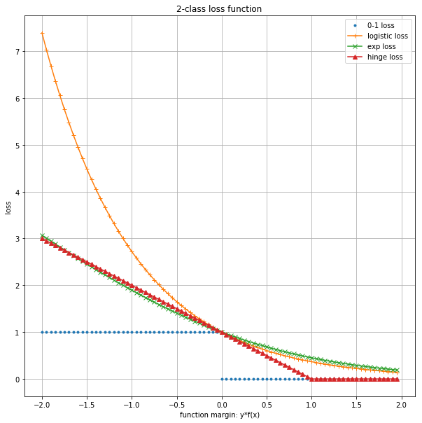

# CH12 统计学习方法总结

[TOC]

## 前言

### 章节目录

这一章的内容很简洁, 但是信息量很大.

1. 适用问题
1. 模型
1. 学习策略
1. 学习算法

### 导读

这一章首先用一个表概括了十个**方法**, 注意, 这里是十个方法, 而不是十个模型, 书中脚注了其中EM算法比较特殊, 是一个一般的方法, 没有具体模型.
其余方法会对应生成模型或者判别模型.

监督学习包括**分类, 标注**和回归.

## 统计学习方法

方法=模型+策略+算法

监督学习, 非监督学习, 强化学习都有这样的三要素.

这里回顾一下第一章的统计学习三要素:

1. 模型
   1. 监督学习中, 模型就是所要学习的条件概率分布或者决策函数.
1. 策略
   1. 统计学习的目标在于从假设空间中选取最优模型.
   1. 损失函数度量一次预测的好坏; **风险函数**度量平均意义下模型预测的好坏.
   1. 经验风险最小化(ERM)与结构风险最小化(SRM)
   1. 经验风险或者结构风险是最优化的目标函数.
1. 算法
   1. 统计学习基于训练数据集, 根据学习策略, 从假设空间中选择最优模型, 最后需要考虑用干什么样的计算方法求解**最优模型**.
   1. 统计学习问题转化为最优化问题.
      1. 有显式解析解, 对应的最优化问题比较简单
      1. 通常解析解不存在, 需要通过数值计算的方式求解.
   1. 算法需要解决的问题是如何找到**全局最优解**, 并且求解的过程非常高效.

## 不同视角

这本书的内容可以从多个角度进行划分

1. 简单分类方法
   1. 感知机
   1. k近邻法
   1. 朴素贝叶斯法
   1. 决策树
1. 复杂分类方法
   1. 逻辑斯谛回归模型
   1. 最大熵
   1. 支持向量机
   1. 提升方法
1. 标注方法
   1. 隐马尔科夫模型
   1. 条件随机场

### 模型

分类问题与标注问题都可以认为是从输入空间到输出空间的映射.

**他们可以写成条件概率分布$P(Y|X)$或者决策函数$Y=f(x)$的形式.**

#### 概率模型和非概率模型

对应**概率模型**和**非概率模型**.

1. 概率模型(由条件概率表示的模型)
   1. 朴素贝叶斯
   1. 隐马尔科夫模型
1. 非概率模型(由决策函数表示的模型)
   1. 感知机
   1. k近邻
   1. 支持向量机
   1. 提升方法
1. 概率模型和非概率模型
   1. 决策树
   1. 逻辑斯谛回归模型
   1. 最大熵模型
   1. 条件随机场

#### 生成模型和判别模型

1. 生成模型
   1. 直接学习条件概率分布$P(Y|X)$或者决策函数$Y=f(X)$的方法为判别方法, 对应的模型为判别模型.
   1. 感知机, k近邻, 决策树, 逻辑斯谛回归模型, 最大熵模型, 支持向量机, 提升方法, 条件随机场
1. 判别模型
   1. 先学习联合概率分布$P(X, Y)$, 从而求得条件概率分布$P(Y|X)$的方法是生成方法, 对应的模型是生成模型.
   1. 朴素贝叶斯, 隐马尔科夫模型

#### 线性模型和非线性模型

1. 线性模型
   1. 感知机
1. 对数线性模型
   1. 逻辑斯谛回归模型
   1. 最大熵模型
   1. 条件随机场
1. 非线性模型
   1. k近邻
   1. 决策树
   1. 支持向量机(核函数)
   1. 提升方法

#### 生成与判别, 分类与标注

这部分书中图12.1，可以参考[CH11](../CH11/README.md)中引用的图来进一步理解。

|      | 生成   | 判别 |
| ---- | ------ | ---- |
| 分类 | LR, ME | NB   |
| 标注 | CRF    | HMM  |

### 学习策略

#### 损失函数

注意, 书中这里描述的是, **在二分类的监督问题中**, 后面会在这个基础上做推广.

1. 合页损失

   支持向量机

   $max(0, 1- yf(x)) $

1. 逻辑斯谛损失函数

   逻辑斯谛回归模型与最大熵模型

   $log(1+exp(-yf(x)))$

1. 指数损失函数

   提升方法

   $exp(- yf(x))$

三种损失函数都是0-1损失函数的上界. 

上面这个图有几点要注意:

1. logistic loss, 里面的对数是2.
1. 另外, 这些函数在0右侧的部分, 都是有值的. 

这几个模型, 用在分类问题上, 可以有一种统一的表达来描述损失函数. 这会引入**经验风险最小化**和**结构风险最小化**. 

学习的策略是优化以下结构风险函数

$$ \min \limits_{f \in {H}} \frac {1}{N} \sum \limits^{N}_{i=1} L(y_i , f(x_i)) + \lambda J(f)$$

第一项为经验风险(经验损失), 第二项为正则化项

#### 二分类推广

1. 推广到多分类
1. 标注问题的条件随机场可以看成是最大熵模型的推广

标注问题的条件随机场可以看成是最大熵模型的推广

1. 概率模型的学习可以形式化为极大似然估计或贝叶斯估计的极大后验概率估计.
1. 决策树[CH05](../CH05/README.md)的学习策略是正则化的极大似然估计, 损失函数是对数损失函数, 正则化项是决策树的复杂度.
1. 逻辑斯谛回归模型与最大熵模型[CH06](../CH06/README.md), 条件随机长的学习策略既可以看成是极大似然估计,有可以看成是极小化逻辑斯谛损失. 
1. 朴素贝叶斯模型[CH04](../CH04/README.md), 隐马尔科夫模型[CH10](../CH10/README.md)的非监督学习也是极大似然估计或极大后验概率估计, 但这时模型含有隐变量.

### 学习算法

1. 朴素贝叶斯法[CH04](../CH04/README.md)和隐马尔科夫模型[CH10](../CH10/README.md)
1. 感知机[CH02](../CH02/README.md), 逻辑斯谛回归模型[CH06](../CH06/README.md), 最大熵模型[CH06](../CH06/README.md), 条件随机场[CH11](../CH11/README.md)
1. 支持向量机[CH07](../CH07/README.md)
1. 决策树[CH05](../CH05/README.md)
1. 提升方法[CH08](../CH08/README.md)
1. EM算法[CH09](../CH09/README.md)

| 方法      | 适用问题         | 模型特点           | 模型类型 | 学习策略                 | 学习的损失函数     | 学习算法             |
| --------- | ---------------- | ------------------ | -------- | ------------------------ | :----------------- | -------------------- |
| Peceptron | 二类分类         | 分离超平面         | 判别模型 | 极小化误分点到超平面距离 | 误分点到超平面距离 | SGD                  |
| KNN       | 多类分类, 回归   | 特征空间, 样本点   | 判别模型 |                          |                    |                      |
| NB        | 多类分类         |                    | 生成模型 | MLE, MAP                 | 对数似然损失       | 概率计算公式, EM算法 |
| DT        | 二类分类         |                    | 判别模型 | 正则化的极大似然估计     | 对数似然损失       | 特征选择, 生成, 剪枝 |
| LR Maxent | 多类分类         |                    | 判别模型 |                          |                    |                      |
| SVM       | 二类分类         |                    | 判别模型 |                          |                    |                      |
| AdaBoost  | 二类分类         |                    | 判别模型 |                          |                    |                      |
| EM        | 概率模型参数估计 | 含隐变量的概率模型 |          |                          |                    |                      |
| HMM       | 标注             |                    | 生成模型 |                          |                    |                      |
| CRF       | 标注             |                    | 判别模型 |                          |                    |                      |

