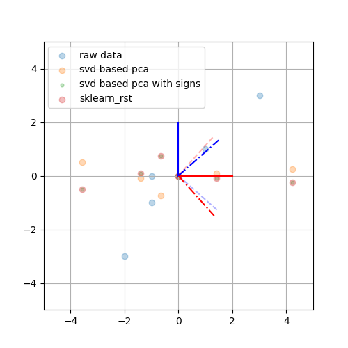

# CH16 主成分分析

[TOC]

## 前言

### 章节目录

1. 总体主成分分析
   1. 基本想法
   1. 定义和导出
   1. 主要性质
   1. 主成分的个数
   1. 规范化变量的总体主成分
1. 样本主成分分析
   1. 样本主成分的定义和性质
   1. 相关矩阵的特征值分解算法
   1. 数据矩阵的奇异值分解算法

### 导读

- 这部分内容介绍了**总体**主成分分析的定义，定理与性质，并在第二节介绍了**样本**主成分分析，介绍了主成分分析的算法。
- PCA的基本想法是由少数不相关的变量来代替相关的变量，用来表示数据，并且要求能够保留数据中的大部分信息。注意这个不是特征选择，得到的主成分是线性无关的新变量。
- 所谓线性相关的$x_1$和$x_2$就是说知道$x_1$的值的情况下，$x_2$的预测不是完全随机的。
- 主成分分析的结果可以作为其他机器学习方法的输入。
- 参考文献4应该是这本书引用的日期最新的Journal Article了，2014年的，文章来自Google，作者还写过一篇ICA的Tutorial
- $y_k=\alpha_k^\mathrm{T}\boldsymbol{x}$考虑PCA是通过组合特征的方法来降维，这样用到**线性组合**。因为涉及到线性组合，所以在PCA过程中首先要给数据规范化就好理解了，也比较好理解数据的"结构"这种说法。
- 书中有提到在实际问题中，不同变量可能有不同的量纲，直接求主成分有时会产生不合理的结果。**消除这个影响**常对各个随机变量实施规范化，使其均值为0，方差为1。
- 关于主成分的性质，规范化的变量总体主成分主要是围绕特征值和特征向量展开的。
- 关于总体和样本的说明可以参考一下Strang的书[^1]中第十二章部分说明。
- 关于$k$的选择，2000年有一个文章自动选择[^2]。

## 内容

### 总体主成分分析

#### 总体主成分性质

1. $\mathrm{cov}(\boldsymbol{y})=\Lambda=\mathrm{diag}(\lambda_1,\lambda_2,\cdots,\lambda_m)$
2. $\sum\limits_{i=1}^m\lambda_i=\sum\limits_{i=1}^m\sigma_{ii}$
3. $\sum\limits_{i=1}^m \mathrm{var}(x_i)=\mathrm{tr}(\mit{\Sigma}^\mathrm{T}\mathrm)=tr\mathrm(A\Lambda A^\mathrm{T}\mathrm)=\mathrm{tr}\mathrm(\Lambda\mathrm)=\sum\limits_{i=1}^m\lambda_i=\sum\limits_{i=1}^m \mathrm{var}\mathrm(y_i\mathrm)$

两个拉格朗日函数的求导

#### 规范化变量的总体主成分
这部分内容描述了规范化随机变量的总体主成分的性质，概括下就是：特征值，特征值的和，特征变量，特征变量按行求和，特征变量按列求和。
1. $\Lambda^*=\mathrm{diag}(\lambda_1^*, \lambda_2^*, \cdots, \lambda_m^*)$
1. $\sum\limits_{k=1}^m \lambda_k^*=m$
1. $\rho(y_k^*, x_i^*)=\sqrt{\lambda_k^*}e_{ik}^*, k,i=1,2,\cdots,m$
1. $\sum\limits_{i=1}^m\rho^2(y_k^*,x_i^*)=\sum\limits_{i=1}^m\lambda_k^*e_{ik}^{*2}=\lambda_k^*,k=1,2,\cdots,m$
1. $\sum\limits_{k=1}^m\rho^2(y_k^*,x_i^*)=\sum\limits_{k=1}^m\lambda_k^*e_{ik}^{*2}=1,i=1,2,\cdots,m$

### 样本主成分分析

观测数据上进行主成分分析就是样本主成分分析。

给定样本矩阵$X$，可以**估计**样本均值以及样本协方差。

$\bar{x}=\frac{1}{n}\sum\limits_{j=1}^nx_j$

#### 相关矩阵的特征值分解算法

关键词：**相关矩阵**， **特征值分解**

1. 观测数据规范化处理，得到规范化数据矩阵$X$
1. 计算相关矩阵$R$
$$
R=[r_{ij}]_{m\times m}=\frac{1}{n-1}XX^\mathrm{T}\\
r_{ij} = \frac{1}{n-1}\sum\limits_{l=1}^nx_{il}x_{lj}, i,j=1,2,\cdots,m
$$
3. 求$R$的特征值和特征向量
$$
|R-\lambda I|=0\\
\lambda_1 \ge \lambda_2 \ge \cdots \ge \lambda_m
$$
求累计方差贡献率达到预定值的主成分个数$k$
$$
\sum_{i=1}^k\eta_i=\frac{\sum\limits_{i=1}^k\lambda_i}{\sum\limits_{i=1}^m\lambda_i}
$$
求前$k$个特征值对应的单位特征向量
$$
a_i=(a_{1i},a_{2i},\cdots,a_{mi})^\mathrm{T}
$$
4. 求$k$个样本主成分
$$
  y_i=a_i^\mathrm{T}\boldsymbol x
$$
  其实算法到这就完事了，剩下两部分是输出。**前面是fit部分，后面是transform部分。**具体可以看下$P_{319}$中的关于相关矩阵特征值分解算法部分内容，构造正交矩阵之后就得到了主成分。
5. 计算$k$个主成分$y_i$与原变量$x_i$的相关系数$\rho(x_i,y_i)$以及$k$个主成分对原变量$x_i$的贡献率$\nu_i$
$$
\nu_i=\rho^2(x_i,(y_1, y_2, \cdots,y_k))=\sum_{j=1}^k\rho^2(x_i,y_j)=\sum_{j=1}^k\lambda_ja_{ij}^2\\
i=1,2,\cdots,m
$$
6. 计算$n$个样本的$k$个主成分值
    第$j$个样本，$\boldsymbol{x}_j=(x_{1j},x_{2j},\cdots, x_{mj})^\mathrm{T}$的第$i$个主成分值是
$$
y_{ij}=(a_{1i},a_{2i},\cdots,a_{mi})(x_{1j},x_{2j},\cdots,x_{mj})^\mathrm{T}=\sum\limits_{l=1}^m a_{li}x_{lj}\\
i=1,2,\cdots,m, j=1,2,\cdots,n
$$

#### 数据矩阵的奇异值分解算法

关键词：**数据矩阵**，**奇异值分解**
算法16.1 主成分分析法
输入：$m\times n$样本矩阵$X$，每一行元素均值为0。`这里每一行是一个特征`
输出：$k\times n$样本主成分矩阵$Y$
参数：主成分个数$k$
1. 构造新的$n\times m$矩阵
$$
X^\prime=\frac{1}{\sqrt{n-1}}X^\mathrm{T}
$$
$X^\prime$每一列均值为0，其实就是转置了。
2. 对矩阵$X^\prime$进行截断奇异值分解
$$
X^\prime=U\mit{\Sigma}V^\mathrm{T}
$$
矩阵$V$的前$k$列构成$k$个样本主成分
3. 求$k\times n$样本主成分矩阵
$$
Y=V^\mathrm{T}X
$$

### 例16.1

这个例子，其实从表16.3中拿到的结论通过表16.2也能拿到。就是说通过单位特征向量和主成分的方差贡献率可以得到通过主成分的因子负荷量以及贡献率能得到的结论。
$y_1$是原始特征的线性组合，并且，各个原始特征的权重(系数)基本相同，说明大家同样重要。$y_1$和总成绩有关系。
$y_2$的贡献可能更多的体现在文理科的差异上，他们的作用相反。

| 类型 | 主成分 | 特征值 | $x_1$ | $x_2$ | $x_3$ | $x_4$ | 方差贡献率 | 备注|
| --- | --- | --- | --- | --- | --- | --- | --- |---|
| 特征向量 |$y_1$| 2.17 | 0.460 | 0.476 | 0.523 | 0.537 | 0.543 ||
| 特征向量 |$y_2$| 0.87 | 0.574 | 0.486 | -0.476 | -0.456 | 0.218 |累计0.761|
| 因子负荷量|$y_1$|2.17|0.678|0.701|0.770|0.791|$\sqrt{\lambda_1}e_{i1}$|平方和=2.169|
| 因子负荷量|$y_2$|0.87|0.536|0.697|0.790|0.806|$\sqrt{\lambda_2}e_{i2}$|平方和=0.870|

这部分数值参考书上内容，如果用numpy做，会有一定出入，回头再复核下。

### 习题16.1
样本数据主成分分析
$$
X=
\left[
\begin{matrix}
2& 3& 3& 4& 5& 7\\
2& 4& 5& 5& 6& 8
\end{matrix}
\right]
$$

这个题，原来就俩特征，然后主成分依然俩特征。俩特征就可以可视化了。
1. 首先要规范化，参考16.33，注意，规范化并不代表数据取值范围在$[0, 1]$之间。

这里总共就两个特征，而且从数据的范围上看，差不多。

## 参考

[^1]: [Introduction to Linear Algebra](https://github.com/J-Mourad/Introduction-to-Linear-Algebra-5th-Edition---EE16A/raw/master/Ed%205%2C%20Gilbert%20Strang%20-%20Introduction%20to%20Linear%20Algebra%20(2016%2C%20Wellesley-Cambridge%20Press).pdf)
[^2]: [Automatic choice of dimensionality for PCA](https://papers.nips.cc/paper/1853-automatic-choice-of-dimensionality-for-pca.pdf)

