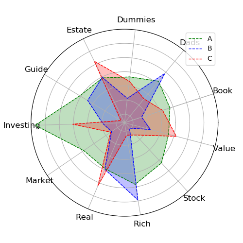

# CH17 潜在语义分析

[TOC]

## 前言

### 章节目录

1. 单词向量空间与话题向量空间
   1. 单词向量空间
   1. 话题向量空间
1. 潜在语义分析算法
   1. 矩阵奇异值分解算法
   1. 例子
1. 非负矩阵分解算法
   1. 非负矩阵分解
   1. 潜在语义分析模型
   1. 非负矩阵分解的形式化
   1. 算法

### 导读

- 潜在语义分析主要用于文本的话题分析，通过矩阵分解发现文本与单词之间的**基于话题**的语义关系。
- 词向量通常是稀疏的，词向量不考虑同义性，也不考虑多义性。
- 一个文本(Doc)一般有多个话题(Topic)。涉及到语义分析，要清楚什么是文本，什么是话题，什么是伪文本。
- NMF那个文章[参考文献3]发的是Nature，1999年的，不过他引不高，才9979。文章中对比了在矩阵分解框架下的VQ，PCA和NMF，说明了NMF和其他两种方法的区别。
- NMF的推导过程见参考文献4
- 潜在语义分析使用的是**非概率**的话题分析模型。
- 潜在语义分析是**构建话题向量空间的方法**(话题分析的方法)
- 单词向量转化成话题向量。文本在不同空间下的相似度用在不同空间下的向量内积表示。
- 话题向量空间$T$，单词-话题矩阵$T$，文本在话题空间的表示$Y$，话题-文本矩阵$Y$
- 本章第一个参考文献做了很多的文字说明，也有个实际的例子，可以参考下。
- 所谓**表示**，可以认为是在某个坐标系(空间)下的坐标。
- 非负矩阵分解旨在用较少的基向量、系数向量来表示较大的数据矩阵。
- 感觉这章的章节结构看起来不是很清晰，在内容部分重新梳理了下结构。
- 在sklearn中LSA就是截断奇异值分解，作为一种降维的手段进行处理。而NMF是单独的一个模型，都是矩阵分解的范畴。

## 内容
### 向量空间模型
#### 单词向量空间
每个向量对应一个文本，单词向量空间行对应单词，话题向量空间行对应话题。
单词-文本矩阵
$$
X=
\left[
\begin{matrix}
x_{11}&x_{12}&\cdots&x_{1n}\\
x_{21}&x_{22}&\cdots&x_{2n}\\
\vdots&\vdots&&\vdots\\
x_{m1}&x_{m2}&\cdots&x_{mn}
\end{matrix}
\right]
$$
元素$x_{ij}$代表单词$w_i$在文本$d_j$中出现的频数或者权值。
$X$可以写作$X=[\begin{array}&x_1&x_2 &\cdots &x_n\end{array}]$

单词多，文本少，这个矩阵是稀疏矩阵。

权值通常用TFIDF
$$
TFIDF_{ij}=\frac{tf_{ij}}{tf_{\cdot j}}\log\frac{\mathrm{d}f}{\mathrm{d}f_i}\\
i=1,2,\cdots,m;\\
j=1,2,\cdots,n
$$

一个单词在一个文本中的TFIDF是两种重要度的乘积，表示综合重要度。
#### 话题向量空间
每个话题由一个定义在单词集合$W$上的$m$维向量表示，称为**话题向量**。
$t_l=[\begin{array}&t_{1l} &t_{2l} & \cdots & t_{ml}\end{array}]^\mathrm{T}, l=1,2,\cdots,k$

$k$个话题向量张成一个话题向量空间，维数为$k$。
$$
T=\left[
\begin{matrix}
&t_{11} &t_{12} &\cdots &t_{1k} \\
&t_{21} &t_{22} &\cdots &t_{2k} \\
&\vdots &\vdots & &\vdots \\
&t_{m1} &t_{12} &\cdots &t_{mk} \\
\end{matrix}
\right]
$$
矩阵$T$可以写成$T=[\begin{array}&t_1 &t_2&\cdots&t_k\end{array}]$
$$
Y=\left[
\begin{matrix}
&y_{11} &y_{12} &\cdots &y_{1n} \\
&y_{21} &y_{22} &\cdots &y_{2n} \\
&\vdots &\vdots & &\vdots \\
&y_{k1} &y_{k2} &\cdots &y_{kn} \\
\end{matrix}
\right]
$$
矩阵$Y$可以写做$Y=[\begin{array}&y_1 &y_2 &\cdots &y_n\end{array}]$

$$
x_j\thickapprox y_{1j}t_1+y_{2j}t_2+\cdots+y_{kj}t_k,j=1,2,\cdots,n
$$

这样，单词-文本矩阵$X$可以近似的表示为单词-话题矩阵$T$与话题-文本矩阵$Y$的乘积形式。这就是潜在语义分析。
$$
X\thickapprox TY
$$

### 基于SVD的潜在语义分析模型

#### 单词-文本矩阵

文本集合$D=\{d_1, d_2,\cdots,d_n\}$
单词集合$W=\{w_1,w_2,\cdots,w_m\}$

表示成单词-文本矩阵$X_{m\times n}$
$$
X=\left[
\begin{matrix}
&x_{11} &x_{12} &\cdots &x_{1n} \\
&x_{21} &x_{22} &\cdots &x_{2n} \\
&\vdots &\vdots & &\vdots\\
&x_{m1} &x_{m2} &\cdots &x_{mn} \\
\end{matrix}
\right]
$$

#### 截断奇异值分解

$$
X\thickapprox U_k\mit{\Sigma_k}V_k^\mathrm{T}
\bf
=\left[
\begin{matrix}
u_1 &u_2 &\cdots &u_k
\end{matrix}
\right]
\left[
\begin{matrix}
\sigma_1 &0 &0 &0\\
0 &\sigma_2 &0 &0 \\
0 &0 &\ddots &0\\
0 &0 &0 &\sigma_k
\end{matrix}
\right]
\left[
\begin{matrix}
v_1^\mathrm{T}\\
v_2^\mathrm{T}\\
\vdots\\
v_k^\mathrm{T}
\end{matrix}
\right]
$$
这中间$k\le n \le m$ 这里假设了文档数量要比单词数量少，其实这个假设也不一定成立。
1. $U_k$是$m\times k$矩阵，前$k$个相互正交的左奇异向量
1. $\mit\Sigma$是$k$阶方阵，前$k$个最大奇异值
1. $V_k$是$n\times k$矩阵，前$k$个相互正交的右奇异向量

#### 话题空间向量

每一列$u_l$表示一个话题，$k$个话题张成一个子空间，称为话题向量空间。
$U_k=\left[\begin{matrix}u_1&u_2&\cdots&u_k\end{matrix}\right]$

#### 文本的话题空间向量表示
如果$u_l$表示话题向量空间，那么将文本表示成$u_l$的线性组合，就是文本在这个空间的表示。
但是，奇异值分解得到三个矩阵，最左边的是话题向量空间，那么右边的两个矩阵的乘积，则对应了话题-文本矩阵(文本的话题空间向量表示)。

这里有个点
$$
V^\mathrm{T}=
\left[
\begin{matrix}
v_{11}& v_{21}& \cdots& v_{n1}\\
v_{12}& v_{22}& \cdots& v_{n2}\\
\vdots& \vdots& & \vdots\\
v_{1k}& v_{2k}& \cdots& v_{nk}\\
\end{matrix}
\right]
$$

问题：这个矩阵是$k\times n$的，右下角标感觉应该是$v_{kn}$这种形式？
这个矩阵是$V^\mathrm{T}$，是$k$个特征值对应的特征向量做了归一化之后的结果，参考$P_{258}$中相应的描述，$A^\mathrm{T}A$的特征向量构成正交矩阵$V$的列。$V$是右奇异向量。
这就是为什么这个矩阵下标如此表示。

$$
\begin{aligned}
x_j&\thickapprox U_k(\mit\Sigma_k V_k^\mathrm{T})_j\\
&=
\left[
\begin{matrix}
u_1& u_2& \cdots& u_k
\end{matrix}
\right]
\left[
\begin{matrix}
\sigma_1v_{j1}\\
\sigma_2v_{j2}\\
\vdots\\
\sigma_kv_{jk}
\end{matrix}
\right]
\\
&=\sum_{l=1}^k\sigma_lv_{jl}u_l,j=1,2,\cdots,n
\end{aligned}
$$

上式是文本$d_j$的近似表达式，由$k$个话题向量$u_l$的线性组合构成。
矩阵$(\mit\Sigma_kV_k^\mathrm{T})$的每一个列向量是一个文本在话题向量空间的表示。

#### 例子
书中这个例子原始数据是这样的：
1. The Neatest Little Guide to Stock Market Investing
1. Investing For Dummies, 4th Edition
1. The Little Book of Common Sense Investing: The Only Way to Guarantee Your Fair Share of Stock Market Returns
1. The Little Book of Value Investing
1. Value Investing: From Graham to Buffett and Beyond
1. Rich Dad's Guide to Investing: What the Rich Invest in, That the Poor and the Middle Class Do Not!
1. Investing in Real Estate, 5th Edition
1. Stock Investing For Dummies
1. Rich Dad's Advisors: The ABC's of Real Estate Investing: The Secrets of Finding Hidden Profits Most Investors Miss

去了停用词之后，做词频统计，得到了数据表。这个数据在[概率潜在语义分析](../CH18/README.md)部分的习题中再次引用了。
对应的这部分数据，实际上还可以做一些事情。可以尝试可视化下。

上图中三个话题ABC，和不同单词的关系可以可以看出。也可以绘制单词-话题的雷达图。

这个例子里面书中给出的参考结果是按照V做了符号调整，保证V中每一行的最大值，符号为正。

### 基于NMF的潜在语义分析模型

#### NMF

$X$是非负矩阵则表示为$X\ge0$
$X\thickapprox WH, W\ge 0, H \ge 0$ 称为非负矩阵分解
非负矩阵分解旨在通过较少的基向量、系数向量来表达较大的数据矩阵。注意这里用到了基向量和数据矩阵，因为这部分内容介绍的是非负矩阵分解，和话题向量空间以及文本在话题向量空间的表示这些还没有联系在一起，是一个抽象的数学描述。

#### 模型定义
$m\times n$的非负矩阵$X\ge 0$。
假设文本集合包含$k$个话题，对$X$进行非负矩阵分解。即求$m\times k$的非负矩阵和$k\times n$的非负矩阵满足$X\thickapprox WH$

其中
$W=\left[\begin{matrix}w_1& w_2& \cdots& w_k\end{matrix}\right]$表示话题向量空间
$w_1, w_2, \cdots, w_k$表示文本集合的$k$个话题
$H=\left[\begin{matrix}h_1& h_2& \cdots& h_k\end{matrix}\right]$表示文本在话题向量空间的表示
$h_1, h_2, \cdots, h_k$表示文本集合的$n$个文本
以上是基于非负矩阵分解的潜在语义分析模型。

非负矩阵分解有很直观的解释，话题向量和文本向量都非负，对应着“伪概率分布”，向量的线性组合表示**局部构成总体**。这个其实和DL里面的意思是一样的。

#### 算法
可以形式化为最优化问题求解。
##### 损失函数
1. 平方损失
两个非负矩阵$A=[a_{ij}]_{m\times n}$和$B=[b_{ij}]_{m\times n}$的平方损失定义为
$$
\left\|A-B\right\|^2=\sum_{i,j}(a_{ij}-b_{ij})^2
$$
下界是0
2. 散度
$$
D(A\|B)=\sum_{i,j}\left(a_{ij}\log\frac{a_{ij}}{b_{ij}}-a_{ij}+b_{ij}\right)
$$
下界是0
$A$和$B$不对称。
当$\sum\limits_{i,j}a_{ij}=\sum\limits_{i,j}b_{ij}=1$时散度损失函数退化为Kullback-Leiber散度或相对熵，这时$A$和$B$是概率分布。
##### 问题定义
针对不同的损失函数有不同的问题定义
1. 平方损失
$$
\min_{W,H} \|X-WH\|^2\\
s.t. W,H\ge 0
$$
2. 散度损失
$$
\min_{W,H} D(X\|WH)\\
s.t. W,H\ge 0
$$
##### 更新规则
这里提到目标函数只是对$W$和$H$之一的凸函数，而不是同时两个变量的凸函数，所以通过数值优化求解局部最优解。

1. 平方损失
$$
H_{lj}\leftarrow H_{lj}\frac{(W^\mathrm{T}X)_{lj}}{(W^\mathrm{T}WH)_{lj}}\\
W_{il}\leftarrow W_{il}\frac{(XH^\mathrm{T})_{il}}{(WHH^\mathrm{T})_{il}}
$$
2. 散度损失
$$
H_{lj}\leftarrow H_{lj}\frac{\sum\limits_i[W_{il}X_{ij}/(WH)_{ij}]}{\sum\limits_iW_{il}}\\
W_{il}\leftarrow W_{il}\frac{\sum\limits_j[H_{lj}X_{ij}/(WH)_{ij}]}{\sum\limits_jH_{lj}}
$$

##### NMF
1. 平方损失
$$
J(W,H)=\frac{1}{2}\|X-WH\|^2=\frac{1}{2}\sum_{i,j}[X_{ij}-(WH)_{ij}]^2
$$
采用梯度下降法求解
这里用到了矩阵求导
$$
\begin{aligned}
\frac{\partial J(W,H)}{\partial W_{il}}&=-\sum_j[X_{ij}-(WH)_{ij}]H_{lj}=-[(XH^\mathrm{T})_{il}-(WHH^\mathrm{T})_{il}]\\
\frac{\partial J(W,H)}{\partial H_{lj}}&=-[(W^\mathrm{T}X)_{lj}-(W^\mathrm{T}WH)_{lj}]
\end{aligned}
$$
根据更新规则有
$$
W_{il}=W_{il}+\lambda_{il}[(XH^\mathrm{T})_{il}-(WHH^\mathrm{T})_{il}]\\
H_{lj}=H_{lj}+\mu_{lj}[(W^\mathrm{T}X)_{lj}-(W^\mathrm{T}WH)_{lj}]\\
\lambda_{il}=\frac{W_{il}}{(WHH^\mathrm{T})_{il}}\\
\mu_{lj}=\frac{H_{lj}}{(W^\mathrm{T}WH)_{lj}}
$$
##### 算法
输入：单词-文本矩阵$X\ge 0$，文本集合的话题个数$k$，最大迭代次数$t$；
输出：话题矩阵$W$，文本表示矩阵$H$
1. 初始化
$W\ge 0$，**并对$W$的每一列数据归一化**
$H\ge 0$
2. 迭代
对迭代次数从$1$到$t$执行下列步骤：
a. 更新$W$的元素，每次迭代对$W$的列向量归一化，**使基向量为单位向量**。
b. 更新$H$的元素

## 习题

习题18.3

## 参考

