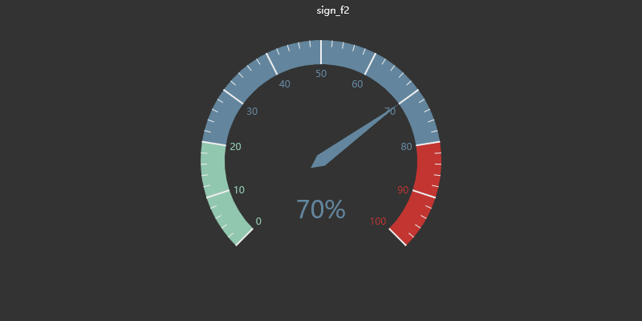
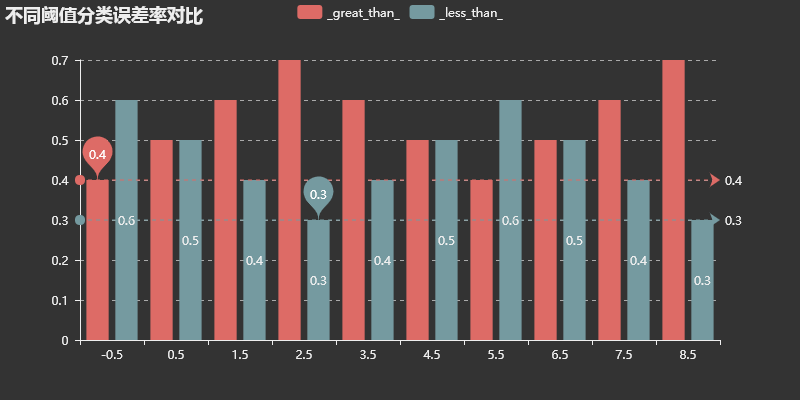

# CH8 提升方法

Boosting方法是一种常用的统计学习方法，应用广泛且有效

- 改变训练样本权重，学习多个分类器
- 线性组合
## 提升方法AdaBoost算法
### 提升方法的基本思路
概率近似正确(PAC, Probably approximately correct)

在PAC学习框架下，一个概念是强可学习的充分必要条件是这个概念是弱可学习的。
两个问题

1. 在每一轮如何改变训练数据的权值或者概率分布
1. 如何将弱分类器组合成一个强分类器

Adaboost解决方案：
1. 提高前一轮被分错的分类样本的权值，降低被正确分类的样本的权值
1. 加权多数表决的方法
### Adaboost算法
#### 算法8.1

* 输入：训练数据集T, 弱学习方法
* 输出：最终分类器G(x)

步骤
1. 初始化训练数据的权值分布 $D_1=(w_{11},\cdots,w_{1i},\cdots,w_{1N},w_{1i}=\frac{1}{N})$
1. m = 1,2, M
    1. $G_m(x):X->{-1,+1}$
    1. 求$G_m$在训练集上的分类误差率  $e_m=\sum_{i=1}^{N}P(G_m(x_i)\ne y_i)=\sum_{i=1}^{N}w_{mi}I(G_m(x_i)\ne y_i)$
    1. 计算$G_m(x)$的系数，$\alpha_m=\frac{1}{2}log\frac{1-e_m}{e_m}$，自然对数
    1. $w_{m+1,i}=\frac{w_{mi}}{Z_m}exp(-\alpha_my_iG_m(x_i))$
    1. $Z_m=\sum_{i=1}^Nw_{mi}exp(-\alpha_my_iG_m(x_i))$
1. $f(x)=\sum_{m=1}^M\alpha_mG_m(x)$
1. 最终分类器$G(x)=sign(f(x))=sign(\sum_{m=1}^M\alpha_mG_m(x))$
### Adaboost例子
#### 例子8.1 

弱分类器选为阈值分类器，通过阈值将数据划分成两部分，标准是分类误差率最低。

需要确定两个参数：

1. 阈值选在哪里
1. 划分的两部分类别指定方式

下面显示m=1，2，3时弱分类器的选择过程

m=1

m=2

 

m=3

 

数据显示了每一轮计算的结果

| x    | 0    | 1    | 2    | 3    | 4    | 5    | 6    | 7    | 8    | 9    |
| ---- | ---- | ---- | ---- | ---- | ---- | ---- | ---- | ---- | ---- | ---- |
| y    |     1 |1      |1      | -1     |-1      |-1      |1      |1      |  1    |  -1    |
|d1|0.1|0.1|0.1|0.1|0.1|0.1|0.1|0.1|0.1|0.1|
|G1|1|1|1|-1|-1|-1|-1|-1|-1|-1|
|d2|0.07143|0.07143|0.07143|0.07143|0.07143|0.07143|0.16666|0.16666|0.16666|0.07143|
|f1|0.4236|0.4236|0.4236|-0.4236|-0.4236|-0.4236|-0.4236|-0.4236|-0.4236|-0.4236|
|sign_f1|1.0|1.0|1.0|-1.0|-1.0|-1.0|-1.0|-1.0|-1.0|-1.0|
|G2|1|1|1|1|1|1|1|1|1|-1|
|d3|0.0455|0.0455|0.0455|0.1667|0.1667|0.1667|0.1061|0.1061|0.1061|0.0455|
|f2|1.0732|1.0732|1.0732|0.226|0.226|0.226|0.226|0.226|0.226|-1.0732|
|sign_f2|1.0|1.0|1.0|1.0|1.0|1.0|1.0|1.0|1.0|-1.0|
|G3|-1|-1|-1|-1|-1|-1|1|1|1|1|
|d4|0.125|0.125|0.125|0.1019|0.1019|0.1019|0.0648|0.0648|0.0648|0.125|
|f3|0.3218|0.3218|0.3218|-0.5254|-0.5254|-0.5254|0.9774|0.9774|0.9774|-0.3218|
|sign_f3|1.0|1.0|1.0|-1.0|-1.0|-1.0|1.0|1.0|1.0|-1.0|

## 