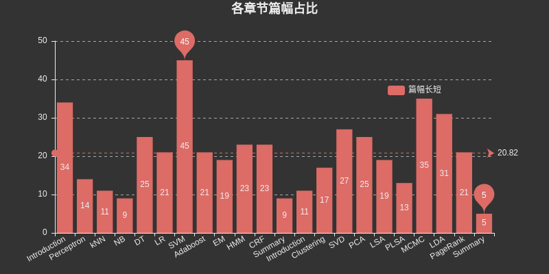

# 统计学习方法

[](https://gitter.im/StatisticalLearningMethods/Book)[](-)[](https://github.com/SmirkCao/Lihang/pulls)

本书已经出第二版，2019年5月之后所有内容更新参考第二版第一次印刷。

[第一版内容见Release first_edition](https://github.com/SmirkCao/Lihang/archive/first_edition.zip)

[TOC]

- GitHub的markdown公式支持一般，推荐使用Chrome插件[TeX All the Things](https://chrome.google.com/webstore/detail/tex-all-the-things/cbimabofgmfdkicghcadidpemeenbffn)来渲染TeX公式,，本地Markdown编辑器推荐[Typora](https://typora.io/)，注意Ctrl+, 打开Preferences，Syntax Support部分勾选inline Math。Ubuntu和Windows都正常。
- math_markdown.pdf为math_markdown.md的导出版本， 方便查看使用， markdown版本为最新版本，基本覆盖了书中用到的数学公式的LaTeX表达方式。

## 前前言

- 2019年5月，期待许久的第二版发布了，第一时间下了订单，预计母亲节这天可以发货。
- 5月13日新书到手，第二版配了一张新照片，短发，比之前显得年轻...
- 第二版修改了标点符号，第一版中逗号中文，句号英文。第二版将之前的英文句号更改成了中文句号。
- 第二版取消了符号表，可能是因为同一本书前后有些地方用了不同的符号？所以在这个repo里面，我们尝试加上[符号表](symbol_index.md)做说明，方便查询。
- 第二版增加了八个无监督的学习方法，至此，数据挖掘十大算法除了Apriori，全了。

如果需要引用这个Repo:

格式： `SmirkCao, Lihang, (2018), GitHub repository, https://github.com/SmirkCao/Lihang`

或者

```
@misc{SmirkCao,
  author = {SmirkCao},
  title = {Lihang},
  year = {2018},
  publisher = {GitHub},
  journal = {GitHub repository},
  howpublished = {\url{https://github.com/SmirkCao/Lihang}},
  commit = {c5624a9bd757a5cc88e78b85b89e9221deb08270}
}
```


## 前言

这部分内容并不对应《统计学习方法》中的前言，书中的**前言**写的也很好，引用如下:

>1. 在内容选取上，侧重介绍那些最重要，最常用的方法，特别是关于**分类与标注**问题的方法.
>1. 力图用统一框架来论述所有方法，使全书整体不失系统性。
>1. 适用于信息检索及自然语言处理等专业大学生，研究生

另外还有一点要注意作者的工作背景

> 作者一直从事利用统计学习方法对文本数据进行各种智能性处理的研究， 包括自然语言处理、信息检索、文本数据挖掘。

- 每个人都有适合自己的理解方式，对同样的内容，会有不同的理解
- 书如数据，学如训练，人即模型。

如果用我这个模型来实现相似度查找，和李老师这本书神似的就是《半导体光电器件》了，只可惜昔时年少，未曾反复研读。

希望在反复研读的过程中，将整个这本书看厚，变薄。这个系列的所有的文档，以及代码，没有特殊说明的情况下"书中"这个描述指代的都是李航老师的《统计学习方法》。其他参考文献中的内容如果引用会给出链接。

在Refs中列出了部分参考文献，有些参考文献对于理解书中的内容是非常有帮助的。关于这些文件的描述和解释会在参考部分对应的[Refs/README.md](Refs/README.md)中补充。这个文档中也添加了其他参考文献的一些说明。

方便参考文献下载， 在review02的时候，添加了[ref_downloader.sh](ref_downloader.sh)，可以用来下载书中列举的参考文献，更新过程随着review02的进行逐渐完成。

另外，李航老师的这本书，~~真的很薄（第二版不薄了）~~，但是几乎每句话都会带出很多点，值得反复研读。

书中在目录之后有个符号表，解释了符号定义，所以如果有不理解的符号可以过来查表；在本书后面有个索引，可以通过索引查找对应的符号表示的含义在书中出现的位置。在本Repo中，维护了一个glossary_index.md，目的是给对应的符号补充一些说明，以及直接标注符号对应的页码，进度随review更新。

每个算法，示例结束之后会有一个◼️，表示这个算法或者例子到此结束。这个叫证明结束符，看文献多了就知道了。

### 关于对数底数

读书的时候经常会有关于对数底数是多少的问题，有些比较重要的，书中都有强调。 有些没有强调的，通过上下文可以理解。另外，因为有换底公式，所以，底具体是什么关系不是太大，差异在于一个常系数。但是选用不同的底会有物理意义和处理问题方面的考虑，关于这个问题的分析，可以看PRML 1.6中关于熵的讨论去体会。

另外关于公式中常系数的问题，如果用迭代求解的方式，有时对公式做一定的简化，可能会改善收敛速度。个中细节可以实践中慢慢体会。

### 关于篇幅



这里插入个图表，列举了各个章节所占篇幅，其中SVM是监督学习里面占用篇幅最大的，MCMC是无监督里面篇幅占用最大的，另外DT，HMM，CRF，SVD，PCA，LDA，PageRank也占了相对较大的篇幅。

章节之间彼此又有联系，比如NB和LR，DT和AdaBoost，Perceptron和SVM，HMM和CRF等等，如果有大章节遇到困难，可以回顾前面章节的内容，或查看具体章节的参考文献，一般都给出了对这个问题描述更详细的参考文献，可能会解释你卡住的地方。


## CH01 统计学习及监督学习概论

[Introduction](CH01/README.md)

统计学习方法三要素:

- 模型

- 策略

- 算法

  

  第二版对这一章的目录结构重新梳理了，更清晰。

## CH02 感知机

[Perceptron](CH02/README.md)
- 感知机是二类分类的线性分类模型
- 感知机对应于特征空间中将实例划分为正负两类的分离超平面.
## CH03 k近邻法

[kNN](CH03/README.md)
- kNN是一种基本的分类与回归方法
- k值的选择, 距离度量及分类决策规则是kNN的三个基本要素.
## CH04 朴素贝叶斯法

[NB](CH04/README.md)
- 朴素贝叶斯法是基于贝叶斯定理与特征条件独立假设的分类方法.
1. $IID\rightarrow$输入输出的联合概率分布
1. $Bayes\rightarrow$后验概率最大的输出
- x的某种组合在先验中没有出现的情况, 会出现概率为0的情况, 对应平滑处理方案
  $$P_\lambda(X^{(j)}=a_{jl}|Y=c_k)=\frac{\sum_{i=1}^{N}{I(x_i^{(j)}=a_{jl}, y_i=c_k)}+\lambda}{\sum_{i=1}^{N}{I(y_i=c_k)+S_j\lambda}}$$
  - $\lambda = 0$ 对应极大似然估计
  - $\lambda = 1$ 对应拉普拉斯平滑
- 朴素贝叶斯法实际上学习到生成数据的机制, 所以属于生成模型.

## CH05 决策树

[DT](CH05/README.md)

- 决策树是一种基本的分类与回归方法
## CH06 逻辑斯谛回归与最大熵模型

[LR](CH06/README.md)

- 逻辑斯谛回归是统计学中的经典分类方法
- 最大熵是概率模型学习的一个准则, 将其推广到分类问题得到最大熵模型

关于最大熵的学习，推荐阅读该章节的参考文献[1]，[Berger, 1996](Refs/README.md), 有益于书中例子的理解以及最大熵原理的把握。

那么, **为什么LR和Maxent要放在一章?**
- 都属于对数线性模型

- 都可用于二分类和多分类

- 两种模型的学习方法一般采用极大似然估计, 或正则化的极大似然估计. 可以形式化为无约束最优化问题, 求解方法有IIS, GD, BFGS等

- 在[Logistic regression](http://scikit-learn.org/stable/modules/linear_model.html#logistic-regression)中有如下描述,

  > Logistic regression, despite its name, is a linear model for classification rather than regression. Logistic regression is also known in the literature as logit regression, maximum-entropy classification (MaxEnt) or the log-linear classifier. In this model, the probabilities describing the possible outcomes of a single trial are modeled using a [logistic function](https://en.wikipedia.org/wiki/Logistic_function).

- 还有[这样的描述](https://www.csie.ntu.edu.tw/~cjlin/papers/maxent_journal.pdf)

  >Logistic regression is a special case of maximum entropy with two labels +1 and −1.

  这个章节的推导中用到了$y\in \mathcal{Y}=\{0,1\}$的性质

- 有时候我们会说，逻辑回归在NLP方面叫做Maxent

## CH07 支持向量机

[SVM](CH07/README.md)

- 支持向量机是一种二分类模型。
- 基本模型是定义在特征空间上的间隔最大化的线性分类器, 间隔最大使他有别于[感知机](CH02/README.md)
- 这一章占了很大篇幅，因为margin这个思想几乎可以串起来整个分类问题。

## CH08 提升方法

[Boosting](CH08/README.md)

- 提升方法是一种常用的统计学习方法, 应用广泛且有效.

## ----分割线----

姑且在这里分一下，因为后面HMM和CRF通常会引出概率图模型的介绍，在《机器学习，周志华》里面更是用了一个单独的**概率图模型**章节来包含HMM，MRF，CRF等内容。另外从HMM到CRF本身也有很多相关的点。

在书中第一章有说明监督学习的三种应用：分类，标注和回归。在第十二章中有补充，本书主要考虑前两者的学习方法。据此， 在这里分割也是合适的，前面介绍分类模型， 少部分提到了回归，后面主要介绍标注问题。

## CH09 EM算法及其推广

[EM](CH09/README.md)

- EM算法是一种迭代算法，用于含有隐变量的概率模型参数**极大似然估计**，或者极大后验概率估计。(这里的极大似然估计和极大后验概率估计是**学习策略**)

- >  如果概率模型的变量都是观测变量，那么给定数据，可以直接用极大似然估计法，或贝叶斯估计法估计模型参数。

  注意书上这个描述如果不理解，参考[CH04](CH04/README.md)中朴素贝叶斯法的参数估计部分。

- 这部分代码实现了BMM和GMM，值得看下

- 关于EM，这个章节写的不多，EM是十大算法之一，EM和Hinton关系紧密，Hinton在2018年ICLR上发表了Capsule Network的第二篇文章《Matrix Capsules with EM Routing》

- 在CH22中将EM算法归类于基础机器学习方法，不涉及具体的机器学习模型，可用于无监督学习也可用于监督学习，半监督学习。

## CH10 隐马尔可夫模型

[HMM](CH10/README.md)

- 隐马尔可夫模型是可用于标注问题的统计学习模型，描述由隐藏的马尔可夫链随机生成观测序列的过程，属于生成模型。
- 隐马尔可夫模型是关于时序的概率模型，描述由一个隐藏的马尔可夫链随机生成不可观测的状态的序列，再由各个状态速记生成一个观测而产生观测的序列的过程。
- 可用于**标注**(Tagging)问题，状态对应标记。
- 三个基本问题：概率计算问题，学习问题，预测问题。

## CH11 条件随机场

[CRF](CH11/README.md)

- 条件随机场是给定一组输入随机变量条件下另一组输出随机变量的条件概率分布模型，其特点是假设输出随机变量构成**马尔可夫随机场**。
- 概率无向图模型，又称为马尔可夫随机场，是一个可以由无向图表示的**联合概率分布**。
- 三个基本问题：概率计算问题，学习问题，预测问题

## CH12 监督学习方法总结

[Summary](CH12/README.md)

这章就简单的几页，可以考虑如下阅读套路：
- 和第一章一起看

- 在前面的学习中遇到不清楚的问题的时候，过一遍这个章节。

- 将这一章看厚，从这一章展开到其他十个章节。

- 注意这一章有个图12.2，这里面提到了逻辑斯谛损失函数，这里的$y$应该是定义在$\cal{Y}=\{+1,-1\}$中的，在前面介绍[LR](CH06/README.md)的时候$y$定义在$\cal{Y}=\{0,1\}$，这里注意下。

李老师这本书真的是每次刷都会有新的收获。

## ----分割线----

第二版增加了八个无监督学习方法：聚类，奇异值分解，主成分分析，潜在语义分析，概率潜在语义分析，马尔可夫链蒙特卡罗法，潜在狄利克雷分配，PageRank。

## CH13 无监督学习概论

[Introduction](./CH13/README.md)

- 无监督学习的基本问题：聚类，降维，话题分析和图分析。
- 横向结构和纵向结构这个问题，从存储的角度来考虑。
- 注意不同任务的策略：类别中心距离最小化，维度转换过程中信息损失的最小化，生成数据概率的最大化。

## CH14 聚类方法

[Clustering](./CH14/README.md)

- 例子14.2很好，建议画出来先自己展开思考下，再往后看
- 聚类可以用于图像压缩

## CH15 奇异值分解

## CH16 主成分分析

## CH17 潜在语义分析

## CH18 概率潜在语义分析

## CH19 马尔可夫链蒙特卡罗法

## CH20 潜在狄利克雷分配

## CH21 PageRank算法

## CH22 无监督学习方法总结

## 后记

整个这本书里面各章节也不是完全独立的，这部分希望整理章节之间的联系以及适用的数据集。算法到底实现到什么程度，能跑什么数据集也是一方面。


## 参考

[^1]: [Matrix Capsules with EM Routing](http://arxiv.org/abs/1710.09829)

